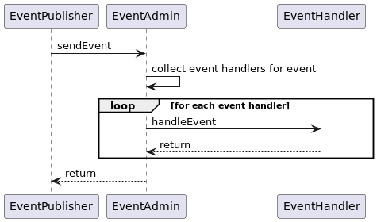
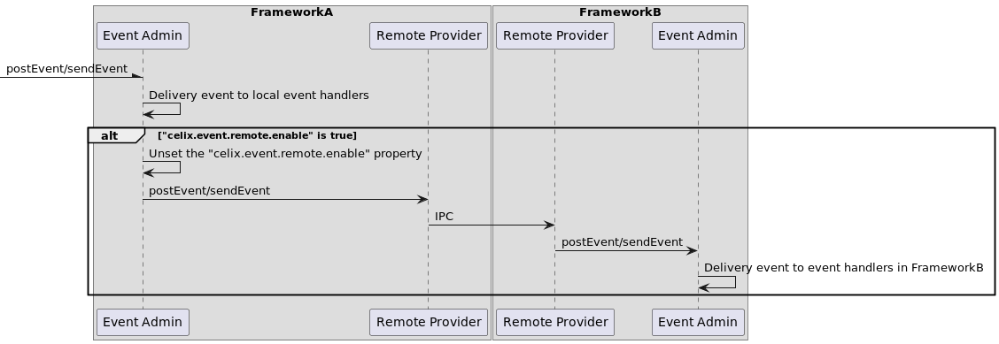

<!--
Licensed to the Apache Software Foundation (ASF) under one or more
contributor license agreements.  See the NOTICE file distributed with
this work for additional information regarding copyright ownership.
The ASF licenses this file to You under the Apache License, Version 2.0
(the "License"); you may not use this file except in compliance with
the License.  You may obtain a copy of the License at
   
    http://www.apache.org/licenses/LICENSE-2.0

Unless required by applicable law or agreed to in writing, software
distributed under the License is distributed on an "AS IS" BASIS,
WITHOUT WARRANTIES OR CONDITIONS OF ANY KIND, either express or implied.
See the License for the specific language governing permissions and
limitations under the License.
-->

## Event Admin

The Event Admin provides the pubsub mechanism for in-process communication. It has implemented two delivery mechanisms:
- Synchronous delivery
- Asynchronous delivery

In addition, the Event Admin provides an adapter for the celix framework-level event. It maps the celix framework-level event to the
event admin pubsub model, and events are delivered asynchronously.

### Cmake options

    BUILD_EVENT_ADMIN=OFF

### Conan options

    build_event_admin=false

### Properties/Configuration

| **Properties**                                           | **Type** | **Description**                                               | **Default value** |
|----------------------------------------------------------|----------|---------------------------------------------------------------|-------------------|
| **CELIX_EVENT_ADMIN_HANDLER_THREADS**                    | long     | The number of event handler threads. Its maximum value is 20. | 5                 |
| **CELIX_EVENT_ADMIN_EVENT_SEQID_CACHE_CLEANUP_INTERVAL** | long     | The event sequence id cache will be cleaned up when it has not been used for this interval. The unit is seconds. The event sequence id cache is used to prevent duplicate events. | (60*60)s          |

### Software Design

#### Synchronous Delivery

In the synchronous delivery, the event handler will be notified in the caller's thread. And the `sendEvent` method will return after all the event handlers have been called.
The diagram of synchronous delivery is shown in the following figure:

#### Asynchronous Delivery

In the asynchronous delivery, the event handler will be notified in a separate event-delivery thread. And the `postEvent` method will return immediately.
The diagram of asynchronous delivery is shown in the following figure:

In the above figure, if the event handler sets the "event.delivery" property to "async.ordered", each event handler can hold 
at most one event-delivery thread at a time, so that events can be delivered in order. If the event handler sets the 
"event.delivery" property to "async.unordered", the event handler can hold multiple event-delivery threads at the same 
time, so that events can be delivered in parallel.

#### Remote Event Delivery

If the event property "celix.event.remote.enable" is set to true, the event will be delivered to the local event handlers
and remote event handlers. For delivering events to local event handlers, it can refer to the section of synchronous delivery
and asynchronous delivery. For delivering events to remote event handlers, event admin will forward the event to the 
[remote provider](../remote_provider/README.md). The remote provider will serialize the event and send it to the remote framework.
The remote framework will deserialize the event and deliver it to the remote event handler. The diagram of remote event delivery
is as follows:

#### Event Adapter

In order to present a consistent view of all the events occurring in the system, the Event Admin provides an adapter for the celix framework-level event.
The events are mapped as follows:

- **Celix Framework Event**

For celix framework Event, we map the celix framework condition id to the event admin event topic. The event admin event properties are none.
The details mappings are shown in the following table:

| Celix Framework Condition ID       | Event Admin Event topic                  |
|------------------------------------|------------------------------------------|
| CELIX_CONDITION_ID_FRAMEWORK_READY | "celix/framework/FrameworkEvent/STARTED" |
| CELIX_CONDITION_ID_FRAMEWORK_ERROR | "celix/framework/FrameworkEvent/ERROR"   |

- **Celix Bundle Event**

For celix bundle Event, we map the celix bundle event type to the event admin event topic. And The event admin event properties are as follows:
- bundle.id
- bundle.symbolicName
- bundle.version

The details mappings are shown in the following table:

| Celix Bundle Event Type        | Event Admin Event topic                   |
|--------------------------------|-------------------------------------------|
| CELIX_BUNDLE_EVENT_INSTALLED   | "celix/framework/BundleEvent/INSTALLED"   |
| CELIX_BUNDLE_EVENT_STARTED     | "celix/framework/BundleEvent/STARTED"     |
| CELIX_BUNDLE_EVENT_STOPPED     | "celix/framework/BundleEvent/STOPPED"     |
| CELIX_BUNDLE_EVENT_UPDATED     | "celix/framework/BundleEvent/UPDATED"     |
| CELIX_BUNDLE_EVENT_UNINSTALLED | "celix/framework/BundleEvent/UNINSTALLED" |
| CELIX_BUNDLE_EVENT_RESOLVED    | "celix/framework/BundleEvent/RESOLVED"    |
| CELIX_BUNDLE_EVENT_UNRESOLVED  | "celix/framework/BundleEvent/UNRESOLVED"  |

- **Celix Service Event**

For celix service Event, we map the celix service register/unregister operation to the event admin event topic. And The event admin event properties are as follows:
- service.id
- service.objectClass
- service.pid

The details mappings are shown in the following table:

| Celix Service Operation | Event Admin Event topic                       |
|-------------------------|-----------------------------------------------|
| Register Service        | "celix/framework/ServiceEvent/REGISTERED"     |
| Unregister Service      | "celix/framework/ServiceEvent/UNREGISTERING"  |