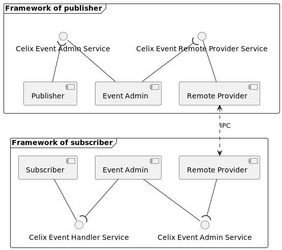

<!--
Licensed to the Apache Software Foundation (ASF) under one or more
contributor license agreements.  See the NOTICE file distributed with
this work for additional information regarding copyright ownership.
The ASF licenses this file to You under the Apache License, Version 2.0
(the "License"); you may not use this file except in compliance with
the License.  You may obtain a copy of the License at
   
    http://www.apache.org/licenses/LICENSE-2.0

Unless required by applicable law or agreed to in writing, software
distributed under the License is distributed on an "AS IS" BASIS,
WITHOUT WARRANTIES OR CONDITIONS OF ANY KIND, either express or implied.
See the License for the specific language governing permissions and
limitations under the License.
-->

## Introduction

The remote provider of Event Admin can deliver events to remote frameworks. To extend new remote communication approaches
through a new remote provider, the remote provider should be implemented as a Celix bundle, and provide the `celix_event_remote_provider_service_t` service.

## The Relationship Between Remote Provider And Event Admin

The `celix_event_remote_provider_service_t` service provides asynchronous event publishing method and synchronous event 
publishing method, which corresponds to the `celix_event_admin_service_t` service. When the Event Admin receives an event
that needs to be published to a remote framework, it forwards the event to the remote framework by calling the `celix_event_remote_provider_service_t`
service. Similarly, when the remote provider receives a remote event, it publishes the event to the local framework by
calling the `celix_event_admin_service_t` service. The component relationship diagram is as follows.

## Remote Provider Bundles

* [Event Admin Remote Provider Based On MQTT](remote_provider_mqtt/README.md) - The remote provider based on MQTT.