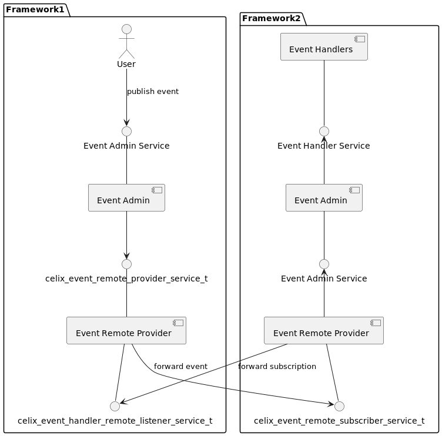
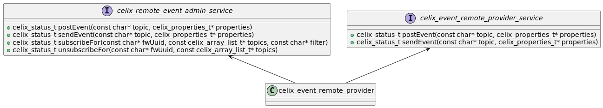
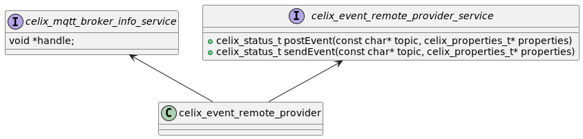

## Q&A
Q1. 通信流程

Q2. PING包是自动发送的还是用户发送的

    由MQTT客户端自动发送，当keeplive时间内没有收到任何消息者自动发送一个MQTT PING包

Q3. 如何配置服务端

[mosquitto.conf](mosquitto.conf)

Q4. V3 and v5 的区别, v5 的优势

Q5. 思考如何完成同步和异步消息的发送和接收，是否应该考虑远程的同步消息(MQTT文档中寻找答案)

Q6. 能否同时运行域套接字与TCP服务

    可以，但是需要考虑如何获取MQTT服务地址，保证不重复连接到同一个broker

Q7. 重发机制

    由于协议运行在TCP/IP，或其它提供了有序、可靠、双向连接的网络连接上。只考虑断开时重发，不考虑对端返回错误时重发。不设置超时重发，只在断开时重发。

Q8. 域套接字的消息是否会转发到TCP链路

    会，broker会将消息转发到所有客户端

Q9. broker互连，bridge机制

    两个broker之间的连接，可以通过bridge机制实现，将消息转发到另一个broker. local topic配置本地broker的消息发送到远端broker, romote topic本地broker订阅远端broker的消息

Q10. will是broker发的还是client发的

    broker发的，broker会在client断开时发送will消息

## 注意点:
1.考虑loop出错重连和心跳保活断开重连
2.MQTT与shm共存共通问题
3.MQTT服务地址获取时如何确保获取到的都是能连接的（同时存在域套接字与TCP服务时）
4. 对端返回错误时不再重发，仅通知用户错误码
5. 同时订阅多个主题
6. 考虑HTTP如何适配进来
7. 订阅时设置no local选项，避免收到自己收到的消息，自己的消息应该本地event admin
8. 考虑关闭会话清理时如何处理（不使用会话清理可以收到连接断开期间的消息,在弱网时该特性可能能保证QOS），需要考虑clientID复用的问题，maybe need to clean=1, because need refresh the subscriber
9. 如何进行主题通配符适配
10. 考虑如何进行身份认证（用户名和密码如何配置）
11. 服务端资源访问授权
12. 远程消息投递顺序问题
13. publish should be after connect ack msg, If a Client sets an Authentication Method in the CONNECT, the Client MUST NOT send any packets other than AUTH or DISCONNECT packets until it has received a CONNACK packet
    If the Client sends QoS 1 or QoS 2 PUBLISH packets before it has received a CONNACK packet, it risks being disconnected because it has sent more than Receive Maximum publications. However, if a Client sends MQTT Control Packets before it receives CONNACK, it might cause a Protocol Error because it made an incorrect assumption about the Server capabilities. Refer to section 3.1.4 CONNECT Actions.

14. QOS0的0拷贝如何做
15. 订阅主题中应该保留$符
16. 考虑本地和远程消息的投递顺序，handler需要标记为远程代理或设置投递优先级的概念
17. 如何判断消息的元素是放在topic中还是放在property中----topic定义发生了什么，相同topic的消息覆盖之后不会影响系统运行

mqtt连接设计

1.获取地址信息
2.判断连接信息是否和前一次相同，相同重连，不相同则更换地址重连
3.特定错误码，且地址为空则不再连接

## 远程事件管理器设计关键点

### 接口设计
对于远程event admin的设计，我有如下想，首先远程分发提供者(这里我将会称之为EventRemoteProvider)应该是可插拔的，其对外提供的接口定义如下:
~~~
    typedef struct celix_event_remote_provider_service {
        void *handle;
        //It is used to distribute the asynchronous event
        celix_status_t (*postEvent)(const char *topic, const celix_properties_t *properties);
        //It is used to distribute the synchronous event
        celix_status_t (*sendEvent)(const char *topic, const celix_properties_t *properties);
    }celix_event_remote_provider_service_t;
~~~
该服务包括属性:celix.event.subscriber.endpoint.framework.uuids, service.ranking，EventAdmin根据这些属性来选择最优的celix_event_remote_provider_service_t服务分发事件到远程。
选择策略如下：
  - 当celix.event.subscriber.endpoint.framework.uuids相同的情况下，选择service.ranking最大的
  - 当celix.event.subscriber.endpoint.framework.uuids及service.ranking都相同的情况下，选择最先注册的(service.id小的)
  - 当celix.event.subscriber.endpoint.framework.uuids的集合为包含关系时，选则包含者
  - 当celix.event.subscriber.endpoint.framework.uuids的集合为相交关系时，应设置事件属性$celix.event.source.framework.uuid(用于标识消息来源),$celix.event.source.seq(用于标识消息序列),用于消息去重
      
另外，事件properties中保留"$"前缀的属性字段,该类属性用于表示provider的特定信息或控制api行为,控制API行为的属性包括:
- $celix.event.remote.qos
  - QOS行为定义:与MQTT保持一致。另外，如果EventRemoteProvider不支持对应的等级可选择降级处理，并记录一条日志。
  - QOS作用对象：被发布的事件和订阅者都可以设置该属性，两者冲突时取最小值
- $celix.event.remote.expiryInterval:事件过期时间，过期事件不再投递给订阅者，如果没有设置该值代表永不过期。
- $celix.event.remote.enable:如果event设置该事件属性时，事件将转发到EventRemoteProvider，如果没有设置该属性，表示仅在本地发布事件

note:如上事件属性仅针对远程事件生效

另外，我目前不打算将框架事件转发到远程，因为我还不确定框架事件转发到远程的意义，如果需要转发到远程，它应该要新增属性"org.osgi.framework.uuid"

[//]: # (    $celix.event.retain: 适用于subscriber和publisher,当publisher设置该属性时，EventRemoteProvider需要将该事件缓存，直到事件过期，当新的subscriber注册时，将缓存的事件发送给新的subscriber。当subscriber设置该属性时，表示该subscriber需要接收retain事件，否则不接收retain事件.---应该在event admin实现)

我打算使用两种方式实现remote distribution provider,一种是基于MQTT的实现，另一种是基于RSA的实现。对于基于MQTT的实现，我打算使用mosquitto库来实现，对于基于RSA的实现，我打算使用RSA库来实现。对于基于MQTT的实现，我打算使用mosquitto库来实现。

对应基于RSA的EventRemoteProvider实现，我们将会新增远程接口celix_event_handler_remote_listener_service_t及celix_event_remote_subscriber_service_t,
celix_event_handler_remote_listener_service_t用于监听远程订阅信息，celix_event_remote_subscriber_service_t用于转发消息给远程订阅者.例如，假设在系统中存在两个进程A和B，进程B需要订阅事件E1，事件E1由进程A发布, 那么进程A需要提供celix_event_handler_remote_listener_service_t服务，进程B需要提供celix_event_remote_subscriber_service_t服务。进程B通过调用进程A的celix_event_handler_remote_listener_service_t服务来转发事件E1的订阅信息，进程A通过调用进程B的celix_event_remote_subscriber_service_t服务来转发E1到进程B。其中celix_event_handler_remote_listener_service_t及celix_event_remote_subscriber_service_t的调用均为远程调用。

我不考虑将进程B的订阅信息附加到celix_event_remote_subscriber_service_t服务属性的原因是，如果这样做了，在更新订阅信息时，进程B需要重新注册celix_event_remote_subscriber_service_t服务，在此期间，进程B可能会丢失一些进程A发布的事件。因此，进程B通过进程A的celix_event_handler_remote_listener_service_t向A传递它的订阅信息。

celix_event_handler_remote_listener_service_t及celix_event_remote_subscriber_service_t的定义如下:

~~~
typedef struct celix_event_handler_remote_listener_service {
    void *handle;
    celix_status_t (*handlerAdded)(void* handle, const char* handlerFwUUID, long handlerSvcId, const char* topics, const char* filter);
    celix_status_t (*handlerRemoved)(void* handle, const char* handlerFwUUID, long handlerSvcId, const char* topics, const char* filter);
}celix_event_handler_remote_listener_service_t;

typedef struct celix_event_remote_subscriber_service {
    void* handle;
    celix_status_t (*receiveEventAsync)(void* handle, const char* topic, const celix_properties_t* properties);
    celix_status_t (*receiveEventSync)(void* handle, const char* topic, const celix_properties_t* properties);
}celix_event_remote_subscriber_service_t;
~~~

##### 组件关系图

实现当中考虑到的一些其他关键点:
- dfi中新增celix_properties_t类型，便于远程调用中事件属性的序列化和反序列化
- 远程celix_event_remote_subscriber_service_t掉线时的处理策略:优先投递事件到在线的服务，然后,Q0S1/QOS2的消息等待掉线服务上线或事件过期或会话过期;QOS0的消息直接丢弃处理.
- 背压处理:考虑到不传输大数据，仅考虑事件数量缓存到一定数量时直接丢弃后续事件（优先丢弃QOS0的事件）。另外对存在问题的订阅者实行断路机制(一段时间内不再投递事件)。

**The implementation based on MQTT**

对于基于MQTT(mosquitto)的EventRemoteProvider实现，我将会新增远程接口celix_mqtt_broker_info_service_t,该服务用于获取MQTT broker的地址信息。EventRemoteProvider通过解析mosquitto.conf文件获取MQTT broker的地址信息，获取到MQTT broker地址后则注册远程服务celix_mqtt_broker_info_service。

celix_mqtt_broker_info_service定义如下：
~~~

#define CELIX_EARPM_MQTT_BROKER_INFO_SERVICE_NAME "celix_mqtt_broker_info_service"

#define CELIX_MQTT_BROKER_ADDRESS "celix.mqtt.broker.addresses"
#define CELIX_MQTT_BROKER_PORT "celix.mqtt.broker.port"

typedef struct celix_mqtt_broker_info_service {
    void *handle;
}celix_mqtt_broker_info_service_t;
~~~

##### 组件关系图

实现当中考虑到的一些其他关键点:
- 各provider将各自的订阅信息通过发布消息celix/mqtt/subscriptions/<frameworkUUID>到broker, provider通过订阅消息celix/mqtt/subscriptions/*来获取远程订阅信息，provider在发布用户消息到broker之前应根据远程订阅信息进行一次过滤   celix/EventAdminMqtt/subscriptions/<frameworkUUID>/SUB  celix/EventAdmin/Mqtt/subscriptions/<frameworkUUID>/UNSUB
- celix/EventAdmin/Mqtt/subscriptions/<frameworkUUID>/UPDATE frameworkUUID应该在消息属性中设置
- 网络断线重连由mosquitto库自动处理
- 利用MQTT的request/respond机制实现同步语义
- 对于同步事件考虑使用断路机制(一段时间内不再向对应的framework投递同步事件)。对于异步事件由mosquitto库自动处理网络异常等情况
- subscriber下线了如何处理，是否需要清理会话，是否需要重新订阅：需要订阅will消息，感知到subscriber下线后，清理会话，重新订阅
- 监听多个网口时如何选择使用哪一个网口
- 仅保证相同QOS消息的顺序，不同QOS消息的顺序不保证，因为可能会降低消息的及时性。需要保证顺序的消息一般应该是相关的，相关的消息其QOS应该是一样的
- 根据MQTT规范，连接断开时发送者应该要缓存消息，不应该将消息发送给MQTT

Translate above chinese to english
To remote event admin, I have the following ideas. First of all, the remote distribution provider should be pluggable, and its interface definition is as follows:
~~~
    typedef struct celix_event_remote_provider_service {
        void *handle;
        //It is used to distribute the asynchronous event
        celix_status_t (*postEvent)(const char *topic, const celix_properties_t *properties);
        //It is used to distribute the synchronous event
        celix_status_t (*sendEvent)(const char *topic, const celix_properties_t *properties);
    }celix_event_remote_provider_service_t;
~~~
The service includes properties: `celix.event.subscriber.endpoint.framework.uuids, service.ranking`, and event admin selects the best `celix_event_remote_provider_service_t` service to distribute events to remote based on these properties.
The selection strategy is as follows:
  - If `celix.event.subscriber.endpoint.framework.uuids` are the same, then select the one with the highest `service.ranking`.
  - If `celix.event.subscriber.endpoint.framework.uuids` and `service.ranking` are the same, then select the one that was registered first (its `service.id` is smallest).
  - If the set of celix.event.subscriber.endpoint.framework.uuids is a containment relationship, then select the container.
  - If the set of celix.event.subscriber.endpoint.framework.uuids is an intersection relationship, then the event property $celix.event.source.framework.uuid (used to identify the message source) and $celix.event.source.seq (used to identify the message sequence) should be set, and they are used for message deduplication.

In addition, the event properties retain the property name with the "$" prefix. These properties are used to represent the specific information of the remote distribution provider or control the API behavior. The properties that control the API behavior include:
- `$celix.event.remote.qos`
  - QOS behavior definition: consistent with MQTT. In addition, if the remote distribution provider does not support the corresponding Q0S level, it can choose to degrade and record a log.
  - QOS scope: Both the published event and the subscriber can set this property. When there is a conflict between the two, the smaller value is taken.
- `$celix.event.remote.expiryInterval`: event expiration time, expired events are no longer delivered to subscribers. If this value is not set, it means never expire.
- `$celix.event.remote.enable`: If the event contains the property, the event will be forwarded to the remote distribution provider. If this property is not set, it means that the event is only published locally.

Note: The above event properties only take effect for remote events

In addition, I do not intend to forward framework events to remote currently, because I am not sure about the meaning of forwarding framework events to remote. If it needs to be forwarded to remote, it should add the property "org.osgi.framework.uuid".

I plan to implement the remote distribution provider in two ways, one is based on RSA, and the other is based on MQTT. For the implementation based on MQTT, I plan to use the mosquitto library to implement it.

**The implementation based on RSA**

For the implementation based on RSA, it will add the remote interface `celix_event_handler_remote_listener_service_t` and `celix_event_remote_subscriber_service_t`. `celix_event_handler_remote_listener_service_t` is used to listen to remote subscription information, and `celix_event_remote_subscriber_service_t` is used to forward event to remote subscribers. For example, suppose there are two processes A and B in the system, process B needs to subscribe to event E1, and event E1 is published by process A, then process A needs to provide `celix_event_handler_remote_listener_service_t` service, and process B needs to provide `celix_event_remote_subscriber_service_t` service. Process B forwards its subscription information to A by calling the `celix_event_handler_remote_listener_service_t` service of process A, and process A forwards E1 to process B by calling the `celix_event_remote_subscriber_service_t` service of process B. Both `celix_event_handler_remote_listener_service_t` and `celix_event_remote_subscriber_service_t` are called remotely.

 **Note**:I don't consider attaching the subscription information of process B to the `celix_event_remote_subscriber_service_t` service properties, because if this is done, when updating the subscription information, process B needs to re-register the `celix_event_remote_subscriber_service_t` service, during this period, process B may lose some events published by process A. Therefore, process B forwards its subscription information to A through the `celix_event_handler_remote_listener_service_t` of process A.

The definition of `celix_event_handler_remote_listener_service_t` and `celix_event_remote_subscriber_service_t` is as follows:

~~~
typedef struct celix_event_handler_remote_listener_service {
    void *handle;
    celix_status_t (*handlerAdded)(void* handle, const char* handlerFwUUID, long handlerSvcId, const char* topics, const char* filter, int qos);
    celix_status_t (*handlerRemoved)(void* handle, const char* handlerFwUUID, long handlerSvcId, const char* topics, const char* filter);
}celix_event_handler_remote_listener_service_t;

typedef struct celix_event_remote_subscriber_service {
    void* handle;
    celix_status_t (*receiveEventAsync)(void* handle, const char* topic, const celix_properties_t* properties);
    celix_status_t (*receiveEventSync)(void* handle, const char* topic, const celix_properties_t* properties);
}celix_event_remote_subscriber_service_t;
~~~

The component relationship diagram is as follows:

Some other key points to consider in the implementation:
- The `celix_properties_t` type will be added to dfi, which is used for the serialization and deserialization of event properties in remote calls.
- The remote `celix_event_remote_subscriber_service_t` offline handling strategy: prioritize delivering events to online services, and then wait for offline services to come online or events to expire or sessions to expire for Q0S1/QOS2 messages; QOS0 messages are directly discarded.
- Backpressure handling: considering that large payload event is not transmitted, we will discard the event when the event count reaches a certain number(QOS0 events are discarded first). In addition, the remote distribution provider will implement a circuit breaker mechanism for problematic subscribers (Events will be not delivered for a period of time).

**The implementation based on MQTT**

For the implementation based on MQTT, I will add the remote interface `celix_mqtt_broker_info_service_t`, which is used to obtain the address information of the MQTT broker. The remote distribution provider obtains the address information of the MQTT broker by parsing the mosquitto.conf file, and then registers the remote service `celix_mqtt_broker_info_service`.

The definition of `celix_mqtt_broker_info_service` is as follows:

~~~
#define CELIX_EARPM_MQTT_BROKER_INFO_SERVICE_NAME "celix_mqtt_broker_info_service"

//The address of the MQTT broker
#define CELIX_MQTT_BROKER_ADDRESS "celix.mqtt.broker.addresses"
//The port of the MQTT broker
#define CELIX_MQTT_BROKER_PORT "celix.mqtt.broker.port"

typedef struct celix_mqtt_broker_info_service {
    void *handle;
}celix_mqtt_broker_info_service_t;
~~~

The component relationship diagram is as follows:

Some other key points to consider in the implementation:
- Each provider publishes its own subscription information through the message `celix/mqtt/subscriptions/<frameworkUUID>` to the broker. The provider obtains remote subscription information by subscribing to the message `celix/mqtt/subscriptions/*`, and the provider should filter events based on the remote subscription information before publishing the message to the broker.
- Network disconnection and reconnection are automatically handled by the mosquitto library.
- Use the request/respond mechanism of MQTT to implement synchronous semantics.
- For synchronous events, consider using a circuit breaker mechanism (no longer deliver synchronous events to the corresponding framework for a period of time). For asynchronous events, network exceptions are automatically handled by the mosquitto library.

### Event Distribution Provider 实现方式

#### 基于RSA的实现

##### 类图

对应基于RSA的EventRemoteProvider实现，我们将会新增远程接口celix_event_handler_remote_listener_service_t及celix_event_remote_subscriber_service_t,
celix_event_handler_remote_listener_service_t用于监听远程订阅信息，celix_event_remote_subscriber_service_t用于转发消息给远程订阅者.例如，假设在系统中存在两个进程A和B，进程B需要订阅事件E1，事件E1由进程A发布，那么进程A需要提供celix_event_handler_remote_listener_service_t服务，进程B需要提供celix_event_remote_subscriber_service_t服务。进程B通过调用进程A的celix_event_handler_remote_listener_service_t服务来准发事件E1的订阅信息，进程A通过调用进程B的celix_event_remote_subscriber_service_t服务来转发E1到进程B。其中celix_event_handler_remote_listener_service_t及celix_event_remote_subscriber_service_t的调用均为远程调用。

NOTE:此处不考虑将进程B的订阅信息附加到celix_event_remote_subscriber_service_t服务属性的原因是，如果这样做了，在更新订阅信息时，进程B需要重新注册celix_event_remote_subscriber_service_t服务，在此期间，进程B可能会丢失一些进程A发布的事件。因此，进程B通过进程A的celix_event_handler_remote_listener_service_t向A传递它的订阅信息。

celix_event_handler_remote_listener_service_t及celix_event_remote_subscriber_service_t的定义如下:

~~~
typedef struct celix_event_handler_remote_listener_service {
    void *handle;
    celix_status_t (*handlerAdded)(void* handle, const char* handlerFwUUID, long handlerSvcId, const char* topics, const char* filter);
    celix_status_t (*handlerRemoved)(void* handle, const char* handlerFwUUID, long handlerSvcId, const char* topics, const char* filter);
}celix_event_handler_remote_listener_service_t;

typedef struct celix_event_remote_subscriber_service {
    void* handle;
    celix_status_t (*receiveEventAsync)(void* handle, const char* topic, const celix_properties_t* properties);
    celix_status_t (*receiveEventSync)(void* handle, const char* topic, const celix_properties_t* properties);
}celix_event_remote_subscriber_service_t;
~~~

各组建关系图如下:

##### 组件关系图

实现当中考虑到的一些其他关键点:
- dfi中新增celix_properties_t类型，便于远程调用中事件属性的序列化和反序列化
- 远程celix_event_remote_subscriber_service_t掉线时的处理方式:优先投递给在线的服务，然后,Q0S1/QOS2的消息等待掉线服务上线或事件过期或会话过期;QOS0的消息直接丢弃处理.
- 背压处理:考虑到不传输大数据，仅考虑事件数量缓存到一定数量时直接丢弃后面的事件（优先丢弃QOS0的事件）。另外对问题链路实行断路机制(一段时间内不再投递事件)。

##### 实现要点
- dfi中新增celix_properties_t类型
- QOS
  - 行为定义：QOS0:仅调用一次远程接口send/post, QOS1:在失败的时候调用多次远程接口, QOS2：send/post接口新增事件ID，保证消息不会重复发送
  - 作用域：发布者和订阅者独立设置QOS值，两者冲突时取最小值
  - 消息对象：同步消息和异步消息均支持
  - event property中添加qos属性 $qos
  - remote_event_admin_service接口新增参数celix_properties_t *remoteExtProperties,属性中包括fwuuid, eventId等信息
- 远程服务掉线了怎么处理？:
  - 如果订阅信息没有去除则对Q0S1的消息进行缓存，直到远程服务上线或超时，QOS0的消息丢弃处理 
- 由EventAdmin根据EventRemoteProviderService的属性(celix.event.peer.framework.uuids, service.ranking)来选择最优的远程服务(最高的等级和最少的发送次数)
- 每个EventRemoteProvider可以提供多个EventRemoteProviderService，每个EventRemoteProviderService对应一个RemoteEventAdminService
- 如何避免远程消息再次被event admin转发到EventRemoteProviderService ?:
   - EventRemoteProvider直接将消息转发给handler(这样好像与本地消息存在消息顺序问题，同时可能会引起并发问题)
   - EventAdmin提供一个不转发消息到远程的接口
   - 事件新增fwUuid属性，用于标识消息来源,没有设置fwUuid的事件默认为本地事件
   - topic附加$local/前缀，用于表示事件仅投递给本地handler，不进行远程转发,或property中新增localonly属性,适用于订阅和分发
- 事件属性中的serviceID等属性远程之后会存冲突，如何解决:
   - 规定这些系统事件不允许远程转发
   - 远程时添加fwUuid属性
   - topic附加$local/前缀，用于表示事件仅投递给本地handler，不进行远程转发,是否转交到远程由用户决定，转交到handler之前由event admin去除$local前缀
- 远程没有订阅的消息不进行转发----会与retain消息冲突,retain优先
- 背压处理:考虑到不传输大数据，仅考虑事件数量缓存到一定数量时直接丢弃后面的事件。另外对问题handler实行断路机制(一段时间内不再投递事件)。暂不考虑发布内存压力事件，因为处理慢的handler一般无法及时收到内存压力事件
- 序列化方式:netstring, JSON方式
- 考虑将RemoteEventAdminService拆分成SubscriberService和PublisherService

##### 优点
- 复用RSA
- 相对于MQTT，中间没有broker,减少了一次转发

##### 缺点

- 对QOS0来说，每次消息都有回应，浪费流量----需要标注不需要等消息返回，和异步调用一起设计

#### 基于MQTT的实现

##### 类图

对于基于MQTT(mosquitto)的EventRemoteProvider实现，我们将会新增远程接口celix_mqtt_broker_info_service_t,该服务用于获取MQTT broker的地址信息。EventRemoteProvider通过解析mosquitto.conf文件获取MQTT broker的地址信息，获取到MQTT broker地址后则注册远程服务celix_mqtt_broker_info_service。

celix_mqtt_broker_info_service定义如下：
~~~

#define CELIX_EARPM_MQTT_BROKER_INFO_SERVICE_NAME "celix_mqtt_broker_info_service"

#define CELIX_MQTT_BROKER_ADDRESS "celix.mqtt.broker.addresses"
#define CELIX_MQTT_BROKER_PORT "celix.mqtt.broker.port"

typedef struct celix_mqtt_broker_info_service {
    void *handle;
}celix_mqtt_broker_info_service_t;
~~~

各组件关系图如下:

##### 组件关系图

实现当中考虑到的一些其他关键点:
 - 各provider将各自的订阅信息通过发布消息celix/mqtt/subscriptions/<frameworkUUID>到broker, provider通过订阅消息celix/mqtt/subscriptions/*来获取远程订阅信息，provider在发布用户消息到broker之前应根据远程订阅信息进行一次过滤
 - 网络断线重连由mosquitto库自动处理
 - 利用MQTT的request/respond机制实现同步语义
 - 对于同步事件考虑使用断路机制(一段时间内不再向对应的framework投递同步事件)。对于异步事件由mosquitto库自动处理网络异常等情况

##### 实现要点

- QOS
    - 行为定义：保持MQTT中的QOS定义
    - 作用域：发布者和订阅者独立设置QOS值，两者冲突时取最小值
    - 消息对象：同步消息和异步消息均支持
- 由EventAdmin根据EventRemoteProviderService的属性(celix.event.peer.framework.uuids/celix.event.remote.subscriber.framework.uuids, service.ranking)来选择最优的远程服务(最高的等级和最少的发送次数)
- 消息中携带framework uuid信息，规避多个EventRemoteProvider时的时间窗口导致handler收到多次相同的消息
- celix.event.peer.framework.uuid/celix.event.remote.subscriber.framework.uuids更新了如何解决？？？
    - 重新注册一下EventRemoteProviderService，该方案不是很好，framework之间会互相影响, 或先注册新的，完成后在反注册旧的
    - EventRemoteProviderService新增接口getRemoteFrameworksInfo，用于获取远程framework的uuid,rank等信息---会导致每次post/send时都有frameworksInfo的内存申请操作
- 如何获取broker地址
    - 通过RSA获取
    - 通过服务发现获取，比较繁琐

##### 优点

##### 缺点

- 同步语义实现较为繁琐

- 网络方式实现
    - 如何与本地event admin结合
      - handler_proxy/event_admin_proxy
          - 实现要点
              - 如何发布:dfi中新增celix_properties_t类型，
              - 如何订阅:注册event_handler_proxy服务时设置service.exported.interfaces，接口如何设计？？？
              - 如何保证一个event_handler只有一个最优代理:????
              - 没有订阅者就不要发布消息
              - 不转发远程消息，接口如何设计？？？
          ~~~
          
        class remote_distribution_provider_service {
          public :
          void postEvent(const std::string &topic, const celix::Properties &properties);
          void sendEvent(const std::string &topic, const celix::Properties &properties);
        }
          
        class remote_event_admin_service {
            public :
            void postEvent(const std::string &topic, const celix::Properties &properties);
            void sendEvent(const std::string &topic, const celix::Properties &properties);
            void subscribeFor(const std::string &fwuuid, const std::string &topic, const std::string &filter);
        }
    
        class remote_distribution_provider {
        private:
        remote_distribution_provider_service *provider_service;//local service, event admin call it
        remote_event_admin_service *admin_service;//remote service, remote distribution provider call it
        }
          ~~~
          - 优点
              - 复用RSA
          - 缺点
              - 会建立多路短连接，但是这也许和RSA的实现相关
              - 效率较低，每次都要等待回应
        - remote event admin provider
            - 实现要点
                - 使用MQTT(mosquitto lib)实现
                    - 每个provider就是一个mosquitto client,既可以发布消息也可以订阅消息
                    - 所有本地消息都发向broker，由broker负责是否将消息给到订阅者
                - 使用共享内存实现
                    - 使用client-server模式，发布者是客户端，订阅者是服务端，共享内存由服务端申请
                    - 考虑0拷贝方案
                    - 没有订阅者就不要发布消息
                - 如何保证使用最优的provider传输远程事件:????，provider要能提供远程端点信息
            - 优点
            - 缺点
        - QOS如何设置
            - QOS等级
            - QOS作用域
                - 发布者
                - 订阅者
                - 作用域冲突处理方式
            - QOS消息对象
                - 同步消息
                - 异步消息
        - 如何实现远程消息的同步和异步
            - 同步实现
            - 异步实现
        - 背压处理
            - 事件管理器背压
            - 远程事件管理器背压
        - 序列化方式
            - netstring
            - JSON方式

REA/RSA统一服务发现

- MQTT服务对于mdns有自己的服务名称，和RSA的服务名称之间存在冲突，如何解决？

首先，我认为同步接口是需要的，因为有些场景下需要同步接口，例如需要等待某个事件处理完成后再继续执行下一步操作。当然，如果我们不提供同步接口，用户可以使用异步接口或RPC来实现同步调用，但是这样会增加用户的开发成本。另外，我认为如果发布者选择使用同步接口发送远程事件，那么就应该知道这样做可能会导致阻塞，因此发布者应该在调用同步接口时考虑到这一点。

根据如下EventAdmin规范，
> The Event Admin service must be registered as a service with the object class org.osgi.service.event.EventAdmin. Multiple Event Admin services can be registered. Publishers should publish their event on the Event Admin service with the highest value for the SERVICE_RANKING service property. This is the service selected by the getServiceReference method. 

也许我们可以实现一个EventAdminWrapper, 其对外提供Event Admin Service, 但是其服务等级是最高的。EventAdminWrapper可以将事件转发到远程(通过EventRemoteProvider)，也可以将事件转发到本地(通过EventAdmin)。这样就可以使EventAdmin对远程事件无感知。

另外，我们是否要考虑多个EventRemoteProvider共存的情况？如果是的话，EventAdminWrapper也可以用于实现一个策略来选择最优的EventRemoteProvider转发远程事件。

对于MQTT broker的地址信息，在我的工作中应该是需要支持动态发现的。
对于MQTT broker服务地址的动态发现，也许可以通过以下几种方式实现:
- 使用前面提到的注册远程服务机制，该方式有如下两个缺点:
    - 需要使用到RSA
    - 在多个网络接口的情况下，无法选择broker地址信息在哪些网络接口上暴露
- 将DISCOVERY独立于RSA与REA。使用该方式存在一个问题是，如果DISCOVERY是基于Bonjour实现的，那么MQTT服务应该有一个特定的服务名“_mqtt._tcp”(https://www.iana.org/assignments/service-names-port-numbers/service-names-port-numbers.xhtml?search=MQTT),这与我们已定义的服务名(_celix-rpc._udp)冲突。我暂时还没有想到解决这个问题的方法。也许我们需要放弃使用服务名“_mqtt._tcp”，否则discovery_zeroconf可能会将Bonjour的细节暴露出来。
- 直接使用bonjour客户端实现

translate above to english:

First of all, I think synchronous interfaces of event delivery are needed because in some scenarios synchronous interfaces are needed, for example, users need to wait for an event to be processed before continuing with the next step. Of course, if we do not provide synchronous interfaces, users can use asynchronous interfaces or RPC to implement synchronous calls, but this will increase the development cost for users. In addition, I think if the publisher chooses to send remote events using synchronous interfaces, then the publisher should be aware that this may cause blocking, so the publisher should consider this when calling synchronous interfaces.

According to the EventAdmin specification,
> The Event Admin service must be registered as a service with the object class org.osgi.service.event.EventAdmin. Multiple Event Admin services can be registered. Publishers should publish their event on the Event Admin service with the highest value for the SERVICE_RANKING service property. This is the service selected by the getServiceReference method.
 
Maybe we can implement an EventAdminWrapper, which implements the Event Admin Service, and its service ranking is the highest. In this way, EventAdminWrapper can forward events to remote (use EventRemoteProvider) or to local (use EventAdmin). And EventAdmin can be unaware of remote events.

In addition, should we consider multiple EventRemoteProviders existing? If yes, EventAdminWrapper can also be used to implement a strategy to select the perfect EventRemoteProvider to forward remote events.

For the MQTT broker address information, it maybe requires dynamic discovery in my work.
Maybe we can implement dynamic discovery in the following ways
1. Use the previously mentioned remote service registration mechanism. But it has the following two disadvantages:
    - RSA is required
    - In the case of multiple network interfaces, it can't choose which network interface the broker address information is exposed on.
2. Making discovery independent of RSA and REA. The problem with this approach is that if DISCOVERY is implemented based on Bonjour, then the MQTT service should have a specific service name "_mqtt._tcp" (https://www.iana.org/assignments/service-names-port-numbers/service-names-port-numbers.xhtml?search=MQTT), which conflicts with the service name we have defined (_celix-rpc._udp). I haven't thought of a solution to this problem yet. Maybe we need to give up using the service name "_mqtt._tcp", otherwise discovery_zeroconf may expose the details of Bonjour.
3. Directly using the bonjour client to implement dynamic discovery of the MQTT broker service address.

### TODO
- 将discovery_zeroconf拆分为multicast_dns_service和discovery_zeroconf两个bundle