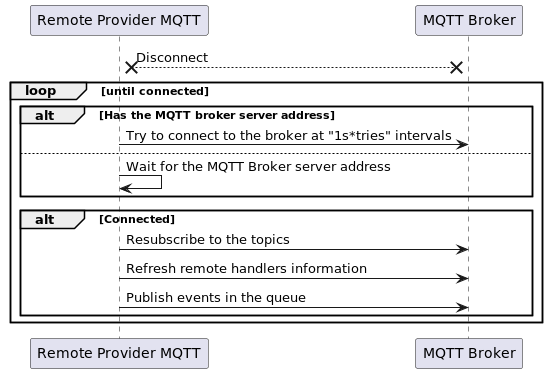

<!--
Licensed to the Apache Software Foundation (ASF) under one or more
contributor license agreements.  See the NOTICE file distributed with
this work for additional information regarding copyright ownership.
The ASF licenses this file to You under the Apache License, Version 2.0
(the "License"); you may not use this file except in compliance with
the License.  You may obtain a copy of the License at
   
    http://www.apache.org/licenses/LICENSE-2.0

Unless required by applicable law or agreed to in writing, software
distributed under the License is distributed on an "AS IS" BASIS,
WITHOUT WARRANTIES OR CONDITIONS OF ANY KIND, either express or implied.
See the License for the specific language governing permissions and
limitations under the License.
-->

## Event Admin Remote Provider Based On MQTT

The remote provider based on MQTT is a remote provider for the event admin. It uses the MQTT protocol to deliver events to remote celix framework instances, and it is implemented based on the [mosquitto library](https://github.com/eclipse/mosquitto). In addition, the remote provider does not need to be configured with the mqtt broker address, it uses the service discovery to discover the broker server.

### Supported Platform
- Linux
- MacOS

### Properties/Configuration

| **Properties**                          | **Type** | **Description**                                                                                                                                                                                                                                                                | **Default value**   |
|-----------------------------------------|----------|--------------------------------------------------------------------------------------------------------------------------------------------------------------------------------------------------------------------------------------------------------------------------------|---------------------|
| CELIX_EARPM_BROKER_PROFILE              | string   | The MQTT broker profile to use.                                                                                                                                                                                                                                                | /etc/mosquitto.conf |
| CELIX_EARPM_EVENT_DEFAULT_QOS           | long     | The default QoS of the remote event.                                                                                                                                                                                                                                           | 0 (At most once)    |
| CELIX_EARPM_MSG_QUEUE_CAPACITY          | long     | The capacity of the message cache queue. The maximum size is 2048.                                                                                                                                                                                                             | 256                 |
| CELIX_EARPM_PARALLEL_MSG_CAPACITY       | long     | The capacity of the parallel message. The maximum size is CELIX_EARPM_PARALLEL_MSG_CAPACITY.                                                                                                                                                                                   | 20                  |
| CELIX_EARPM_SYNC_EVENT_DELIVERY_THREADS | long     | The number of threads used to deliver the synchronous event. The maximum size is 20.                                                                                                                                                                                           | 5                   |
| CELIX_EARPM_SYNC_EVENT_CONTINUOUS_NO_ACK_THRESHOLD | long | The threshold for the number of consecutive synchronous events that have not been acknowledged. If the threshold is reached, the event remote provider will not wait for the acknowledgment, until receiving a new message from the remote celix framework instance.   | 10 |

### Conan Option
    build_event_admin_remote_provider_mqtt=True   Default is False

### CMake Option
    EVENT_ADMIN_REMOTE_PROVIDER_MQTT=ON           Default is OFF

### Software Design

#### The Relationship Between Event Admin Remote Provider MQTT And Other Components

If you need to deliver events to remote celix framework instances, multiple different components need to work together, as shown in the diagram below:

In the diagram above, the event admin is responsible for publishing and subscribing to events. The remote provider based on MQTT is responsible for delivering events to remote frameworks. The MQTT broker is responsible for routing messages that from the remote provider based on MQTT. The service discovery is responsible for discovering the MQTT broker server, and it reuses the service discovery of celix remote service subproject.

#### The MQTT Broker Server Discovery

When `event_admin_remote_provider_mqtt` is started, it will try to load the MQTT broker profile, read the MQTT broker address information from the profile, and then announce the MQTT broker address information by the service discovery. On hosts without a mqtt broker profile, `event_admin_remote_provider_mqtt` will discover the MQTT broker server by the service discovery. The sequence diagram is as follows:

#### The Subscription Process Of Event Admin Remote Provider MQTT

To obtain event handler information, an event handler service tracker will be created when `event_admin_remote_provider_mqtt` is initialized. Once an event handler service is registered, `event_admin_remote_provider_mqtt` will subscribe to the corresponding event topic on the mqtt broker, and send the event handler information to remote celix framework instances with the control message (`celix/EventAdminMqtt/HandlerInfo/add`). There are two purposes for sending event handler information to a remote celix framework instance:

- Before the event message is forwarded to other celix framework instances, it can be filtered according to the existing remote event handler information to avoid unnecessary forwarding;
- `event_admin_remote_provider_mqtt` can use the remote event handler information to determine whether to wait for the response from the corresponding celix framework instance, when it forwards the synchronous event message.

The sequence diagram is as follows:

#### The Publishing Process Of Event Admin Remote Provider MQTT

Event publishing includes asynchronous event publishing and synchronous event publishing. The steps of asynchronous event publishing are as follows:
- Serialize event properties to a JSON format string;
- Convert the event to an MQTT message, where the event topic is the MQTT message topic, and the event property is the MQTT message payload;
- Publish the corresponding MQTT message to the MQTT broker, and then MQTT broker forwards the message to the remote celix framework instance.

The steps of synchronous event publishing are as follows:
- Serialize event properties to a JSON format string;
- Convert the event to an MQTT message, where the event topic is the MQTT message topic, the event property is the MQTT message payload, and the response message topic and sequence number are added to the MQTT message properties;
- Publish the corresponding MQTT message to the MQTT broker, and then MQTT broker forwards the message to the remote celix framework instance;
- Wait for response messages from all remote celix framework instances.

The sequence diagram is as follows:

#### Exception Handling

##### QOS Mechanism

To ensure the reliability of messages, `event_admin_remote_provider_mqtt` reuses the [MQTT QOS mechanism](https://docs.oasis-open.org/mqtt/mqtt/v5.0/os/mqtt-v5.0-os.html#_Toc3901234). The QOS value includes three levels: 0, 1, and 2, which represent at most once, at least once, and exactly once, respectively. The default QOS value used by `event_admin_remote_provider_mqtt` is 0, and users can modify the default QOS value by the configuration property `CELIX_EARPM_EVENT_DEFAULT_QOS`. The event publisher can also specify a specific QOS value for the event with the event property `celix.event.remote.qos`. For QOS, events have the following features:
- When the network is disconnected, events with QOS 0 will be discarded directly, while events with QOS 1 and 2 will be retransmitted after the network is restored. (It is guaranteed by mosquitto)
- Ordered events with the same QOS value will be received in order, while events with different QOS values may be received in any order.

##### Timeout Mechanism

To avoid messages being waited forever, `event_admin_remote_provider_mqtt` provides a timeout mechanism. The timeout mechanism is designed as follows:

- For synchronous event messages, the timeout value can be specified by the event property `celix.event.remote.expiryInterval`. If the event does not receive response messages from all remote frameworks within the specified time, the `sendEvent` interface will terminate the waiting and return a timeout error. If the event property is not set, the default timeout time(300 seconds) will be used.
- For asynchronous event messages, the timeout value can also be specified by the property `celix.event.remote.expiryInterval`. This property is equivalent to the [Message Expiry Interval in MQTT](https://docs.oasis-open.org/mqtt/mqtt/v5.0/os/mqtt-v5.0-os.html#_Toc3901112).

##### BackPressure Mechanism

When messages are generated faster than they are consumed, the message queue becomes congested and may cause the system to run out of memory. To solve this problem, `event_admin_remote_provider_mqtt` provides a backpressure processing mechanism. The mechanism is designed as follows:

- The capacity of the message queue in `event_admin_remote_provider_mqtt` can be configured, and its default value is 256.
- Messages are classified into three types: user event messages, event response messages, and internal control messages, and the corresponding message priorities are high, medium, and low. Low-priority messages are rejected when the number of messages in the message queue exceeds 70% of the message queue capacity; medium-priority messages are rejected when the number of messages in the message queue exceeds 85% of the message queue capacity; and high-priority messages are rejected when the number of messages in the message queue exceeds 100% of the message queue capacity.
- For synchronous event messages, when the available capacity of the message queue is insufficient, if the event QOS value is greater than 0, the message will be sent after the message queue is available; if the QOS value is 0, the message will be directly discarded.

##### Reconnect Mechanism

When the MQTT connection is disconnected, `event_admin_remote_provider_mqtt` will first check whether there is an available MQTT broker address. If there is, it will try to reconnect to the MQTT broker. If the connection fails, it will reconnect at a linearly increasing time interval of 1 second (maximum interval value is 30 seconds) until the connection is successful. Once the connection is successful, `event_admin_remote_provider_mqtt` will resubscribe to the event topic and continue to transmit messages in the message queue; at the same time, to ensure the consistency of handler information, it will resend the local handler information to the remote celix framework instances and re-request the handler information of the remote celix framework instance. The sequence diagram is as follows:

### Example

See the cmake target `remote_event_admin_mqtt_publisher` and `remote_event_admin_mqtt_subscriber` in the `event_admin/examples` directory.

Note: Before running the example, make sure the `mosquitto broker` and the `mdnsd` are running. You can get `mosquitto` from [here](https://github.com/eclipse/mosquitto) and `mdnsd` from [here](https://github.com/apple-oss-distributions/mDNSResponder). And you should use command `mosquitto -c <profile>` to start the `mosquitto broker`. The profile of the `mosquitto broker` can be got from [here](../../examples/res/mosquitto.conf).

