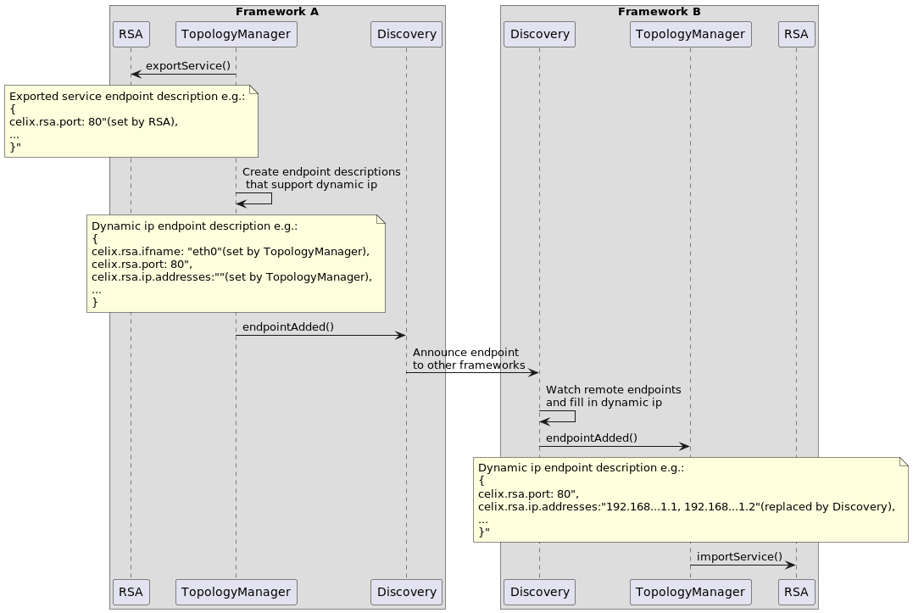

<!--
Licensed to the Apache Software Foundation (ASF) under one or more
contributor license agreements.  See the NOTICE file distributed with
this work for additional information regarding copyright ownership.
The ASF licenses this file to You under the Apache License, Version 2.0
(the "License"); you may not use this file except in compliance with
the License.  You may obtain a copy of the License at
   
    http://www.apache.org/licenses/LICENSE-2.0

Unless required by applicable law or agreed to in writing, software
distributed under the License is distributed on an "AS IS" BASIS,
WITHOUT WARRANTIES OR CONDITIONS OF ANY KIND, either express or implied.
See the License for the specific language governing permissions and
limitations under the License.
-->

## Introduction

The Remote Service Admin Service subproject contains an adapted implementation of the OSGi Enterprise Remote Service Admin Service Specification. The subproject consists of three parts, each described in more detail in the following sections.

### Topology Manager

The topology manager decides which services should be imported and exported according to a defined policy. Currently, only one policy is implemented in Celix, the *promiscuous* policy, which simply imports and exports all services.

| **Bundle** | `Celix::rsa_topology_manager` |
|--|-----------------------------------------|
| **Configuration** | *None*                 |

### Remote Service Admin

The Remote Service Admin (RSA) provides the mechanisms to import and export services when instructed to do so by the Topology Manager.

#### Remote Service Admin DFI

Provides remote service admin using HTTP and JSON. The serialization is done using [libdfi](../../libs/dfi/README.md) to convert function call information into [JSON representation](https://amdatu.atlassian.net/wiki/spaces/AMDATUDEV/pages/21954571/Amdatu+Remote#AmdatuRemote-AdminHTTP%2FJson).
`libffi` is configured using descriptor files in the bundles. 

| **Bundle** | `Celix::rsa_dfi`                                         |
|--|--------------------------------------------------------------------|
| **Configuration** | See [Remote Service Admin DFI](remote_service_admin_dfi/README.md) |

#### Remote Service Admin SHM

Provides remote service admin using shared memory. The serialization implementation is pluggable, and the default serialization is done using [libdfi](../../libs/dfi/README.md) to convert function call information into [JSON representation](https://amdatu.atlassian.net/wiki/spaces/AMDATUDEV/pages/21954571/Amdatu+Remote#AmdatuRemote-AdminHTTP%2FJson).
`libffi` is configured using descriptor files in the bundles.

| **Bundle**        | `Celix::rsa_shm`                                                       |
|-------------------|------------------------------------------------------------------------|
| **Configuration** | See [Remote Service Admin SHM](remote_service_admin_shm_v2/README.md)  |

### Discovery

Actively discovers the presence of remote exported services and provides information about local exported services, as given by the Topology Manager, to others.

#### Configured discovery

Provides a service discovery with preconfigured discovery endpoints, allowing a static mesh of nodes for remote service invocation to be created. The configured discovery bundle in Celix is compatible with the configured discovery implementation provided by [Amdatu Remote](https://amdatu.atlassian.net/wiki/display/AMDATUDEV/Amdatu+Remote).

| **Bundle** | `Celix::rsa_discovery` |
|--|--|
| **Configuration** | `DISCOVERY_CFG_POLL_ENDPOINTS`: defines a comma-separated list of discovery endpoints that should be used to query for remote services. Defaults to `http://localhost:9999/org.apache.celix.discovery.configured`; |
| | `DISCOVERY_CFG_POLL_INTERVAL`: defines the interval (in seconds) in which the discovery endpoints should be polled. Defaults to `10` seconds. |
| | `DISCOVERY_CFG_POLL_TIMEOUT`: defines the maximum time (in seconds) a request of the discovery endpoint poller may take. Defaults to `10` seconds. |
| | `DISCOVERY_CFG_SERVER_PORT`: defines the port on which the HTTP server should listen for incoming requests from other configured discovery endpoints. Defaults to port `9999`; |
| | `DISCOVERY_CFG_SERVER_PATH`: defines the path on which the HTTP server should accept requests from other configured discovery endpoints. Defaults to `/org.apache.celix.discovery.configured`. |

Note that for configured discovery, the "Endpoint Description Extender" XML format defined in the OSGi Remote Service Admin specification (section 122.8 of OSGi Enterprise 5.0.0) is used.

#### etcd discovery 

Provides a service discovery using etcd distributed key/value store.

| **Bundle** | `Celix::rsa_discovery_etcd` |
|------------|----------------------|
| **Configuration** | See [etcd discovery](discovery_etcd/README.md)|

#### Zero configuration discovery

Provides a service discovery using Bonjour.

| **Bundle** | `Celix::rsa_discovery_zeroconf` |
|--|----------------------------|
| **Configuration** | See  [Zeroconf Discovery](discovery_zeroconf/README.md) |

## Dynamic IP Mechanism For Remote Service Admin

In order to make remote services work without configuring the IP of the RSA, we have designed the following dynamic IP mechanism.

  - The remote service admin service adds the property "celix.rsa.dynamic.ip.support". If RSA sets this property to true, the RSA will support dynamic IP address.
  - If the RSA supports dynamic IP addresses, it should bind the network service address to any address(0.0.0.0/::), and set the property "celix.rsa.port" (which indicates the network port number of the remote service) for the exported remote service endpoint.
  - The endpoint listener service of discovery adds the property "celix.rsa.discovery.interface.specific.endpoints.support". If this property is set to true, it means that the discovery support dynamic IP address filling.
  - Add the configuration property "CELIX_RSA_INTERFACES_OF_PORT_<port>", which indicates which network interfaces is used to expose the specified port service.
  - When the topology manager exports remote services, it should detect whether the "celix.rsa.dynamic.ip.support" property of the remote service admin service is true. If so, the topology manager should create multiple endpoints that support dynamic IP address for a single export registration base on CELIX_RSA_INTERFACES_OF_PORT_<port>. These endpoints are then forwarded to the discovery endpoint listener services that support dynamic IP address filling.
  - The endpoint that supports dynamic IP address adds the property "celix.rsa.ifname", which indicates which network interface is used for exported endpoint exposure. This property is set by the topology manager based on CELIX_RSA_INTERFACES_OF_PORT_<port>.
  - The endpoint that supports dynamic IP address adds the property "celix.rsa.ip.addresses", which indicates the list of IP addresses corresponding to the endpoint. When the topology manager creates the endpoint description that supports dynamic IP address, the value of this property should be set to null, and the discovery that support dynamic IP address filling will replace the value(Discovery will decide whether to fill in the dynamic IP addresses based on whether the "celix.rsa.ip.addresses" key exists or not).

The sequence diagram of the dynamic IP mechanism is as follows:

  The example of dynamic IP mechanism see `remote-services-zeroconf-server` and `remote-services-zeroconf-client`.

## Usage

To develop for the Remote Service Admin implementation of Celix, one needs the following:

1. A service **interface**, describes the actual service and methods[^1] that can be called. The service interface is needed at development time to allow a consistent definition;
2. A service **implementation**, when exporting it as remote service. A service endpoint is needed to delegate remote requests to your service implementation;
3. A service **client** or user, which invokes methods on the local or remote service. The client is oblivious to the fact whether the service is running locally or remote.

The Celix source repository provides a simple calculator example that shows all of the described parts:

1. [The calculator service interface](https://github.com/apache/celix/blob/master/bundles/remote_services/examples/calculator_api/include/calculator_service.h), providing three methods: one for adding two numbers, one for subtracting two numbers, and lastly, a method that calculates the square root of a number;
2. [A calculator service implementation](https://github.com/apache/celix/blob/master/bundles/remote_services/examples/calculator_service/src/calculator_impl.c) that simply implements the three previously described functions. To mark this service as "remote service", you need to add the `service.exported.interfaces` service property to its service registration. This way, the RSA implementation can expose it as remote service to others;
3. [A service client](https://github.com/apache/celix/blob/master/bundles/remote_services/examples/calculator_shell/src/add_command.c), that exposes the three calculator methods to as Celix shell commands. The implementation simply retrieves the calculator service as it would do with any other Celix service.

If you have access to the Celix source repository, you can run the calculator example using various discovery implementations by invoking the `deploy` target. You can find the example deployments in the `CELIX_BUILD/deploy` directory. For example, to run the calculator example using the configured discovery mechanism, you should open two terminals. In the first terminal, type:

    remote-service-cfg$ export RSA_PORT=18888
    remote-service-cfg$ sh run.sh
    ...
    RSA: Export services (org.apache.celix.calc.api.Calculator)
    ...
    -> _

In the second terminal, type:

    remote-service-cfg-client$ export RSA_PORT=28888
    remote-service-cfg-client$ sh run.sh
    ...
    RSA: Import service org.apache.celix.calc.api.Calculator
    ...
    -> _

Now, if all went well, the client (second terminal) has three new shell commands, `add`, `sub` and `sqrt`, which you can use to invoke the calculator service:

    -> add 3 5
    CALCULATOR_SHELL: Add: 3.000000 + 5.000000 = 8.000000
    -> _

On the server side (first terminal), you can follow each invocation as well:

    CALCULATOR_ENDPOINT: Handle request "add(DD)D" with data "{"m": "add(DD)D", "a": [3.0, 5.0]}"
    CALCULATOR: Add: 3.000000 + 5.000000 = 8.000000

Note that the `RSA_PORT` property needs to be unique for at least the client in order to communicate correctly when running the examples on the same machine. 

## Building

To build the Remote Service Admin Service the CMake build option "`BUILD_REMOTE_SERVICE_ADMIN`" has to be enabled.If you use conan to build it, you should set the conan option `celix:build_remote_service_admin` to true.

## Dependencies

The Remote Service Admin Service depends on the following subprojects:

- Framework
- Utils
- dfi
- log_helper

## RSA Bundles

* [Remote Service Admin DFI](remote_service_admin_dfi/README.md) - A Dynamic Function Interface (DFI) implementation of the RSA.
* [Remote Service Admin SHM](remote_service_admin_shm_v2/README.md) - A Shared Memory (SHM) implementation of the RSA.
* [Remote Service Admin RPC Using JSON](rsa_rpc_json/README.md) - A Remote Procedure Call (RPC) implementation of the RSA using JSON.
* [Topology Manager](topology_manager/README.md) - A (scoped) RSA Topology Manager implementation.
* [Discovery Configured](discovery_configured) - A RSA Discovery implementation using static configuration (xml).
* [Discovery Etcd](discovery_etcd/README.md) - A RSA Discovery implementation using etcd.
* [Discovery Zeroconf](discovery_zeroconf/README.md) - A RSA Discovery implementation using Bonjour.

## Notes

[^1]: Although C does not use the term "method", we use this term to align with the terminology used in the RSA specification. 
