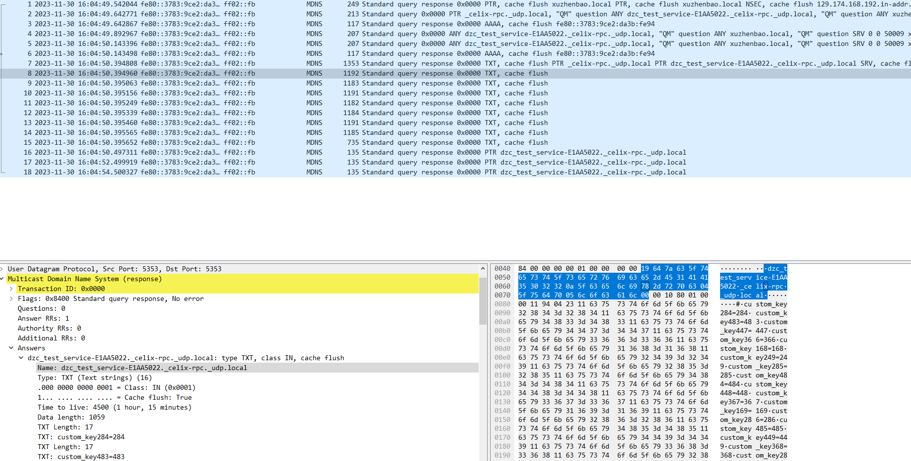

<!--
Licensed to the Apache Software Foundation (ASF) under one or more
contributor license agreements.  See the NOTICE file distributed with
this work for additional information regarding copyright ownership.
The ASF licenses this file to You under the Apache License, Version 2.0
(the "License"); you may not use this file except in compliance with
the License.  You may obtain a copy of the License at
   
    http://www.apache.org/licenses/LICENSE-2.0

Unless required by applicable law or agreed to in writing, software
distributed under the License is distributed on an "AS IS" BASIS,
WITHOUT WARRANTIES OR CONDITIONS OF ANY KIND, either express or implied.
See the License for the specific language governing permissions and
limitations under the License.
-->

## Discovery Zeroconf

The `Discovery_zeroconf` is implemented based on [Bonjour](https://github.com/apple-oss-distributions/mDNSResponder), and its operation depends on the mDNS daemon.

The mapping between celix and mdns services is as follows:

| **mDNS service** | **celix service**             |
|------------------|-------------------------------|
| instance name    | service name+pid(process id)  |
| service type     | "${last word of service configuration type}._sub._celix-rpc._udp"|
| domain name      | "local"                       |
| txt record       | service properties            |
| host             | hostname of OS(It can be got by gethostname function).|
| port             | The property value of "celix.rsa.port". It is set by RSA. If it is not network server, Discovery will set a dummy value(65535) to mDNS daemon.|

The domain name value is set to "local" , because for remote discovery the mDNS query will only use link-local multicast.

For readability and debuggability of instance names, we set the instance name of the mDNS service as `service_name + pid(process id)`. If there is a conflict in the instance name of same process, we will add a conflict number to the end of the instance name, because the mDNS daemon thinks that services with the same instance name on the same host are the same service. If there is a conflict in the instance name of different host, mDNS daemon will resolve it.

### Supported Platform
- Linux

### Conan Option
    build_rsa_discovery_zeroconf=True   Default is False

### CMake Option
    RSA_DISCOVERY_ZEROCONF=ON           Default is OFF

### Software Design

#### The Remote Service Endpoint Announce Process

In the process of publishing remote service endpoints, `discovery_zeroconf` provides an `endpoint_listener_t` service, and sets the service property `DISCOVERY=true`. `topology_manager` updates service endpoint description to `discovery_zeroconf` by calling this service. At the same time, `discovery_zeroconf` establishes a domain socket connection with `mDNS_daemon`, and `discovery_zeroconf` publishes the service information to mDNS_daemon through this connection. Then, `mDNS_daemon` publishes the service information to other `mDNS_daemons`. The sequence diagram is as follows:

#### The Remote Service Endpoint Discovery Process

In the process of discovering remote service endpoints, discovery_zeroconf also establishes a domain socket connection with mDNS_daemon. discovery_zeroconf listens to remote endpoint information through this connection, and updates the listened remote endpoint information to topology_manager. The sequence diagram is as follows:

#### Lager txt record(service properties) process

According to [rfc6763](https://www.rfc-editor.org/rfc/rfc6763.txt) 6.1 and 6.2 section, DNS TXT record can be up to 65535 (0xFFFF) bytes long in mDNS message. and we should keep the size of the TXT record under 1300 bytes(allowing it to fit in a single 1500-byte Ethernet packet). Therefore, `Discovery_zeroconf` announce celix service endpoint using multiple txt records and each txt record max size is 1300 bytes. When the service with large properties,the `Discovery_zeroconf` will split the properties into multiple txt records, and mDNS daemon send them to the remote mDNS daemon. The mDNS message snapshot of wireshark is as follows:

As in the above figure, the mDNS message contains multiple txt records, and each txt record message contains the same service instance name, but the service properties in the txt record are different. In addition, to avoid mDNS message packet loss, we set a specific service property `DZC_SVC_PROPS_SIZE_KEY`, which indicates the size of the service properties. When the number of txt records received by remote `Discovery_zeroconf` is equal to the number indicated by `DZC_SVC_PROPS_SIZE_KEY`, the remote `Discovery_zeroconf` will combine the txt records into a service properties.

### Example

See the cmake target `remote-services-zeroconf-server` and `remote-services-zeroconf-client`.

**Notes:** Before running the example, you should start the mDNS daemon first.You can get the mDNS daemon from bonjour project.
