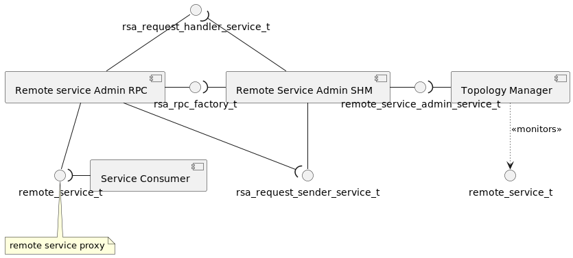

<!--
Licensed to the Apache Software Foundation (ASF) under one or more
contributor license agreements.  See the NOTICE file distributed with
this work for additional information regarding copyright ownership.
The ASF licenses this file to You under the Apache License, Version 2.0
(the "License"); you may not use this file except in compliance with
the License.  You may obtain a copy of the License at
   
    http://www.apache.org/licenses/LICENSE-2.0

Unless required by applicable law or agreed to in writing, software
distributed under the License is distributed on an "AS IS" BASIS,
WITHOUT WARRANTIES OR CONDITIONS OF ANY KIND, either express or implied.
See the License for the specific language governing permissions and
limitations under the License.
-->

## Remote Service Admin SHM

The Celix Remote Service Admin SHM bundle implement OSGi remote service using shared memory.
In order to reuse the (de)serialization features of remote service admin,
the remote service admin will be realized by ‘rsa_shm’ and 'rsa_json_rpc'(see [Remote Service Admin RPC Using JSON](../rsa_rpc_json/README.md)) bundles.
The ‘rsa_shm’ bundle is used to realize ‘remote_service_admin_service_t’ and IPC.
The ‘rsa_json_rpc’ bundle is used to realize (de)serialization and creating service endpoint/proxy.

### Supported Platform
- Linux

### Properties/Configuration

| **Properties**                             | **Type** | **Description**| **Default value** |
|--------------------------------------------|----------|----------------|------------------|
| **CELIX_RSA_SHM_POOL_SIZE**                | long     | The RSA SHM pool size in bytes. Its value should be greater than or equal to 8192 bytes.| 256KB            |
| **CELIX_RSA_SHM_MSG_TIMEOUT**                    | long     | The timeout of remote service invocation in seconds. | default 30s      |
| **CELIX_RSA_SHM_MAX_CONCURRENT_INVOCATIONS_NUM** | long     | The maximum concurrent invocations of the same service. If there are more concurrent invocations than its value,  service invocation will fail.| 32       |

The value of RSA_SHM_POOL_SIZE should be greater than or equal to 8192 bytes, because current memory pool ctrl block(control_t) size is 6536 bytes.

### Supported service.exported.configs

- **celix.remote.admin.shm** : The IPC type is shared memory, and the default serialization type is json. And remote service can use `celix.remote.admin.shm.rpc_type` property to configure the serialization type(Current only implement json serialization in celix project).The value of `celix.remote.admin.shm.rpc_type` property should be equal to the value of `celix.remote.admin.rpc_type` property of `rsa_rpc_factory_t`.

### Conan Option
    build_rsa_remote_service_admin_shm_v2=True   Default is False

### CMake Option
    RSA_REMOTE_SERVICE_ADMIN_SHM_V2=ON           Default is OFF

### Software Design

#### The Relationship Between RSA_SHM And Other RSA Bundles

If you need to complete a remote procedure call, multiple different bundles need to work together, as shown in the figure below:

RSA_SHM (Remote Service Admin SHM) has implemented data transmission based on shared memory, and provides a remote service admin service (`remote_service_admin_service_t`), and a remote request sending service (`rsa_request_sender_service_t`).

RSA_RPC (Remote Service Admin RPC) implements the serialization and deserialization for interactive data, and provides an endpoint/proxy factory service (`rsa_rpc_factory_t`) of remote service, as well as a remote request handler service (`rsa_request_handler_service_t`).

During imports/exports remote services, the topology manager imports/exports the remote service endpoint by `remote_service_admin_service_t`. At the same time, RSA_SHM creates a remote service proxy/endpoint by `rsa_rpc_factory_t`.

When a remote procedure call occurs, the remote service proxy use `rsa_request_sender_service_t` to send the request to the remote service endpoint. And the remote service endpoint uses `rsa_request_handler_service_t` to convert the request into a local service call.

#### The Remote Service Invocation Sequence

When the user uses the remote service, the user directly calls the proxy service. The proxy service will send the request to the remote service endpoint via shared memory. The remote service endpoint will convert the request into a local service call. The sequence diagram for remote invocation is as follows:

#### The Shared Memory Communication Sequence

In order to dynamically allocate shared memory only on the client.
The client will transmit the shared memory id and shared memory offset to the server
using a domain datagram socket. And response will reuse the shared memory of request.

### Example

See the cmake target `remote-services-shm-server` and `remote-services-shm-client`.
