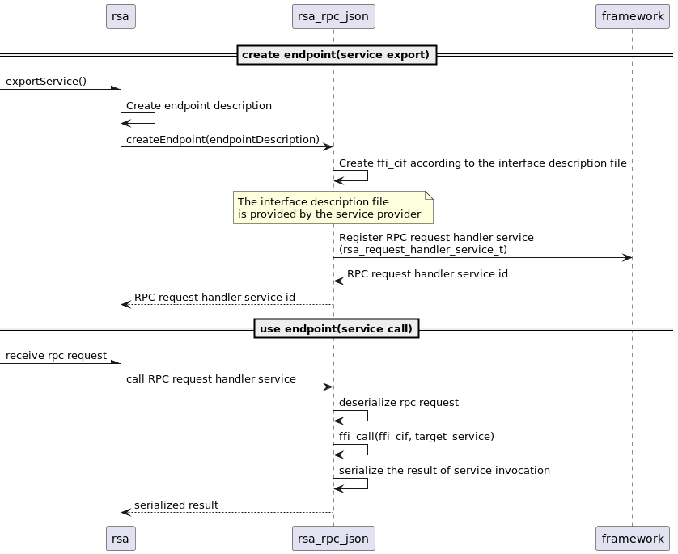

<!--
Licensed to the Apache Software Foundation (ASF) under one or more
contributor license agreements.  See the NOTICE file distributed with
this work for additional information regarding copyright ownership.
The ASF licenses this file to You under the Apache License, Version 2.0
(the "License"); you may not use this file except in compliance with
the License.  You may obtain a copy of the License at
   
    http://www.apache.org/licenses/LICENSE-2.0

Unless required by applicable law or agreed to in writing, software
distributed under the License is distributed on an "AS IS" BASIS,
WITHOUT WARRANTIES OR CONDITIONS OF ANY KIND, either express or implied.
See the License for the specific language governing permissions and
limitations under the License.
-->

## Remote Service Admin RPC Using JSON

Remote service admin RPC does not appear in the OSGI standard document. It is an extraction of the serialization/deserialization functionality from remote service admin. It is part of the remote service admin feature.

`rsa_json_rpc` is a serialization implementation based on [JSON representation](https://amdatu.atlassian.net/wiki/spaces/AMDATUDEV/pages/21954571/Amdatu+Remote#AmdatuRemote-AdminHTTP%2FJson). It uses `libdfi` to convert function invocation information into JSON messages. The interface description is configured through the description file in the interface consumer/provider. See the [libdfi documentation](../../../libs/dfi/README.md) for the interface description file.

### Supported Platform
- Linux

### Properties/Configuration

| **Properties** | **Type** | **Description**|
|----------------|----------|----------------|
| **RSA_JSON_RPC_LOG_CALLS**| bool | If set to true, the RSA will Log calls info to the file in RSA_JSON_RPC_LOG_CALLS_FILE. Default is false. |
| **RSA_JSON_RPC_LOG_CALLS_FILE**| string | Log file. If RSA_JSON_RPC_LOG_CALLS is enabled, the service calls info will be writen to the file(If restart this bundle, it will truncate file). Default is stdout. |

### Conan Option
    build_rsa_json_rpc=True   Default is False

### CMake Option
    RSA_JSON_RPC=ON           Default is OFF

### Software Design

The implementation of `rsa_json_rpc` includes two parts: 1. Creation of remote service endpoints; 2. Creation of remote service proxies

- Remote service endpoint: It receives remote JSON_RPC requests and calls the corresponding service instances.
- Remote service proxy: It provides proxy services and serializes service call information (method name, arguments,...) into JSON_RPC requests.

#### The Process Of Creating And Using A Remote Endpoint

When a service is exported, RSA can use rsa_json_rpc to create a service endpoint. When a service is called, the service endpoint calls the corresponding service instance after the RPC request is deserialized. The detailed process is as follows diagram:

#### The Process Of Creating And Using A Remote Proxy

When a service is imported, RSA can use rsa_json_rpc to create a proxy service factory. When a service is requested, the proxy service factory creates the proxy service and gives it to the service requester. Then, when the requested service is called (i.e. the service proxy is called), the service proxy serializes the service call information into an RPC request. And the RPC request will be sent to remote endpoint by RSA. The detailed process is as follows diagram:

In the above process, each consumer of the remote service will have a different service proxy, because the service proxy needs to use the interface description file in the consumer (which may be a bundle) to serialize the service call information.

### Example

See the cmake target `remote-services-shm-server` and `remote-services-shm-client`.