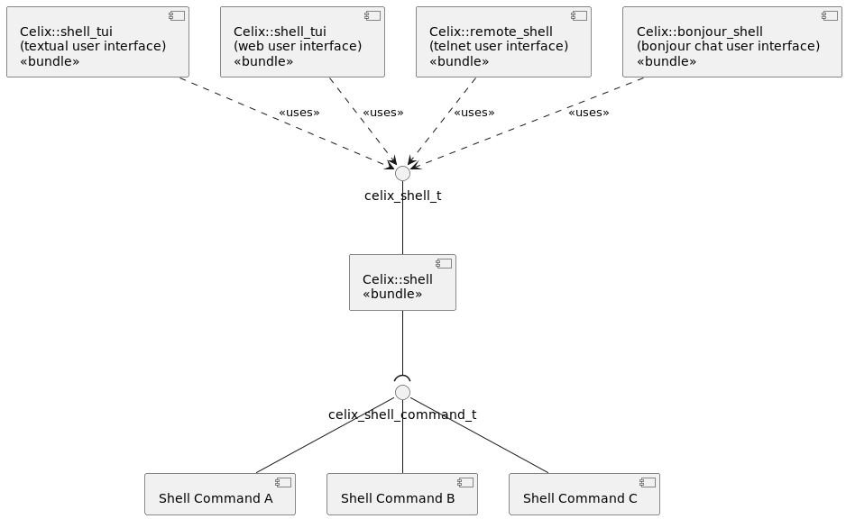
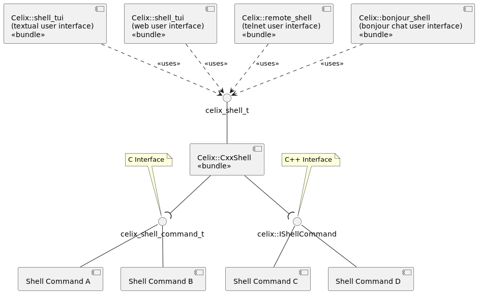

<!--
Licensed to the Apache Software Foundation (ASF) under one or more
contributor license agreements.  See the NOTICE file distributed with
this work for additional information regarding copyright ownership.
The ASF licenses this file to You under the Apache License, Version 2.0
(the "License"); you may not use this file except in compliance with
the License.  You may obtain a copy of the License at
   
    http://www.apache.org/licenses/LICENSE-2.0

Unless required by applicable law or agreed to in writing, software
distributed under the License is distributed on an "AS IS" BASIS,
WITHOUT WARRANTIES OR CONDITIONS OF ANY KIND, either express or implied.
See the License for the specific language governing permissions and
limitations under the License.
-->

# Intro
The Celix Shell provides a service interface which can be used to interact with the Celix framework. It uses a modular
approach to enable multiple frontends, e.g. textual or graphical.

While the shell can be extended with additional commands by other bundles, it already offers some built in commands,
for example:
 - `lb`: list bundles
 - `install`: install additional bundle 
 - `uninstall`: uninstall bundles
 - `start`: start bundle
 - `stop`: stop bundle
 - `help`: displays available commands

Further information about a command can be retrieved by using `help` combined with the command.

# Service interfaces
The Celix Shell functionality is achieved by 3 service interfaces. These interfaces are available through the 
`Celix::shel_api` CMake INTERFACE library target. 

- `celix_shell_t`: The shell service can be used to get an overview of the available shell commands and to execute
   shell commands.
- `celix_shell_command_t`: A C service interface to provide an additional shell command to the shell. 
- `celix::IShellCommand`: A C++ service interface to provide an additional shell command to the shell.

# Bundles
The complete Celix shell functionality is provided by serveral bundles:
 - `Celix::shell` : The core shell which offer a `celix_shell_t` service and uses `celix_shell_command_t` services.
 - `Celix::CxxShell` : The core C++ shell which offers a `celix_shell_t` service and uses both `celix_shell_command_t`
   and `celix::IShellCommand` services. Offers the same functionality as `Celix::shell`, but also supports C++
   `celix::IShellCommand` services.
 - `Celix::shell_tui` : Textual (terminal) user interface to the shell service. 
 - `Celix::shell_wui` : Web user interface to the shell service.
 - `Celix::remote_shell` : Remote telnet interface to shell service 
 - `Celix::bonjour_shell`: Chat interface to the shell service using bonjour. Warning not mature and still unstable. When used it should be possible to chat to a Celix shell using Linux's pidgin application or OSX's 
   Messages application.

## Logical Design Celix Shell

|

## Logical Design Celix Shell for C++

# CMake options

- BUILD_SHELL=ON
- BUILD_SHELL_TUI=ON
- BUILD_SHELL_WUI=ON
- BUILD_REMOTE_SHELL=ON

# Shell Config Options

- SHELL_USE_ANSI_COLORS - Configures whether shell commands are allowed to use
ANSI colors when printing info for `Celix::shell`. Default is true.
- SHELL_TUI_USE_ANSI_CONTROL_SEQUENCES - Configures whether to use ANSI control
  sequences to support backspace, left, up, etc key commands in the
  `Celix::shell_tui`. Default is true if a TERM environment is set else false.
- "remote.shell.telnet.port": Configures port used in `Celix::remote_shell`. Default is 6666.
- "remote.shell.telnet.maxconn": Configures max nr of concurrent connections in `Celix::remote_shell`. Default is 2.

# Using info

If the Celix Shell is installed, `find_package(Celix)` will set:
 - The `Celix::shell_api` interface (i.e. header only) library target
 - The `Celix::shell` bundle target

If the Celix Shell TUI is installed, `find_package(Celix)` will set:
- The `Celix::shell_tui` bundle target if the shell_tui is installed

If the Celix Shell WUI is installed, `find_package(Celix)` will set:
- The `Celix::shell_wui` bundle target if the shell_wui is installed