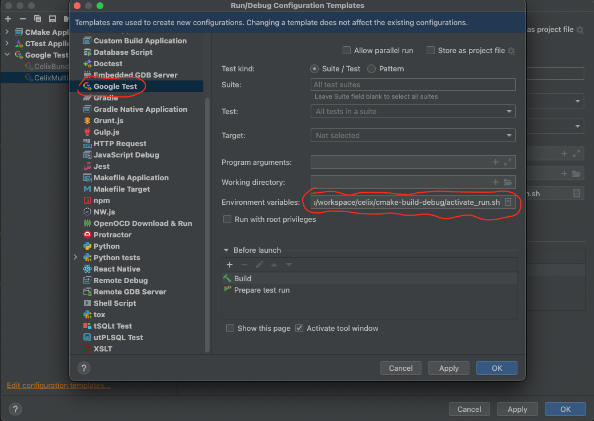

<!--
Licensed to the Apache Software Foundation (ASF) under one or more
contributor license agreements.  See the NOTICE file distributed with
this work for additional information regarding copyright ownership.
The ASF licenses this file to You under the Apache License, Version 2.0
(the "License"); you may not use this file except in compliance with
the License.  You may obtain a copy of the License at
   
    http://www.apache.org/licenses/LICENSE-2.0

Unless required by applicable law or agreed to in writing, software
distributed under the License is distributed on an "AS IS" BASIS,
WITHOUT WARRANTIES OR CONDITIONS OF ANY KIND, either express or implied.
See the License for the specific language governing permissions and
limitations under the License.
-->

# Building and Developing Apache Celix with CLion
Apache Celix can be build for development in CLion with use of the Conan package manager.
Conan will arrange the building of the Apache Celix dependencies and generate Find<package> files for these dependencies.

Conan will also generate a `conanrun.sh` and `deactivate_conanrun.sh` script that does the environment (de)setup for the 
binary locations of the build dependencies (i.e. configures `PATH` and `LD_LIBRARY_PATH`/`DYLD_LIBRARY_PATH`).

## Configuring CLion for C++17
C++ code in Celix is default configured for C++14. This is manually changed for C++17 libraries, bundles and test code
by updating the CMAKE_CXX_STANDARD var (`set(CMAKE_CXX_STANDARD 17`) in their respective CMakelists.txt files.

The downside is that CLion seems to only take into account the top level CMAKE_CXX_STANDARD value.
To ensure that CLion provides the right syntax support for C++17, add `-DCMAKE_CXX_STANDARD=17` to the `CMake Options`
in `File` -> `Settings` -> `Build, Execution, Deployment` -> `CMake`.

## Setting up the build directory
```shell
#clone git repo
git clone https://github.com/apache/celix.git
cd celix

#if needed setup conan default and debug profile
conan profile new default --detect
conan profile new debug --detect
conan profile update settings.build_type=Debug debug

# Generate and configure cmake-build-debug directory
# If CLion's CMake Preset Integration has been enabled, then CLion will load available CMake profiles 
# from the CMakeUserPresets.json file at the project root, which is generated by `conan install`.
conan install . celix/2.3.0 -pr:b default -pr:h debug -if cmake-build-debug/ -o celix:enable_testing=True -o celix:enable_address_sanitizer=True -o celix:build_all=True -b missing

#optional build
conan build . -bf cmake-build-debug/

#optional setup run env and run tests
cd cmake-build-debug
source conanrun.sh 
ctest --verbose
source deactivate_conanrun.sh 
```

## Configuring CLion
To ensure that all Conan build dependencies can be found the Run/Debug configurations of CLion needs te be updated.

This can be done under the menu "Run->Edit Configurations...", then select "Edit configuration templates..." and
then update the "Google Test" template so that the `conanrun.sh` Conan generated script is sourced in the 
"Environment variables" entry. 

If the Apache Celix CMake build directory is `home/joe/workspace/celix/cmake-build-debug` then the value for 
"Environment variables" should be: `source /home/joe/workspace/celix/cmake-build-debug/conanrun.sh`


