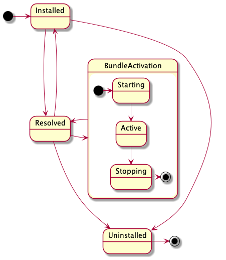

<!--
Licensed to the Apache Software Foundation (ASF) under one or more
contributor license agreements.  See the NOTICE file distributed with
this work for additional information regarding copyright ownership.
The ASF licenses this file to You under the Apache License, Version 2.0
(the "License"); you may not use this file except in compliance with
the License.  You may obtain a copy of the License at
   
    http://www.apache.org/licenses/LICENSE-2.0

Unless required by applicable law or agreed to in writing, software
distributed under the License is distributed on an "AS IS" BASIS,
WITHOUT WARRANTIES OR CONDITIONS OF ANY KIND, either express or implied.
See the License for the specific language governing permissions and
limitations under the License.
-->

# Apache Celix Bundles
An Apache Celix Bundle contains a collection of shared libraries, configuration files and optional
an activation entry combined in a zip file. Bundles can be dynamically installed and started in an Apache Celix framework.

## The anatomy of a Celix Bundle
Technically, an Apache Celix Bundle is a zip file with the following content:

- META-INF/MANIFEST.json: The required bundle manifest, containing information about the bundle (name, activator library etc)
- Bundle shared libraries (so/dylib files): Optionally, a bundle has 1 or more shared libraries.
  The bundle manifest configures which libraries will be loaded (private libs) and which - if any - library is used
  when activating the bundle.
- Bundle resource files: A bundle can also contain additional resource files. 
  This could be configuration files, html files, etc.  
  It is also possible to have bundles which no shared library, but only resource files.
  Note that bundles can access other bundles resources files.

If a `jar` command is available the Celix CMake commands will use that (instead of the `zip` command) to create bundle
zip files.

```bash
#unpacking celix_shell_wui.zip bundle file from a cmake build `cmake-build-debug`.
#The celix_shell_wui.zip file is the Celix Shell Web UI bundle. Which provides a web ui interface to the Celix 
#interactive shell; It contains a manifest file, shared libraries, and additional web resources 
#which can be picked up by the `Celix::http_admin` bundle. 
% unzip cmake-build-debug/bundles/shell/shell_wui/celix_shell_wui.zip -d unpacked_bundle_dir 
% find unpacked_bundle_dir 
unpacked_bundle_dir
unpacked_bundle_dir/resources
unpacked_bundle_dir/resources/index.html
unpacked_bundle_dir/resources/ansi_up.js
unpacked_bundle_dir/resources/script.js
unpacked_bundle_dir/META-INF
unpacked_bundle_dir/META-INF/MANIFEST.json
unpacked_bundle_dir/libcivetweb_shared.so #or dylib for OSX
unpacked_bundle_dir/libshell_wui.1.so #or dylib for OSX    
```

## Bundle lifecycle
An Apache Celix Bundle has its own lifecycle with the following states:

- Installed - The bundle has been installed into the Celix framework, but it is not yet resolved. For Celix this 
  currently means that not all bundle libraries can or have been loaded. 
- Resolved - The bundle is installed and its requirements have been met. For Celix this currently means that the
  bundle libraries have been loaded. 
- Starting - Starting is a temporary state while the bundle activator's create and start callbacks are being executed.
- Active - The bundle is active. 
- Stopping - Stopping is a temporary state while the bundle activator stop and destroy callbacks are being executed. 
- Uninstalled - The bundle has been removed from the Celix framework. 



## Bundle activation
Bundles can be installed and started dynamically. When a bundle is started it will be activated by looking up the bundle
activator entry points (using `dlsym`). The entry points signatures are:
- `celix_status_t celix_bundleActivator_create(celix_bundle_context_t *ctx, void **userData)`: 
   Called to create the bundle activator.
- `celix_status_t celix_bundleActivator_start(void *userData, celix_bundle_context_t *ctx)`: 
   Called to start the bundle.
- `celix_status_t celix_bundleActivator_stop(void *userData, celix_bundle_context_t *ctx)`: 
   Called to stop the bundle.
- `celix_status_t celix_bundleActivator_destroy(void *userData, celix_bundle_context_t* ctx)`: 
   Called to destroy (free mem) the bundle activator.

The most convenient way to create a bundle activator in C is to use the macro `CELIX_GEN_BUNDLE_ACTIVATOR` defined in
`celix_bundle_activator.h`. This macro requires two functions (start,stop), these function can be `static` and
use a typed bundle activator struct instead of `void*`.

For C++, the macro `CELIX_GEN_CXX_BUNDLE_ACTIVATOR` defined in `celix/BundleActivator.h` must be used to create a
bundle activator. For C++ a RAII approach is used for bundle activation.
This means that a C++ bundle is started by creating a bundle activator object and stopped by
letting the bundle activator object go out of scope.

## Bundle and Bundle Context

A bundle can interact with the Apache Celix framework using a bundle execution context or bundle context in short.
The bundle context provides functions/methods to:
 - Register and un-register services. 
 - Install, start, stop or uninstall bundles.
 - Track for service being added or removed.
 - Track for bundles being installed, started, stopped or uninstalled.
 - Track for service tracker being started or stopped
 - Find service ids for a given filter.
 - Use services directly (without manually creating a service tracker).
 - Use bundles directly (without manually creating a bundle tracker).
 - Wait for events in the Apache Celix event thread.
 - Retrieve framework property values. 
 - Retrieve the bundle object associated with the bundle context. 
 
## Hello World Bundle Example
The hello world bundle example is a simple example which print a "Hello world" and "Goodbye world" line when
starting / stopping the bundle.

Knowledge about C, C++ and CMake is expected to understand the examples.

The C and C++ examples exists of a single source file which contains the bundle activator and some Apache Celix 
CMake commands to create a bundle and a container.

Both containers example uses 3 bundles: the Apache Celix Shell bundle, the Apache Celix Shell Textual UI bundle 
and the Hello World bundle. The Apache Celix Shell bundle provides a set of interactive shell commands and the
Apache Celix Shell Textual UI bundle can be used to run these command from a console terminal. 

When the C or C++ Hello World bundle example container is started, the following commands can be used to dynamically
stop and start the Hello World bundle.
```bash
stop 3 #Stopping the Hello World bundle. Note that the Hello World is the third bundle, so it will get a bundle id 3.
start 3 #Starting the Hello World bundle again.
uninstall 3 #Stoping and uninstalling the Hello World bundle.
stop 0 #stop the Apache Celix framework
```

The see what other Apache Celix shell commands are available run the `celix::help` command:
```bash
help #note can also be triggered with celix::help (the fully qualified command name). 
help celix::start 
help celix::lb
stop 0 #stop the Apache Celix framework
```

### C Example
```C
//src/my_bundle_activator.c
#include <stdio.h>
#include <celix_bundle_activator.h>

typedef struct my_bundle_activator_data {
    /*the hello world bundle activator struct is empty*/
} my_bundle_activator_data_t;

void myBundle_helloWorld(celix_bundle_context_t* ctx) {
    printf("Hello world from bundle with id %li\n", celix_bundleContext_getBundleId(ctx));
}

void myBundle_goodbyeWorld(celix_bundle_context_t* ctx) {
    printf("Goodbye world from bundle with id %li\n", celix_bundleContext_getBundleId(ctx));
}

static celix_status_t myBundle_start(my_bundle_activator_data_t *data CELIX_UNUSED, celix_bundle_context_t *ctx CELIX_UNUSED) {
    myBundle_helloWorld(ctx);
    return CELIX_SUCCESS;
}

static celix_status_t myBundle_stop(my_bundle_activator_data_t *data CELIX_UNUSED, celix_bundle_context_t *ctx CELIX_UNUSED) {
    myBundle_goodbyeWorld(ctx);
    return CELIX_SUCCESS;
}

CELIX_GEN_BUNDLE_ACTIVATOR(my_bundle_activator_data_t, myBundle_start, myBundle_stop)
```

```CMake
#CMakeLists.txt
find_package(Celix REQUIRED)

#With `make all`, `make celix-bundles` this bundle will be created at:
#  ${CMAKE_CURRENT_BINARY_DIR}/my_bundle.zip.
add_celix_bundle(my_bundle
    VERSION 1.0.0 
    SOURCES src/my_bundle_activator.c
)

#With `make all`, `make celix-containers` or `make my_container` this Apache Celix container executable will be created at:
# ${CMAKE_BINARY_DIR}/deploy/my_container/my_container
add_celix_container(my_container
    C
    BUNDLES
        Celix::shell
        Celix::shell_tui
        my_bundle
)
```

### C++ Example
```C++
//src/MyBundleActivator.cc
#include <iostream>
#include "celix/BundleActivator.h"

class MyBundleActivator {
public:
    explicit MyBundleActivator(const std::shared_ptr<celix::BundleContext>& ctx) {
        std::cout << "Hello world from bundle with id " << ctx->getBundleId() << std::endl;
    }

    ~MyBundleActivator() noexcept {
        std::cout << "Goodbye world" << std::endl;
    }
};

CELIX_GEN_CXX_BUNDLE_ACTIVATOR(MyBundleActivator)
```

```CMake
#CMakeLists.txt
find_package(Celix REQUIRED)

#With `make all`, `make celix-bundles` this bundle will be created at:
#  ${CMAKE_CURRENT_BINARY_DIR}/MyBundle.zip.
add_celix_bundle(MyBundle
    SOURCES src/MyBundleActivator.cc
)

#With `make all`, `make celix-containers` or `make MyContainer` this Apache Celix container executable will be created at:
# ${CMAKE_BINARY_DIR}/deploy/my_container/MyContainer
add_celix_container(MyContainer
    CXX
    BUNDLES
        Celix::ShellCxx
        Celix::shell_tui
        MyBundle
)
```

## Interaction between bundles
By design bundles cannot directly access the symbols of another bundle. Interaction between bundles must be done using
Apache Celix services. This means that unless functionality is provided by means of an Apache Celix service, 
bundle functionality is private to the bundle.
In Apache Celix symbols are kept private by loading bundle libraries locally (`dlopen` with `RTLD_LOCAL`). 

## Bundle symbol visibility
Since bundles are unable to directly access the symbols of another bundle, the default symbol visibility preset for the 
bundle activator library is set to hidden. To modify this, supply the `DO_NOT_CONFIGURE_SYMBOL_VISIBILITY` option within the 
`add_celix_bundle` CMake function call.

Hiding symbols for a bundle offers several advantages, including:

- Reduced bundle library size;
- Faster link-time and load-time;
- Lower memory usage;
- Enhanced optimization possibilities.

However, one drawback can be that debugging a bundle becomes more difficult, particularly when not using the -g 
compiler flag.

It's important to note that exporting service symbols isn't necessary when utilizing and invoking C and C++ services 
from another bundle. For C++, this only applies when the provided services are based on a C++ header-only interface, 
while for C, this is always the case since C service structs don't produce any symbols.

The bundle activator symbols (create, start, stop, and destroy) must be exported as they are invoked by the 
Apache Celix framework. For this reason, the bundle activator functions in `celix_bundle_activator.h` are marked for 
export.

### Example of disabling hiding of symbols for a bundle
```CMake
add_celix_bundle(my_bundle_do_not_hide_symbols
    VERSION 1.0.0
    SOURCES src/my_bundle_activator.c
    DO_NOT_CONFIGURE_SYMBOL_VISIBILITY
)
```

## Installing bundles
Apache Celix bundles can be installed on the system with the Apache Celix CMake command `install_celix_bundle`.
Bundles will be installed as zip files in the package (default the CMAKE_PROJECT_NAME) share directory 
(e.g `/use/share/celix/bundles`).

It is also possible to use Apache Celix bundles as CMake imported targets, but this requires a more complex 
CMake installation setup.

## Installing Apache Celix CMake targets
The `install_celix_targets` can be used to generate a CMake file with the imported Apache Celix Bundle CMake targets 
and this is ideally coupled with a CMake config file so that the bundles are made available when 
CMake's `find_package` is used.

Example:
```CMake
#Project setup
project(ExamplePackage C CXX)
find_package(Celix REQUIRED)

#Create bundles
add_celix_bundle(ExampleBundleA ...)
add_celix_bundle(ExampleBundleB ...)

#Install bundle zips
install_celix_bundle(ExampleBundleA EXPORT MyExport)
install_celix_bundle(ExampleBundleB EXPORT MyExport)
#install exported Apache Celix CMake targets
install_celix_targets(MyExport NAMESPACE ExamplePackage:: DESTINATION share/ExamplePackage/cmake FILE CelixTargets)

#Install Package CMake configuration
file(GENERATE OUTPUT ${CMAKE_BINARY_DIR}/ExamplePackageConfig.cmake CONTENT "
  # relative install dir from lib/CMake/ExamplePackage.
  get_filename_component(EXAMPLE_PACKAGE_REL_INSTALL_DIR "${CMAKE_CURRENT_LIST_FILE}" PATH)
  get_filename_component(EXAMPLE_PACKAGE_REL_INSTALL_DIR "${EXAMPLE_PACKAGE_REL_INSTALL_DIR}" PATH)
  get_filename_component(EXAMPLE_PACKAGE_REL_INSTALL_DIR "${EXAMPLE_PACKAGE_REL_INSTALL_DIR}" PATH)
  get_filename_component(EXAMPLE_PACKAGE_REL_INSTALL_DIR "${EXAMPLE_PACKAGE_REL_INSTALL_DIR}" PATH)
  include(${EXAMPLE_PACKAGE_REL_INSTALL_DIR}/share/celix/cmake/CelixTargets.cmake)
")

install(FILES
  ${CMAKE_BINARY_DIR}/ExamplePackageConfig.cmake
  DESTINATION ${CMAKE_INSTALL_LIBDIR}/cmake/ExamplePackage)
```

Downstream Usage Example:
```CMake 
project(UsageExample C CXX)
find_package(Celix REQUIRED)
find_package(ExamplePackage REQUIRED)
add_celix_container(test_container BUNDLES
  Celix::shell
  Celix::shell_tui
  ExamplePackage::ExampleBundleA
  ExamplePackage::ExampleBundleB
)
```

See [Apache Celix CMake Commands](cmake_commands/README.md) for more detailed information.

# The `celix::lb` shell command
To interactively see the installed bundles the `celix::lb` shell command (list bundles) can be used.

Examples of supported `lb` command lines are:
 - `celix::lb` - Show an overview of the installed bundles with their bundle id, bundle state, bundle name and 
   bundle group.
 - `lb` - Same as `celix::lb` (as long as there is no colliding other `lb` commands). 
 - `lb -s` - Same as `celix::lb` but instead of showing the bundle name the bundle symbolic name is printed.
 - `lb -u` - Same as `celix::lb` but instead of showing the bundle name the bundle update location is printed.
