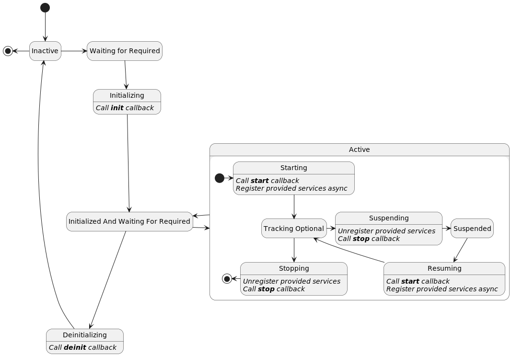

<!--
Licensed to the Apache Software Foundation (ASF) under one or more
contributor license agreements.  See the NOTICE file distributed with
this work for additional information regarding copyright ownership.
The ASF licenses this file to You under the Apache License, Version 2.0
(the "License"); you may not use this file except in compliance with
the License.  You may obtain a copy of the License at
   
    http://www.apache.org/licenses/LICENSE-2.0

Unless required by applicable law or agreed to in writing, software
distributed under the License is distributed on an "AS IS" BASIS,
WITHOUT WARRANTIES OR CONDITIONS OF ANY KIND, either express or implied.
See the License for the specific language governing permissions and
limitations under the License.
-->

# Apache Celix Components
In Apache Celix, components are plain old C/C++ objects (POCOs) managed by the Apache Celix Dependency Manager (DM).
Components can provide services and depend on services. Components are configured declarative using the DM api.

Service dependencies will influence the component's lifecycle as a component will only be active when all required
dependencies are available.   
The DM is responsible for managing the component's service dependencies, the component's lifecycle and when
to register/unregister the component's provided services.

Note that the Apache Celix Dependency Manager is inspired by the 
[Apache Felix Dependency Manager](http://felix.apache.org/documentation/subprojects/apache-felix-dependency-manager.html), 
adapted to Apache Celix and the C/C++ usage.

# Component Lifecycle
Each component has its own lifecycle.
A component's lifecycle state model is depicted in the state diagram below.



The DM can be used to configure a component's lifecycle callbacks, the following component's lifecycle callbacks can
be configured:

- `init`
- `start`
- `stop`
- `deinit`

These callbacks are used in the intermediate component's lifecycle states `Initializing`, `Starting`, `Suspending`, `Resuming`, `Stopping` and `Deinitializing` and the lifecycle callbacks are always called from the Celix event thread.

A component has the following lifecycle states:
- `Inactive`: The component is inactive and the DM is not managing the component yet.
- `Waiting For Required`: The component is waiting for required service dependencies.
- `Initializing`: The component has found its required dependencies and is initializing by
  calling the `init` callback.
- `Initialized And Waiting For Required`: The component has been initialized, but is waiting for required
  dependencies.
  _Note: that this can mean that:
    - During the `init` callback, 1 or more unavailable required service dependencies where added.
    - The component was active, but 1 or more required service dependency where removed and as result the
      component is not active anymore.
- `Starting`: The component has found its required dependencies and is starting by calling the `start` callback and
  registering the components provided services.
- `Tracking Optional`: The component has found its required dependencies and is started. It is still tracking for
  additional optional and required services.
- `Suspending`: The component has found its required dependencies, but is suspending to prepare for a service change by
  unregistering the components provided service and calling the `stop` callback.
- `Suspended`: The component has found its required dependencies and is suspended so that a service change can be
  processed.
- `Resuming`: The component has found its required dependencies, a service change has been processed, and it is
  resuming by calling the `start` callback and registering the components provided services.
- `Stopping`: The component has lost one or more of its required dependencies and is stopping by unregistering the
  components provided service and calling the `stop` callback.
- `Deinitializing`: The component is being removed and is deinitializing by calling the `deinit` callback.

## Component API

The DM Component C api can be found in the `celix_dm_component.h` header and the C++ api can be found in the
`celix/dm/Component.h` header.

## Example: Create and configure component's lifecycle callbacks in C
The following example shows how a simple component can be created and managed with the DM in C.
Because the component's lifecycle is managed by the DM, this also means that if configured correctly no additional
code is needed to remove and destroy the DM component and its implementation.

Remarks for the C example:
1. Although this is a C component. The simple component functions have been design for a component approach,
   using the component pointer as first argument.
2. The component implementation can be any POCO, as long as its lifecycle and destroy function signature follow a
   component approach: A single argument, with as type the component implementation pointer and an int return
   for the component lifecycle functions and a void return for the component destroy function.
3. Creates the DM component, but note that the DM component is not yet known to the DM. This makes it possible to
   first configure the DM component over multiple function calls, before adding it to the DM.
4. Configures the component implementation in the DM component, so that the implementation pointer can be used
   in the configured component callbacks.
5. Configures the component lifecycle callbacks to the DM Component. These callbacks should accept the component
   implementation as its only argument. The `CELIX_DM_COMPONENT_SET_CALLBACKS` marco is used instead of the
   `celix_dmComponent_setCallbacks` function so that the component implementation type can directly be used
   in the lifecycle callbacks (instead of `void*`).
6. Configures the component destroy implementation callback to the Dm Component. This callback will be called when
   the DM component is removed from the DM and has become inactive. The callback will be called from the Celix event
   thread. The advantages of configuring this callback is that the DM manages when the callback needs to be called;
   this removes some complexity for the users. The `CELIX_DM_COMPONENT_SET_IMPLEMENTATION_DESTROY_FUNCTION` marco
   is used instead of the `celix_dmComponent_setImplementationDestroyFunction` function so that the component
   implementation type can be directly used in the callback (instead of `void*`).
7. Adds the DM Component the DM and as result the DM will that point on manage the components' lifecycle, service
   dependencies and provided services.
8. No additional code is needed to clean up components and as such no activator stop callback function needs to be
   configured. The generated bundle activator will ensure that all components are removed from the DM when the
   bundle is stopped and the DM will ensure that the components are deactivated and destroyed correctly.

```C
//src/simple_component_activator.c
#include <stdio.h>
#include <celix_bundle_activator.h>
#include <celix_dm_component.h>

//********************* COMPONENT *******************************/

typedef struct simple_component {
    int transitionCount; //not protected, only updated and read in the celix event thread.
} simple_component_t;

static simple_component_t* simpleComponent_create() {
    simple_component_t* cmp = calloc(1, sizeof(*cmp));
    cmp->transitionCount = 1;
    return cmp;
}

static void simpleComponent_destroy(simple_component_t* cmp) {
    free(cmp);
}

static int simpleComponent_init(simple_component_t* cmp) { // <------------------------------------------------------<1>
    printf("Initializing simple component. Transition nr %i\n", cmp->transitionCount++);
    return 0;
}

static int simpleComponent_start(simple_component_t* cmp) {
    printf("Starting simple component. Transition nr %i\n", cmp->transitionCount++);
    return 0;
}

static int simpleComponent_stop(simple_component_t* cmp) {
    printf("Stopping simple component. Transition nr %i\n", cmp->transitionCount++);
    return 0;
}

static int simpleComponent_deinit(simple_component_t* cmp) {
    printf("De-initializing simple component. Transition nr %i\n", cmp->transitionCount++);
    return 0;
}


//********************* ACTIVATOR *******************************/

typedef struct simple_component_activator {
    //nop
} simple_component_activator_t;

static celix_status_t simpleComponentActivator_start(simple_component_activator_t *act, celix_bundle_context_t *ctx) {
    //creating component
    simple_component_t* impl = simpleComponent_create(); // <--------------------------------------------------------<2>

    //create and configuring component and its lifecycle callbacks using the Apache Celix Dependency Manager
    celix_dm_component_t* dmCmp = celix_dmComponent_create(ctx, "simple_component_1"); // <--------------------------<3>
    celix_dmComponent_setImplementation(dmCmp, impl); // <-----------------------------------------------------------<4>
    CELIX_DM_COMPONENT_SET_CALLBACKS(
            dmCmp,
            simple_component_t,
            simpleComponent_init,
            simpleComponent_start,
            simpleComponent_stop,
            simpleComponent_deinit); // <----------------------------------------------------------------------------<5>
    CELIX_DM_COMPONENT_SET_IMPLEMENTATION_DESTROY_FUNCTION(
            dmCmp,
            simple_component_t,
            simpleComponent_destroy); // <---------------------------------------------------------------------------<6>

    //Add dm component to the dm.
    celix_dependency_manager_t* dm = celix_bundleContext_getDependencyManager(ctx);
    celix_dependencyManager_add(dm, dmCmp); // <---------------------------------------------------------------------<7>
    return CELIX_SUCCESS;
}

CELIX_GEN_BUNDLE_ACTIVATOR(simple_component_activator_t, simpleComponentActivator_start, NULL) // <------------------<8>
```

## Example: Create and configure component's lifecycle callbacks in C++
The following example shows how a simple component can be created and managed with the DM in C++.
For C++ the DM will manage the component and also ensures that component implementation is kept in scope for as
long as the component is managed by the DM.

Remarks for the C++ example:
1. For C++ the DM can directly work on classes and as result lifecycle callback can be class methods.
2. Creates a component implementation using a unique_ptr.
3. Create a C++ DM Component and directly add it to the DM. For C++ DM Component needs to be "build" first, before the
   DM will manage them. This way C++ components can be build using a fluent api and marked complete with a `build()`
   method call.
   For a component implementation the DM accepts a unique_ptr, a shared_ptr, a value type or no implementation. If no
   implementation is provided the DM will create a component implementation using the template argument and
   assuming a default constructor (e.g. `ctx->getDependencyManager()->createComponent<CmpWithDefaultCTOR>()`).
4. Configures the component lifecycle callbacks as class methods. The DM will call these callbacks using the
   component implementation raw pointer as object instance (`this`).
5. "Builds" the component. C++ components will only be managed by the DM after they are build. This makes it possible
   to configure a component over multiple method calls before marking the component complete (build).
   The generated C++ bundle activator will also enable all components created during the bundle activation, this is
   done to ensure that the build behaviour is backwards compatible with previous released DM implementation.
   It is preferred that users explicitly build their components when they are completely configured.

```C++
//src/SimpleComponentActivator.cc
#include <celix/BundleActivator.h>

class SimpleComponent {
public:
    void init() { // <-----------------------------------------------------------------------------------------------<1>
        std::cout << "Initializing simple component. Transition nr " << transitionCount++ << std::endl;
    }

    void start() {
        std::cout << "starting simple component. Transition nr " << transitionCount++ << std::endl;
    }

    void stop() {
        std::cout << "Stopping simple component. Transition nr " << transitionCount++ << std::endl;
    }

    void deinit() {
        std::cout << "De-initializing simple component. Transition nr " << transitionCount++ << std::endl;
    }
private:
    int transitionCount = 1; //not protected, only updated and read in the celix event thread.
};

class SimpleComponentActivator {
public:
    explicit SimpleComponentActivator(const std::shared_ptr<celix::BundleContext>& ctx) {
        auto cmp = std::make_unique<SimpleComponent>(); // <---------------------------------------------------------<2>
        ctx->getDependencyManager()->createComponent(std::move(cmp), "SimpleComponent1") // <------------------------<3>
                .setCallbacks(
                        &SimpleComponent::init,
                        &SimpleComponent::start,
                        &SimpleComponent::stop,
                        &SimpleComponent::deinit) // <---------------------------------------------------------------<4>
                .build(); // <---------------------------------------------------------------------------------------<5>
    }
};

CELIX_GEN_CXX_BUNDLE_ACTIVATOR(SimpleComponentActivator)
```

# Component's Provided Services
Components can be configured to provide services. These provided services will result in service registrations
when a component is `Starting` or `Resuming` (i.e. when a component goes to the `Tracking Optional` state).

If a component provide services, these services will have an additional automatically added service property - named "component.uuid" - next to its configured provided service properties. The "component.uuid" service property can be
used to identify if a service is provided by a component and which component.

## Example: Component with a provided service in C
The following example shows how a component that provide a `celix_shell_command` service.

Remarks for the C example:
1. C services do not support inheritance. So even if a C component provides a certain service, it is not an
   instance of said service. This also means the C service struct provided by a component needs to be stored
   separately. In this example this is done storing the service struct in the bundle activator data. Note
   that the bundle activator data "outlives" the component, because all components are removed before a bundle
   is completely stopped.
2. Configures a provided service (interface) for the component. The service will not directly be registered, but
   instead will be registered in the component states `Starting` and `Resuming`.

```C
 //src/component_with_provided_service_activator.c
#include <stdlib.h>
#include <celix_bundle_activator.h>
#include <celix_shell_command.h>

//********************* COMPONENT *******************************/

typedef struct component_with_provided_service {
    int callCount; //atomic
} component_with_provided_service_t;

static component_with_provided_service_t* componentWithProvidedService_create() {
    component_with_provided_service_t* cmp = calloc(1, sizeof(*cmp));
    return cmp;
}

static void componentWithProvidedService_destroy(component_with_provided_service_t* cmp) {
    free(cmp);
}

static bool componentWithProvidedService_executeCommand(
        component_with_provided_service_t *cmp,
        const char *commandLine,
        FILE *outStream,
        FILE *errorStream CELIX_UNUSED) {
    int count = __atomic_add_fetch(&cmp->callCount, 1, __ATOMIC_SEQ_CST);
    fprintf(outStream, "Hello from cmp. command called %i times. commandLine: %s\n", count, commandLine);
    return true;
}

//********************* ACTIVATOR *******************************/

typedef struct component_with_provided_service_activator {
    celix_shell_command_t shellCmd; // <-----------------------------------------------------------------------------<1>
} component_with_provided_service_activator_t;

static celix_status_t componentWithProvidedServiceActivator_start(component_with_provided_service_activator_t *act, celix_bundle_context_t *ctx) {
    //creating component
    component_with_provided_service_t* impl = componentWithProvidedService_create();

    //create and configuring component and its lifecycle callbacks using the Apache Celix Dependency Manager
    celix_dm_component_t* dmCmp = celix_dmComponent_create(ctx, "component_with_provided_service_1");
    celix_dmComponent_setImplementation(dmCmp, impl);
    CELIX_DM_COMPONENT_SET_IMPLEMENTATION_DESTROY_FUNCTION(
            dmCmp,
            component_with_provided_service_t,
            componentWithProvidedService_destroy);

    //configure provided service
    act->shellCmd.handle = impl;
    act->shellCmd.executeCommand = (void*)componentWithProvidedService_executeCommand;
    celix_properties_t* props = celix_properties_create();
    celix_properties_set(props, CELIX_SHELL_COMMAND_NAME, "hello_component");
    celix_dmComponent_addInterface(
            dmCmp,
            CELIX_SHELL_COMMAND_SERVICE_NAME,
            CELIX_SHELL_COMMAND_SERVICE_VERSION,
            &act->shellCmd,
            props); // <---------------------------------------------------------------------------------------------<2>


    //Add dm component to the dm.
    celix_dependency_manager_t* dm = celix_bundleContext_getDependencyManager(ctx);
    celix_dependencyManager_add(dm, dmCmp);
    return CELIX_SUCCESS;
}

CELIX_GEN_BUNDLE_ACTIVATOR(
        component_with_provided_service_activator_t,
        componentWithProvidedServiceActivator_start,
        NULL)
```

## Example: Component with a provided service in C++
The following example shows how a C++ component that provide a C++ `celix::IShellCommand` service
and a C `celix_shell_command` service. For a C++ component it's possible to provide C and C++ services.

Remarks for the C++ example:
1. If a component provides a C++ services, it also expected that the component implementation inherits the service
   interface.
2. The overridden `executeCommand` method of `celix::IShellCommand`.
3. Methods of C service interfaces can be implemented as class methods, but the bundle activator should ensure that
   the underlining C service interface structs are assigned with compatible C function pointers.
4. Creating a component using only a template argument. The DM will construct - using a default constructor - a
   component implementation instance.
5. Configures the component to provide a C++ `celix::IShellCommand` service. Note that because the component
   implementation is an instance of `celix::IShellCommand` no additional storage is needed. The service will not
   directly be registered, but instead will be registered in the components states `Starting` and `Resuming`.
6. Set the C `executeCommand` function pointer of the `celix_shell_command_t` service interface struct to a
   capture-less lambda expression. The lambda expression is used to forward the call to the `executeCCommand`
   class method. Note the capture-less lambda expression can decay to C-style function pointers.
7. Configures the component to provide a C `celix_shell_command_t` service. Note that for a C service, the
   `createUnassociatedProvidedService` must be used, because the component does not inherit `celix_shell_command_t`.
   The service will not directly be registered, but instead will be registered in the component states `Starting` and
   `Resuming`.
8. "Build" the component so the DM will manage the component.


```C++
//src/ComponentWithProvidedServiceActivator.cc
#include <celix/BundleActivator.h>
#include <celix/IShellCommand.h>
#include <celix_shell_command.h>

class ComponentWithProvidedService : public celix::IShellCommand { // <----------------------------------------------<1>
public:
    ~ComponentWithProvidedService() noexcept override = default;

    void executeCommand(
            const std::string& commandLine,
            const std::vector<std::string>& /*commandArgs*/,
            FILE* outStream,
            FILE* /*errorStream*/) override {
        fprintf(outStream, "Hello from cmp. C++ command called %i times. commandLine is %s\n", 
                cxxCallCount++, commandLine.c_str());
    } // <-----------------------------------------------------------------------------------------------------------<2>

    void executeCCommand(const char* commandLine, FILE* outStream) {
        fprintf(outStream, "Hello from cmp. C command called %i times. commandLine is %s\n", cCallCount++, commandLine);
    } // <-----------------------------------------------------------------------------------------------------------<3>
private:
    std::atomic<int> cxxCallCount{1};
    std::atomic<int> cCallCount{1};
};

class ComponentWithProvidedServiceActivator {
public:
    explicit ComponentWithProvidedServiceActivator(const std::shared_ptr<celix::BundleContext>& ctx) {
        auto& cmp = ctx->getDependencyManager()->createComponent<ComponentWithProvidedService>(); // <---------------<4>

        cmp.createProvidedService<celix::IShellCommand>()
                .addProperty(celix::IShellCommand::COMMAND_NAME, "HelloComponent"); // <-----------------------------<5>

        auto shellCmd = std::make_shared<celix_shell_command_t>();
        shellCmd->handle = static_cast<void*>(&cmp.getInstance());
        shellCmd->executeCommand = [](void* handle, const char* commandLine, FILE* outStream, FILE*) -> bool {
            auto* impl = static_cast<ComponentWithProvidedService*>(handle);
            impl->executeCCommand(commandLine, outStream);
            return true;
        }; // <------------------------------------------------------------------------------------------------------<6>

        cmp.createUnassociatedProvidedService(std::move(shellCmd), CELIX_SHELL_COMMAND_SERVICE_NAME)
                .addProperty(CELIX_SHELL_COMMAND_NAME, "hello_component"); // < -------------------------------------<7>

        cmp.build(); // <--------------------------------------------------------------------------------------------<8>
    }
private:
};

CELIX_GEN_CXX_BUNDLE_ACTIVATOR(ComponentWithProvidedServiceActivator)
```

# Component's Service Dependencies
Components can be configured to have service dependencies. These service dependencies will influence the component's
lifecycle. Components can have optional and required service dependencies. When service dependencies are required the
component can only be active if all required dependencies are available; where available means at least 1 matching
service dependency is found.

When configuring service dependencies, callbacks can be configured for handling services that are being added,
removed or for when a new highest ranking service is available.

Service dependency callbacks can be configured with 3 different types of argument signatures:
- A single argument for the service pointer (raw pointer or shared_ptr);
- A service pointer (raw pointer or shared_ptr) as first argument and the service properties as second argument.
- A service pointer (raw pointer or shared_ptr) as first argument, the service properties as second argument and
  the bundle providing the service as third argument.

Service dependency callbacks will always be called from the Celix event thread.

A service change (injection/removal) can be handled by the component using a Locking-strategy or a suspend-strategy.
This strategy can be configured per service dependency and expect the following behaviour from the component
implementation:
- Locking-strategy: The component implementation must ensure that the stored service pointers (and if applicable the
  service properties and its bundle) are protected using a locking mechanism (e.g. a mutex).
  This should ensure that services are no longer in use after they are removed (or replaced) from a component and
  thus can be safely deleted from memory.
- Suspend-strategy: The DM will ensure that before service dependency callbacks are called, all provided services
  are (temporary) unregistered and the component is suspended (using the components' `stop` callback). This should mean
  that there are no active users - through the provided services or active threads - of the service dependencies
  anymore and that service changes can safely be handling without locking. The component implementation must ensure
  that after a `stop` callback there are no active threads, thread pools, timers, etc - that use service dependencies -
  are active anymore.

## Example: Component with a service dependencies in C
The following example shows how a C component that has two service dependency on the `celix_shell_command_t` service.

One service dependency is a required dependency with a suspend-strategy and uses a `set ` callback which ensure
that a single service is injected and that is always the highest ranking service. Note that the highest ranking
service can be `NULL` if there are no other matching services.

The other dependency is an optional dependency with a locking-strategy and uses a `addWithProps` and
`removeWithProps` callback. These callbacks will be called for every `celix_shell_command_t` service being added/removed
and will be called with not only the service pointer, but also the service properties.

Remarks for the C example:
1. Creates a mutex to protect the `cmdShells` field which is configured with a locking-strategy service dependency.
2. Updates the `highestRankingCmdShell` field without locking. Note that because the service dependency is
   configured with a suspend-strategy the `componentWithServiceDependency_setHighestRankingShellCommand` function
   will only be called when the component is in the `Suspended` state or when it is not in the `Active` compound state.
3. Locks the mutex and adds the newly added service to the `cmdShells` list. Note that because the service dependency
   is configured with a locking-strategy the `componentWithServiceDependency_addShellCommand` and
   `componentWithServiceDependency_removeShellCommand` functions can be called from any component lifecycle state.
4. Creates a new DM service dependency object. Note that the DM service dependency is not yet known to the DM Component.
5. Configures for which service name the service dependency will track services for. Optionally it is also possible
   to fine tune the tracked service by providing a service version range and/or service filter.
6. Configures the update strategy for the service dependency to suspend-strategy.
7. Configures the service dependency as a required service dependency.
8. Creates an empty service dependency callback options struct. This struct can be used to configure different
   service dependency callbacks.
9. Configures the `set` service dependency callback to `componentWithServiceDependency_setHighestRankingShellCommand`
10. Configures the dependency manager to use the callbacks configures in opts.
11. Adds the DM service dependency object to the DM component object.
12. Configures the update strategy for the service dependency to locking-strategy.
13. Configures the service dependency as an optional service dependency.
14. Configures the `addWithProps` service dependency callback to `componentWithServiceDependency_addShellCommand`.

```C
//src/component_with_service_dependency_activator.c
#include <stdlib.h>
#include <celix_bundle_activator.h>
#include <celix_shell_command.h>

//********************* COMPONENT *******************************/

typedef struct component_with_service_dependency {
    celix_shell_command_t* highestRankingCmdShell; //only updated when component is not active or suspended
    celix_thread_mutex_t mutex; //protects cmdShells
    celix_array_list_t* cmdShells;
} component_with_service_dependency_t;

static component_with_service_dependency_t* componentWithServiceDependency_create() {
    component_with_service_dependency_t* cmp = calloc(1, sizeof(*cmp));
    celixThreadMutex_create(&cmp->mutex, NULL); // <-----------------------------------------------------------------<1>
    cmp->cmdShells = celix_arrayList_createPointerArray();
    return cmp;
}

static void componentWithServiceDependency_destroy(component_with_service_dependency_t* cmp) {
    celix_arrayList_destroy(cmp->cmdShells);
    celixThreadMutex_destroy(&cmp->mutex);
    free(cmp);
}

static void componentWithServiceDependency_setHighestRankingShellCommand(
        component_with_service_dependency_t* cmp,
        celix_shell_command_t* shellCmd) {
    printf("New highest ranking service (can be NULL): %p\n", shellCmd);
    cmp->highestRankingCmdShell = shellCmd; // <---------------------------------------------------------------------<2>
}

static void componentWithServiceDependency_addShellCommand(
        component_with_service_dependency_t* cmp,
        celix_shell_command_t* shellCmd,
        const celix_properties_t* props) {
    long id = celix_properties_getAsLong(props, CELIX_FRAMEWORK_SERVICE_ID, -1);
    printf("Adding shell command service with service.id %li\n", id);
    celixThreadMutex_lock(&cmp->mutex); // <-------------------------------------------------------------------------<3>
    celix_arrayList_add(cmp->cmdShells, shellCmd);
    celixThreadMutex_unlock(&cmp->mutex);
}

static void componentWithServiceDependency_removeShellCommand(
        component_with_service_dependency_t* cmp,
        celix_shell_command_t* shellCmd,
        const celix_properties_t* props) {
    long id = celix_properties_getAsLong(props, CELIX_FRAMEWORK_SERVICE_ID, -1);
    printf("Removing shell command service with service.id %li\n", id);
    celixThreadMutex_lock(&cmp->mutex);
    celix_arrayList_remove(cmp->cmdShells, shellCmd);
    celixThreadMutex_unlock(&cmp->mutex);
}

//********************* ACTIVATOR *******************************/

typedef struct component_with_service_dependency_activator {
    //nop
} component_with_service_dependency_activator_t;

static celix_status_t componentWithServiceDependencyActivator_start(component_with_service_dependency_activator_t *act, celix_bundle_context_t *ctx) {
    //creating component
    component_with_service_dependency_t* impl = componentWithServiceDependency_create();

    //create and configuring component and its lifecycle callbacks using the Apache Celix Dependency Manager
    celix_dm_component_t* dmCmp = celix_dmComponent_create(ctx, "component_with_service_dependency_1");
    celix_dmComponent_setImplementation(dmCmp, impl);
    CELIX_DM_COMPONENT_SET_IMPLEMENTATION_DESTROY_FUNCTION(
            dmCmp,
            component_with_service_dependency_t,
            componentWithServiceDependency_destroy);

    //create mandatory service dependency with cardinality one and with a suspend-strategy
    celix_dm_service_dependency_t* dep1 = celix_dmServiceDependency_create(); // <-----------------------------------<4>
    celix_dmServiceDependency_setService(dep1, CELIX_SHELL_COMMAND_SERVICE_NAME, NULL, NULL); // <-------------------<5>
    celix_dmServiceDependency_setStrategy(dep1, DM_SERVICE_DEPENDENCY_STRATEGY_SUSPEND); // <------------------------<6>
    celix_dmServiceDependency_setRequired(dep1, true); // <----------------------------------------------------------<7>
    celix_dm_service_dependency_callback_options_t opts1 = CELIX_EMPTY_DM_SERVICE_DEPENDENCY_CALLBACK_OPTIONS; // <--<8>
    opts1.set = (void*)componentWithServiceDependency_setHighestRankingShellCommand; // <----------------------------<9>
    celix_dmServiceDependency_setCallbacksWithOptions(dep1, &opts1); // <-------------------------------------------<10>
    celix_dmComponent_addServiceDependency(dmCmp, dep1); // <-------------------------------------------------------<11>

    //create optional service dependency with cardinality many and with a locking-strategy
    celix_dm_service_dependency_t* dep2 = celix_dmServiceDependency_create();
    celix_dmServiceDependency_setService(dep2, CELIX_SHELL_COMMAND_SERVICE_NAME, NULL, NULL);
    celix_dmServiceDependency_setStrategy(dep2, DM_SERVICE_DEPENDENCY_STRATEGY_LOCKING);  // <----------------------<12>
    celix_dmServiceDependency_setRequired(dep2, false); // <--------------------------------------------------------<13>
    celix_dm_service_dependency_callback_options_t opts2 = CELIX_EMPTY_DM_SERVICE_DEPENDENCY_CALLBACK_OPTIONS;
    opts2.addWithProps = (void*)componentWithServiceDependency_addShellCommand;  // <-------------------------------<14>
    opts2.removeWithProps = (void*)componentWithServiceDependency_removeShellCommand;
    celix_dmServiceDependency_setCallbacksWithOptions(dep2, &opts2);
    celix_dmComponent_addServiceDependency(dmCmp, dep2);

    //Add dm component to the dm.
    celix_dependency_manager_t* dm = celix_bundleContext_getDependencyManager(ctx);
    celix_dependencyManager_add(dm, dmCmp);
    return CELIX_SUCCESS;
}

CELIX_GEN_BUNDLE_ACTIVATOR(
        component_with_service_dependency_activator_t,
        componentWithServiceDependencyActivator_start,
        NULL)
```

## Example: Component with a service dependencies in C++
The following example shows how a C++ component that has two service dependency. One
service dependency for the C++ `celix::IShellCommand` service and one for the C `celix_shell_command_t` service.

The `celix::IShellCommand` service dependency is a required dependency with a suspend-strategy and uses a
`set` callback which ensure that a single service is injected and that is always the highest ranking service.
Note that the highest ranking service can be an empty shared_ptr if there are no service.

The `celix_shell_command_t` service dependency is an optional dependency with a locking-strategy and uses a
`addWithProperties` and `removeWithProperties` callback.
These callbacks will be called for every `celix_shell_command_t` service being added/removed
and will be called with not only the service shared_ptr, but also the service properties.

Note that for C++ component service dependencies, there is no real different between a C++ or a C service dependency;
In both cases the service pointers are injected using shared_ptr and if applicable the service properties and
bundle argument are also provided as shared_ptr using the C++ `celix::Properties` and `celix::Bundle`.

Remarks for the C++ example:
1. Creates a mutex to protect the `shellCommands` field which is configured with a locking-strategy service dependency.
2. Updates the `highestRankingShellCmd` field without locking. Note that because the service dependency is
   configured with a suspend-strategy the `ComponentWithServiceDependency::setHighestRankingShellCommand` method
   will only be called when the component is in the `Suspended` state or when it is not in the `Active` compound state.
3. Locks the mutex and adds the newly added service to the `shellCommands` list. Note that because the service
   dependency is configured with a locking-strategy the `ComponentWithServiceDependency::addCShellCmd` and
   `ComponentWithServiceDependency::removeCShellCmd` methods can be called from any component lifecycle state.
4. Creates a new DM service dependency object, the service dependency is considered incomplete until the
   service dependency, component or DM is build. Note that the `celix::dm::Component::createServiceDependency` method
   is called without provided a service name, the service name will be inferred using the `celix::typeName`.
5. Configures the service dependency set callback.
6. Configures the service dependency as a required service dependency.
7. Configures the update strategy for the service dependency to suspend-strategy.
8. Creates another new DM service dependency object and in this case also explicitly provides the service name
   to use (`CELIX_SHELL_COMMAND_SERVICE_NAME`).
9. Builds the component and as result also builds the components' service dependencies (i.e. marking them as complete).

```C++
//src/ComponentWithServiceDependencyActivator.cc
#include <celix/BundleActivator.h>
#include <celix/IShellCommand.h>
#include <celix_shell_command.h>

class ComponentWithServiceDependency {
public:
    void setHighestRankingShellCommand(const std::shared_ptr<celix::IShellCommand>& cmdSvc) {
        std::cout << "New highest ranking service (can be NULL): " << (intptr_t)cmdSvc.get() << std::endl;
        highestRankingShellCmd = cmdSvc; // <------------------------------------------------------------------------<2>
    }

    void addCShellCmd(
            const std::shared_ptr<celix_shell_command_t>& cmdSvc,
            const std::shared_ptr<const celix::Properties>& props) {
        auto id = props->getAsLong(celix::SERVICE_ID, -1);
        std::cout << "Adding shell command service with service.id: " << id << std::endl;
        std::lock_guard lck{mutex}; // <-----------------------------------------------------------------------------<3>
        shellCommands.emplace(id, cmdSvc);
    }

    void removeCShellCmd(
            const std::shared_ptr<celix_shell_command_t>& /*cmdSvc*/,
            const std::shared_ptr<const celix::Properties>& props) {
        auto id = props->getAsLong(celix::SERVICE_ID, -1);
        std::cout << "Removing shell command service with service.id: " << id << std::endl;
        std::lock_guard lck{mutex};
        shellCommands.erase(id);
    }
private:
    std::shared_ptr<celix::IShellCommand> highestRankingShellCmd{};
    std::mutex mutex{}; //protect shellCommands // <-----------------------------------------------------------------<1>
    std::unordered_map<long, std::shared_ptr<celix_shell_command_t>> shellCommands{};
};

class ComponentWithServiceDependencyActivator {
public:
    explicit ComponentWithServiceDependencyActivator(const std::shared_ptr<celix::BundleContext>& ctx) {
        using Cmp = ComponentWithServiceDependency;
        auto& cmp = ctx->getDependencyManager()->createComponent<Cmp>(); 

        cmp.createServiceDependency<celix::IShellCommand>() // <-----------------------------------------------------<4>
                .setCallbacks(&Cmp::setHighestRankingShellCommand) // <----------------------------------------------<5>
                .setRequired(true) // <------------------------------------------------------------------------------<6>
                .setStrategy(DependencyUpdateStrategy::suspend); // <------------------------------------------------<7>

        cmp.createServiceDependency<celix_shell_command_t>(CELIX_SHELL_COMMAND_SERVICE_NAME) // <--------------------<8>
                .setCallbacks(&Cmp::addCShellCmd, &Cmp::removeCShellCmd) 
                .setRequired(false)
                .setStrategy(DependencyUpdateStrategy::locking);

        cmp.build(); // <--------------------------------------------------------------------------------------------<9>
    }
};

CELIX_GEN_CXX_BUNDLE_ACTIVATOR(ComponentWithServiceDependencyActivator)
```

# When will a component be suspended
Components will only suspend if:
- The component is in the state `Tracking Optional`;
- The component has at least 1 service dependency where the update strategy is configured as suspend-strategy;
- There is a service update event ongoing, where the update service event matches 1 of the components'
  suspend-strategy service dependencies;
- And least one of the component's matching suspend-strategy service dependency has a configured service injection/
  removal callback configured.

# The `celix::dm` shell command
To interactively see the available components, their current lifecycle state, provided service and service dependencies
the `celix::dm` shell command can be used.

Examples of supported `dm` command lines are:
- `celix::dm` - Show an overview of all components in the Celix framework. Only shows component lifecycle state.
- `dm` - Same as `celix::dm` (as long as there is no colliding other `dm` commands).
- `dm full` - Show a detailed overview of all components in the Celix framework. This also shows the provided
  services and service dependencies of each component.