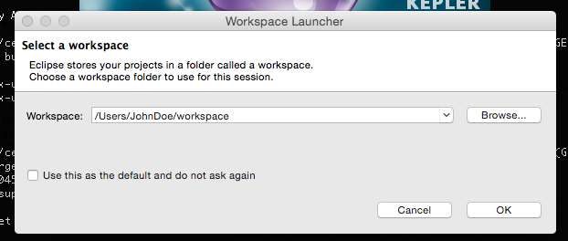
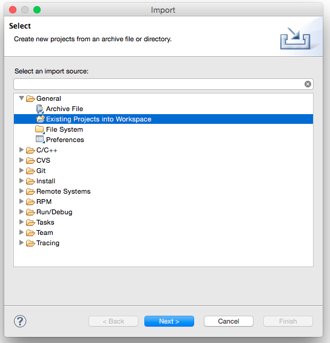

<!--
Licensed to the Apache Software Foundation (ASF) under one or more
contributor license agreements.  See the NOTICE file distributed with
this work for additional information regarding copyright ownership.
The ASF licenses this file to You under the Apache License, Version 2.0
(the "License"); you may not use this file except in compliance with
the License.  You may obtain a copy of the License at
   
    http://www.apache.org/licenses/LICENSE-2.0

Unless required by applicable law or agreed to in writing, software
distributed under the License is distributed on an "AS IS" BASIS,
WITHOUT WARRANTIES OR CONDITIONS OF ANY KIND, either express or implied.
See the License for the specific language governing permissions and
limitations under the License.
-->

# Apache Celix - Getting Started Guide: Creating a Simple Bundle

## Intro
This page is intended for first time users of Apache Celix. It should guide you through building & installing Apache Celix, setting up a new project, creating your first bundle, setting up the project for use with Eclipse project and finally running and debugging your bundle directly from eclipse workspace. 

If there are any uncertainties or question, don't hesitate to ask your questions in the [Apache Celix mailing](https://celix.apache.org/support/mailinglist.html).

## Prerequisite
Some experience with a command line interface (xterm) is expected to be able to follow this guide. 

## Building and Installing
For Apache Celix see [Building And Installing](../building/readme.md)

## Installing Eclipse CDT
Download the latest eclipse CDT at [http://www.eclipse.org](http://www.eclipse.org) and install it on your system. For more information on how the install eclipse on your system consult the eclipse documentation. For this getting started guide the luna version of eclipse was used ([linux](http://www.eclipse.org/downloads/download.php?file=/technology/epp/downloads/release/luna/R/eclipse-cpp-luna-R-linux-gtk-x86_64.tar.gz) [mac](http://www.eclipse.org/downloads/download.php?file=/technology/epp/downloads/release/luna/R/eclipse-cpp-luna-R-macosx-cocoa-x86_64.tar.gz)).

## Apache Celix Bundle project
Now that Apache Celix and Eclipse is installed, we are ready to create a new Apache Celix Bundle project.
CMake is used as build tool for Apache Celix projects.

To setup of the project, first create a new project dir to work in:

```bash
#Create a new workspace to work in, e.g:
mkdir ${HOME}/workspace
export WS=${HOME}/workspace

mkdir ${WS}/myproject
cd ${WS}/myproject
```

Then create a CMakeLists.txt file - the makefile variant of CMake -in project root directory:

```cmake	
#${WS}/myproject/CMakeLists.txt
	
#Part 1. setup project
cmake_minimum_required(VERSION 3.4)
project(myproject C CXX)

#Part 2. setup compilers
SET(CMAKE_C_FLAGS "-D_GNU_SOURCE -std=gnu99 -Wall -Werror -fPIC ${CMAKE_C_FLAGS}")
SET(CMAKE_C_FLAGS_DEBUG "-g -DDEBUG")
SET(CMAKE_CXX_FLAGS "-std=c++11 ${CMAKE_CXX_FLAGS}")
SET(CMAKE_CXX_FLAGS_DEBUG "-g -DDEBUG")

#Part 3. Setup Celix cmake files, include paths, libraries and library paths
#Note. If celix is not installed in /usr/local dir, change the location accordingly.
set(CMAKE_MODULE_PATH  ${CMAKE_MODULE_PATH} "/usr/local/share/celix/cmake/modules")
find_package(CELIX REQUIRED)
include_directories(${CELIX_INCLUDE_DIRS})

#Part 4. Choose C, C++ or both
add_subdirectory(bundles/HelloWorld_c) #C
add_subdirectory(bundles/HelloWorld_cxx) #C++
```
		
This CMakeLists.txt file, sets up the following:

* Part 1 
	* The minimum cmake version required. 
	* The project name
	* The type of source files to expect, in this case C and C++.
* Part 2
    * Setup the compilers. c99 for C and C++11 for C++
* Part 3
	* The Celix package should be searched, configured and that the Celix package is required. 
	* For all build targets in this CMakeLists.txt file or any sub directory CMakeLists.txt files the Apache Celix headers directory should be included.
* Part 4
	* The CMakelists.txt file in the subdirectory bundles/hello_world and/or bundles/HelloWorld should also be processed.
	

It is a good practice to create a separate CMakeLists.txt file for every bundle you want to build. For the hello_world bundle a CMakeLists.txt file should be created in the bundles/hello_world sub directory.

Create the sub directory:

```CMake
#Create directory structure for the hello_world bundles
cd ${WS}/myproject
mkdir -p bundles/HelloWorld_c/src
mkdir -p bundles/HelloWorld_cxx/src
mkdir -p bundles/HelloWorld_cxx/include
```


And add the following CMakeLists.txt file for the C Bundle:

```CMake	
#${WS}/myproject/bundles/HelloWorld_c/CMakeLists.txt

add_celix_bundle(HelloWorld_c
    VERSION 1.0.0
	SOURCES
        src/HelloWorld_activator.c
)	

if(APPLE)
    target_link_libraries(HelloWorld_c ${CELIX_LIBRARIES} -Wl,-all_load ${CELIX_DM_STATIC_LIB})
else()  
    target_link_libraries(HelloWorld_c -Wl,--no-undefined -Wl,--whole-archive ${CELIX_DM_STATIC_LIB} -Wl,--no-whole-archive ${CELIX_LIBRARIES})
endif()
```

And/or the following CMakeLists.txt for the C++ bundle:

```CMake
#${WS}/myproject/bundles/HelloWorld_cxx/CMakeLists.txt

add_celix_bundle(HelloWorld_cxx
    VERSION 1.0.0
	SOURCES
        src/HelloWorldActivator.cc
)
target_include_directories(HelloWorld_cxx PRIVATE include)

IF(APPLE)
    target_link_libraries(HelloWorld_cxx ${CELIX_LIBRARIES} -Wl,-all_load ${CELIX_DM_STATIC_CXX_LIB})
else()
    target_link_libraries(HelloWorld_cxx -Wl,--no-undefined -Wl,--whole-archive ${CELIX_DM_STATIC_CXX_LIB} -Wl,--no-whole-archive ${CELIX_LIBRARIES})
endif()
```
	
These CMakeLists.txt files declare that the bundles should be build based on the build result (shared library) of the declared sources (in this case the `private/src/hello_world_activator.c` or `private/src/HelloWorldActivator.cc` source). 
The `add_celix_bundle` CMake function is an Apache Celix specific CMake extension. 
The library used for the bundle will also be linked against the dependency manager static library. 


The Celix framework will install the bundle, load the bundle shared library and call the bundle activator entry symbols. These entries need to be programmed by the user. 
Note that in these examples we use the dependency manager libraries (C and C++ version) instead of developing a "vanilla" bundle activator; 
The dependency manager uses a higher abstraction and is more simple to understand and maintain, but not part of the OSGi standard.

The C Bundle Activator:
```C
//${WS}/myproject/bundles/hello_world/src/HelloWorld_activator.c
#include <stdlib.h>
#include <stdio.h>

#include "dm_activator.h"


struct userData {
	    char * word;
};

celix_status_t dm_create(bundle_context_pt context, void **out) {
	celix_status_t status = CELIX_SUCCESS;
    struct userData* result = calloc(1, sizeof(*result));
	if (result != NULL) {
            result->word = "C World";
            *out = result;
    } else {
            status = CELIX_START_ERROR;
    }
    return status;
}

celix_status_t dm_init(void* userData, bundle_context_pt context, dm_dependency_manager_pt manager) {
    struct userData* data = (struct userData *) userData;
    printf("Hello %s\n", data->word);
    return CELIX_SUCCESS;
}

celix_status_t dm_destroy(void* userData, bundle_context_pt context, dm_dependency_manager_pt manager) {
    free(userData);
    return CELIX_SUCCESS;
}
```
	
The C++ Bundle Activator (header + source):
```C++
//${WS}/myproject/bundles/HelloWorld/include/HelloWorldActivator.h
#ifndef HELLOWORLDACTIVATOR_H_
#define HELLOWORLDACTIVATOR_H_

#include "celix/dm/DmActivator.h"

class HelloWorldActivator : public celix::dm::DmActivator {
private:
    const std::string word {"C++ World"};
public:
    HelloWorldActivator(celix::dm::DependencyManager& mng) : DmActivator {mng} {}
    virtual void init();
    virtual void deinit();
};

#endif //HELLOWORLDACTIVATOR_H_
```

```C++
//${WS}/myproject/bundles/HelloWorld/private/src/HelloWorldActivator.cc
#include "HelloWorldActivator.h"
#include <iostream>

DmActivator* DmActivator::create(celix::dm::DependencyManager& mng) {
    return new HelloWorldActivator(mng);
}

void HelloWorldActivator::init() {
    std::cout << "Hello " << this->word << "\n";
}

void HelloWorldActivator::deinit() {
    //nothing to do
}
```
	
### Building
One of the highly recommended features of CMake is the ability to do out of source builds, the benefit is that all of the build results will go in a separate directory without cluttering the (source) project.
CMake also needs to able to find the cmake files Celix provides. This can be achieved by providing a CMAKE_MODULE_PATH variable (or setting the CMAKE_MODULE_PATH in the top level CMakeLists.txt). 
For this example it is assumed that Celix in installed in `/usr/local`.
To create the build directory and build the project execute the following commands:


```bash
cd ${WS}
mkdir myproject-build
cd myproject-build
cmake ../myproject
make all  
```	

Hopefully you will some some build results scrolling over the screen and actual build results in the build directory.
There should be a HelloWorld_c.zip in the bundles/HelloWorld_c directory and a HelloWorld_cxx.zip in the bundles/HelloWorld_cxx directory,
these are the actual bundles.
A bundle on its own has no real value, so lets setup a Celix container and run Celix with these bundles.

### Running

To create a deployment for the hello world bundles two things are needed: 
	
1. Add a `add_celix_container` statement in the (top level) `CMakeLists.txt` file declaring what to deploy and under which name.

```CMake
#${WS}/myproject/CMakeLists.txt
add_celix_container(myproject
    CXX 
    BUNDLES 
	    ${CELIX_BUNDLES_DIR}/shell.zip 
	    ${CELIX_BUNDLES_DIR}/shell_tui.zip
	    ${CELIX_BUNDLES_DIR}/dm_shell.zip 
	    HelloWorld_c #C bundle
	    HelloWorld_cxx #C++ bundle
)		
```

With the `add_celix_container` CMake function a Celix container will be configured, which bundles to use can be specified with absolute paths to
bundle files (e.g. the shell.zip bundle) or Celix bundle CMake target (e.g. the HelloWorld_c bundle).

Rerun make again form the build project. the make files generated by CMake will ensure cmake is run it again to update the actual make files.

```bash 		
cd ${WS}/myproject-build
make -j
```	

Now a deploy directory myproject should be available in the deploy directory. This directory contains - among other files - a release.sh script. This can be used to setup the required environment variables (like LD_LIBRARY_PATH).

```bash
cd ${WS}/myproject-build/deploy/myproject
./myproject
```

The HelloWorld_c and HelloWorld_cxx bundles should be started with their own famous "Hello World" text variant printed. One for the C and one for the C++ bundle.
The shell and shell_tui bundle are also deployed and these can be used to query and control the running framework. Below some commands are shown for querying the installed bundles, listing all known shell command, showing the help of a specific command and stopping a specific bundle (note that bundle 0 is the framework "bundle"):

```
lb 
help
stop 0
```
	
## Apache Celix Projects in Eclipse

A nice feature of CMake is the ability to generate Eclipse project files, with this feature bundles can also be developed with use of Eclipse. This should help speed up the development process. 
To get started change directory to the build directory and generate a eclipse project file.

	cd ${WS}/myproject-build 
	cmake -G "Eclipse CDT4 - Unix Makefiles" .
	
Startup the Eclipse EDI and a chose the `${WS}`



Import the project with existing project. 



To build the project, use Project->Build All.
To run or debug from Eclipse navigate to the myproject deploy directory and right click on
the 'myproject' executable and as "Local C/C++ Application"


## Apache Celix Projects in CLion

Using Apache Celix projects in CLion quite easy.
Just use `File -> Open ...` and select a Apache Celix project.
Because CLion is a IDE for CMake projects and Apache Celix projects are CMake projects this works out of the box.

To run a Celix container just select the target from CLion and press Run.

 
## Next

The get a complete overview of the available Celix CMake commands see:
 - [Apache Celix - Celix CMake Commands](../cmake_commands/readme.md)

The idea behind service oriented programming is that functionality is provided and used by abstract service, which hide implementation details.
For a guide how to provide and use services see

- [Apache Celix - Getting Started Guide: Using Services with C](using_services_with_c.md)
- [Apache Celix - Getting Started Guide: Using Services with C++](using_services_with_cxx.md)
 


	
	
