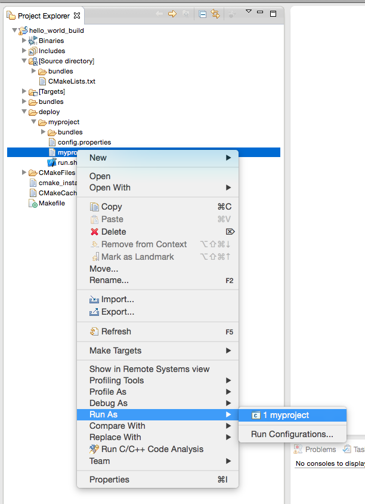

#Apache Celix - Getting Started

##Intro
This page is intended for first time users of Apache Celix. It should guide you through building & installing Apache Celix, setting up a new project, creating your first bundle, setting up the project for use with Eclipse project and finally running and debugging your bundle directly from eclipse workspace. 

If there are any uncertainties or question, don't hesitate to ask your questions in the [Apache Celix mailing](https://celix.apache.org/support/mailinglist.html).

##Prerequisite
Some experience with a command line interface (xterm) is expected to be able to follow this guide. 

##Building and Installing
For Apache Celix see [Building And Installing](../building/readme.md)

##Installing Eclipse CDT
Download the latest eclipse CDT at [http://www.eclipse.org](http://www.eclipse.org) and install it on your system. For more information on how the install eclipse on your system consult the eclipse documentation. For this getting started guide the luna version of eclipse was used ([linux](http://www.eclipse.org/downloads/download.php?file=/technology/epp/downloads/release/luna/R/eclipse-cpp-luna-R-linux-gtk-x86_64.tar.gz) [mac](http://www.eclipse.org/downloads/download.php?file=/technology/epp/downloads/release/luna/R/eclipse-cpp-luna-R-macosx-cocoa-x86_64.tar.gz)).

##Apache Celix Bundle project
Now that Apache Celix and Eclipse is installed, we are ready to create a new Apache Celix Bundle project. In this project cmake will be create a singe hello world bundle with a deployment configuration for testing the bundle.

To setup of the project, first create a new project dir to work in:

```bash
#Create a new workspace to work in, e.g:
mkdir ${HOME}/workspace
export WS=${HOME}/workspace

mkdir ${WS}/myproject
cd ${WS}/myproject
```
Then create a CMakeLists.txt file - the makefile variant of CMake -in project root directory:

```cmake	
#${WS}/myproject/CMakeLists.txt
	
#PART 1
cmake_minimum_required(VERSION 3.2)
project(myproject C)

#PART 2
    #Note. If celix is not installed in /usr/local dir, change the location accordingly.
set(CMAKE_MODULE_PATH ${CMAKE_MODULE_PATH} "/usr/local/share/celix/cmake/modules")
find_package(CELIX REQUIRED)
include_directories(${CELIX_INCLUDE_DIRS})

#PART 3
add_subdirectory(bundles/hello_world)
```
		
This CMakeLists.txt file, sets up the following:

* Part 1 
	* The minimum cmake version required. 
	* The project name
	* The type of source files to expect, in this case C.
* Part 2
 	* The CMake module path to be used (e.g. where CMake find_package module can be found)
	* That Celix package should be searched, configured and that the Celix package is required. 
	* That for all build targets in this CMakeLists.txt file or any sub directory CMakeLists.txt files the Apache Celix headers directory should be included.
* Part 3
	* The CMakelists.txt file in the subdirectory bundles/hello_world should also be processed.
	

It is a good pratice to create a seperate CMakeLists.txt file for every bundle you want to build. For the hello_world bundle a CMakeLists.txt file should be created in the bundles/hello_world sub directory.

Create the sub directory:

```CMake
#Create directory structure for the hello_world bundles
cd ${WS}/myproject
mkdir -p bundles/hello_world/private/src
```


And add the following CMakeList.txt file:

```CMake	
#${WS}/myproject/bundles/hello_world/CMakeLists.txt

add_bundle(hello_world
    VERSION 1.0.0
	SOURCES
        private/src/activator
)	
```
	
This CMakeLists.txt file declares that a bundle should be build based on the build result (shared library) of the declared sources (in this caese the private/src/activator.c source). The add_bundle function is an Apache Celix specific CMake extension. 

The last part for the hello_world bundle is the bundle activator source. The bundle activator is the entry point for an Apache Celix Bundle. Think of the bundle activator as the main function for a bundle, whith the difference that is does not only control the start of a bundle, but also the stopping of a bundle. 

Creating/starting and stopping/destroying is seperated in bundle activator. This is done to make a clear seperation between the instantion/creation of a structure (e.g. object) and exposure of that instantation to other parts of the program. The same, but then reserve hold for seperating stopping and destroying a bundle. 

```C
//${WS}/myproject/bundles/hello_world/private/src/activator.c
#include <stdlib.h>
#include <stdio.h>

#include "bundle_activator.h"
#include "bundle_context.h"


struct userData {
	    char * word;
};

celix_status_t bundleActivator_create(bundle_context_pt context, void **userData) {
	celix_status_t status = CELIX_SUCCESS;
    *userData = malloc(sizeof(struct userData));
	if (userData != NULL) {
            ((struct userData *)(*userData))->word = "World";
    } else {
            status = CELIX_START_ERROR;
    }
    return CELIX_SUCCESS;
}

celix_status_t bundleActivator_start(void * userData, bundle_context_pt context) {
    struct userData * data = (struct userData *) userData;
    printf("Hello %s\n", data->word);
    return CELIX_SUCCESS;
}

celix_status_t bundleActivator_stop(void * userData, bundle_context_pt context) {
    struct userData * data = (struct userData *) userData;
    printf("Goodbye %s\n", data->word);
    return CELIX_SUCCESS;
}       
    
celix_status_t bundleActivator_destroy(void * userData, bundle_context_pt context) {
	free(userData);
    return CELIX_SUCCESS;
}
```
	
###Building 
One of the highly recommended features of CMake is the ability to do out of source builds, the benefit is that all of the build results will go in a seperate directory without cluttering the (source) project. To create the build directory and build the project execute the following commands:

```bash
cd ${WS}
mkdir myproject/build
cd myproject/build
cmake ..
make all  
#Or
#cmake -G Ninja ..
#ninja
```	

Hopefully you will some some build results scrolling over the screen and actual build results in the build directory. There should be a hello_world.zip in the bundles/hello_world directory, this the actual bundle. But a bundle on its own has no real value, so lets setup a deployment and run the Apache Celix framwork with this bundle.


###Running 

To create a deployment for the hello_world bundle two things are needed: 
	
1. Add a `add_deploy` statement in the `bundles/hello_world/CMakeLists.txt` file declaring what to deploy and under which name.

```CMake
${WS}/myproject/bundles/hello_world/CMakeLists.txt
add_deploy("myproject-deploy" BUNDLES 
	${CELIX_BUNDLES_DIR}/shell.zip 
	${CELIX_BUNDLES_DIR}/shell_tui.zip
	hello_world
)		
```
 		   
Rerun make again form the  build project. the make files genereated by CMake will ensure cmake is runned again to update the actual make files.

```bash 		
cd ${WS}/myproject-build
make 
#or
#ninja
```	

Now a deploy directory myproject should be availabe in the deploy directory. This directory contains - among other files - the run.sh script. This can be used to run the Apache Celix framework with the declared bundles from the deploy.cmake.

```bash
cd ${WS}/myproject-build/deploy/myproject-deploy
sh run.sh
```

The hello_world bundle should be started with the famous "Hello World" text printed. The shell and shell_tui bundle are also deployed and these can be used to query and control the running framework. Below some commands are shown for printed the installed bundles, printing all known shell command, printing help of a specific command and stopping a specific bundle (note that bundle 0 is the framework):

```
lb 
help
help inspect
stop 0
```
	
##Apache Celix Bundle Project in Eclipse

A nice feature of CMake is the ability to generate Eclipse project files, with this feature bundles can also be developed with use of Eclipse. This should help speed up the development process. 
To get started change directory to the build directory and generate a eclipse project file.

	cd ${WS}/myproject/build 
	cmake -G "Eclipse CDT4 - Unix Makefiles" .
	
Startup the Eclipse EDI and a chose the `${WS}`


Import the project with existing project. 


To build the project, use Project->Build All. To run or debug from Eclipse navigate to the myproject deploy directory and right click on the 'myproject.launch' file. And select Run As or Debug As to run or debug the bundle.

 
 

 
 


	
	
