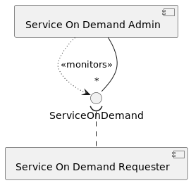

<!--
Licensed to the Apache Software Foundation (ASF) under one or more
contributor license agreements.  See the NOTICE file distributed with
this work for additional information regarding copyright ownership.
The ASF licenses this file to You under the Apache License, Version 2.0
(the "License"); you may not use this file except in compliance with
the License.  You may obtain a copy of the License at
   
    http://www.apache.org/licenses/LICENSE-2.0

Unless required by applicable law or agreed to in writing, software
distributed under the License is distributed on an "AS IS" BASIS,
WITHOUT WARRANTIES OR CONDITIONS OF ANY KIND, either express or implied.
See the License for the specific language governing permissions and
limitations under the License.
-->

# Apache Celix / OSGi  patterns
TODO rephrase 
There are several design patterns typical for Apache Celix and/or OSGi that are worth mentioned.  

## Extender Pattern
The extender pattern is a design pattern which leverages the concept of bundles containing resources.
It is a pattern where functionality of an extender bundle can be extended by installing other (extendee) bundles 
containing certain resources files and/or bundle manifest entries.


An example of the extender pattern is the `Celix::http_admin` bundle. The `Celix::http_admin` monitors installed
bundles and read the bundles `MANIFEST.MF` file for a `X-Web-Resource` entry. If a `X-Web-Resource` entry is found
its value web resources to the `Celix::http_admin`. This can be used to dynamically add/remove static web resources
to an HTTP server.

### `Celix::http_admin` Extendee Bundle Example
The following example shows how a very simple `Celix::http_admin` extendee bundle, which provided a minimal
hello world `index.html` page for the `Celix::http_admin` to pick up. 


Remarks for the `Celix::http_admin` extendee bundle example:
1. Creates a bundle which will function as an extendee bundle for the `Celix::http_admin`.
2. Marks the bundle as a resource-only bundle, i.e. a bundle with no C or C++ activator.
3. Creates a very simple `index.html` file in CMake
4. Adds the `index.html` file to the `http_admin_extendee_bundle` bundle in the bundle directory resources.
5. Adds a `X-Web-Resource` bundle manifest entry, which marks this bundle as an extendee bundle for the 
   `Celix::http_admin` bundle. See `Celix::http_admin` for more info. Note that `$<SEMICOLON>` is used, 
   because a literal `;` has a special meaning in CMake.
6. Create a container which installs and starts the `Celix::http_admin` (extender) bundle and the
   `http_admin_extendee_bundle` bundle.
 
```CMake
#CMakeLists.txt
add_celix_bundle(http_admin_extendee_bundle # <----------------------------------------------------------------------<1>
    VERSION 1.0.0
    NO_ACTIVATOR # <-------------------------------------------------------------------------------------------------<2>
)
file(WRITE "${CMAKE_CURRENT_BINARY_DIR}/index.html" "<html><body>Hello World</body></html>") # <---------------------<3>
celix_bundle_files(http_admin_extendee_bundle "${CMAKE_CURRENT_BINARY_DIR}/index.html" DESTINATION resources) # <----<4>
celix_bundle_headers(http_admin_extendee_bundle "X-Web-Resource: /hello$<SEMICOLON>/resources") # <------------------<5>

add_celix_container(extender_pattern_example_container # <-----------------------------------------------------------<6>
    BUNDLES
        Celix::http_admin
        http_admin_extendee_bundle
)
```

## Whiteboard Pattern

TODO example http_admin with http service


## Service on Demand (SOD) Pattern

TODO example logging service and/or remote service
TODO also mention FindHook for Java

