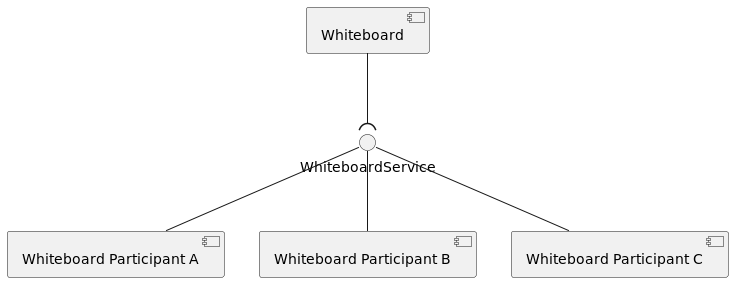

<!--
Licensed to the Apache Software Foundation (ASF) under one or more
contributor license agreements.  See the NOTICE file distributed with
this work for additional information regarding copyright ownership.
The ASF licenses this file to You under the Apache License, Version 2.0
(the "License"); you may not use this file except in compliance with
the License.  You may obtain a copy of the License at
   
    http://www.apache.org/licenses/LICENSE-2.0

Unless required by applicable law or agreed to in writing, software
distributed under the License is distributed on an "AS IS" BASIS,
WITHOUT WARRANTIES OR CONDITIONS OF ANY KIND, either express or implied.
See the License for the specific language governing permissions and
limitations under the License.
-->

# Apache Celix / OSGi  patterns 
There are several design patterns used in Apache Celix and OSGi.  

## Whiteboard Pattern
The whiteboard pattern is a pattern where the act of registering a service is enough to participate in or extend 
an existing functionality.  
A typical aspect of the whiteboard pattern is that an application should 
still resolve and startup even if the bundle or bundles that pick up the whiteboard pattern services are absent.



Many Apache Celix services are whiteboard services. For example:
 - `celix_shell_command_t` and `celix::IShellCommand` services. These services can be 
   picked up by the `Celix::shell` bundle, but applications should still work if there is no `Celix::shell` installed 
   and started. <br/>
   
 - `celix_http_service_t` and `celix_websocket_service_t` services. These services can be picked up by the
   `Celix::http_admin` bundle to provide http url endpoints or websocket url endpoints. <br/>
   
 - `celix_log_sink_t` services. If there is no `Celix::log_admin` bundle installed and started, the log sinks 
   services will never be called, but the application should still work. Note that the `Celix::log_admin` bundle
   also uses a service on demand pattern (see below). <br/>
   
 - Services marked as remote service (`service.exported.interface=*`). These services will work fine
   but only as local services - if there are no remote service bundles installed and started.


For modularity, the whiteboard pattern is a nice fit, because a whiteboard service admin does not need to know how 
many - if any - whiteboard services are going to be provided and how the implementation details work (as long as 
the implementation adheres to the service contract).    

Whiteboard pattern services are always [consumer types](https://docs.osgi.org/javadoc/osgi.annotation/8.0.0/org/osgi/annotation/versioning/ConsumerType.html), although for Apache Celix interfaces cannot be annotated as
consumer or provider type. 

One of the downsides of the whiteboard pattern is that it is not always clear why an application is not working as 
expected or what is missing to get the application working as expected. This is because it is not an error 
if there are unused services, and as result there is no error to help a user to identify what is missing. 

For example: A `log_collector` bundle which provides a `celix_log_sink_t` service is installed and started, 
so that logging can be collected at in a central log database. 
But no logging is added to the central log database. Initially it could seem that the `log_collector` bundle 
does not work, especially because the application will not print any warnings or errors. 
But if the `Celix::log_admin` bundle is not installed and started, the `log_collector` bundle provided  
`celix_log_sink_t` service will never be called, so installing and starting the `Celix::log_admin` is the issue 
in this example.


## Extender Pattern
The extender pattern is a design pattern which leverages the concept of resource containing bundles.
With the extender pattern, functionality of an extender bundle can be extended by installing so called extendee bundles. 
The extendee bundles contain certain resources files and/or bundle manifest entries which are used by the extender
bundle.


An example of the extender pattern is the `Celix::http_admin` bundle. The extender bundle `Celix::http_admin` 
monitors installed bundles and reads bundle `MANIFEST.MF` entries for a `X-Web-Resource` entry. 
If a `X-Web-Resource` entry is found, its value is used to set up new HTTP endpoint in the HTTP server of
the `Celix::http_admin` bundle using the static web resources of the extendee bundle.

### `Celix::http_admin` Extendee Bundle Example
The following example shows how a very simple `Celix::http_admin` extendee bundle, which provided a minimal
hello world `index.html` page for the `Celix::http_admin` to pick up.

Remarks for the `Celix::http_admin` extendee bundle example:
1. Creates a bundle which will function as an extendee bundle for the `Celix::http_admin`.
2. Marks the bundle as a resource-only bundle, i.e. a bundle with no C or C++ activator.
3. Creates a very simple `index.html` file in CMake
4. Adds the `index.html` file to the `http_admin_extendee_bundle` bundle in the bundle directory resources.
5. Adds a `X-Web-Resource` bundle manifest entry, which marks the bundle as an extendee bundle for the 
   `Celix::http_admin` bundle. See `Celix::http_admin` for more info. Note that `$<SEMICOLON>` is used, 
   because a literal `;` has a special meaning in CMake.
6. Create a container which installs and starts the `Celix::http_admin` (extender) bundle and the
   `http_admin_extendee_bundle` (extendee) bundle.
 
```CMake
#CMakeLists.txt
add_celix_bundle(http_admin_extendee_bundle # <----------------------------------------------------------------------<1>
    VERSION 1.0.0
    NO_ACTIVATOR # <-------------------------------------------------------------------------------------------------<2>
)
file(WRITE "${CMAKE_CURRENT_BINARY_DIR}/index.html" "<html><body>Hello World</body></html>") # <---------------------<3>
celix_bundle_files(http_admin_extendee_bundle "${CMAKE_CURRENT_BINARY_DIR}/index.html" DESTINATION resources) # <----<4>
celix_bundle_headers(http_admin_extendee_bundle "X-Web-Resource: /hello$<SEMICOLON>/resources") # <------------------<5>

add_celix_container(extender_pattern_example_container # <-----------------------------------------------------------<6>
    BUNDLES
        Celix::http_admin
        http_admin_extendee_bundle
)
```

When the `extender_pattern_example_container` executable is running the web address `http://localhost:8080/hello`
should show the content of the `index.html`


## Service on Demand (SOD) Pattern

A less known Apache Celix / OSGi pattern is the service on demand (SOD) pattern. With the SOD pattern,
services are ad hoc registered at the moment they are requested.

Where the whiteboard pattern can be used to extend functionality in modular and service oriented fashion, the SOD
pattern can be used to use to provide more functional cohesive services to users in a service oriented fashion.

For the SOD pattern, the service filter to request services can be used to extract information about if and how
a service on demand needs to be created.


Some Apache Celix bundles use the SOD pattern. For example:
 - The `Celix::log_admin` bundle creates and registers `celix_log_service_t` services already preconfigured for 
   a requested logger name. <br/>
   
 - The Apache Celix / OSGi remote services uses SOD, by ad hoc imported services only when they are discovered and
   requested.

SOD services are always [provider types](https://docs.osgi.org/javadoc/osgi.annotation/8.0.0/org/osgi/annotation/versioning/ProviderType.html), although for Apache Celix interfaces cannot be annotated as
consumer or provider type.

For OSGi the [FindHook](https://docs.osgi.org/javadoc/osgi.core/8.0.0/org/osgi/framework/hooks/service/FindHook.html)
service can be used to further fine tune which services are visible for bundle requesting a SOD service. 
Apache Celix does not yet support the FindHook service. 


