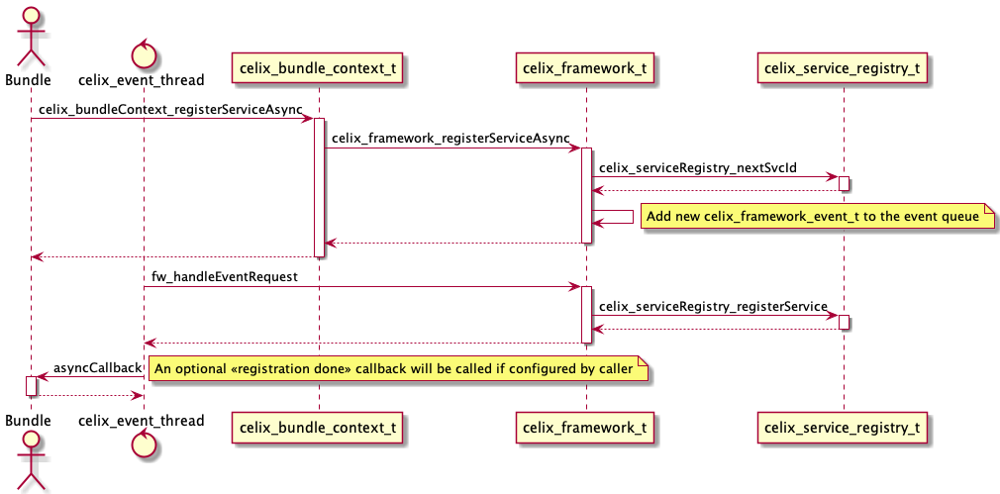
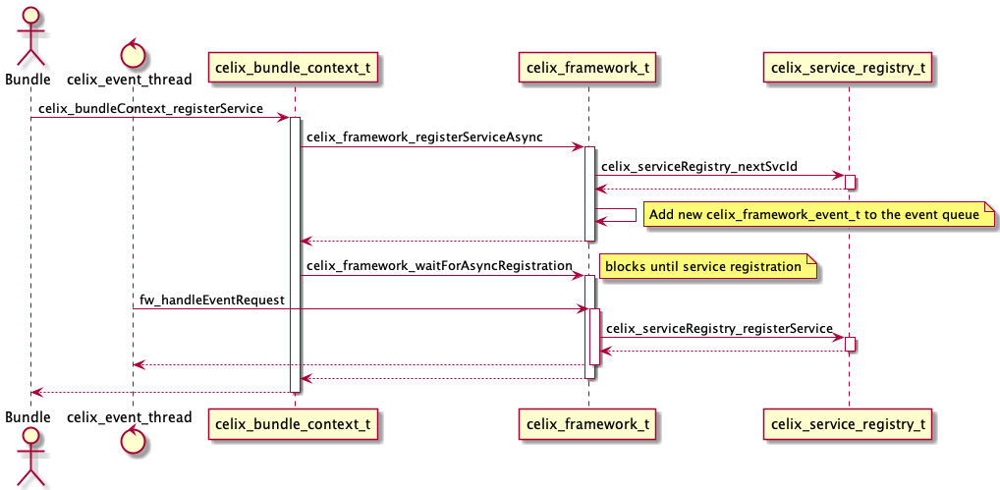
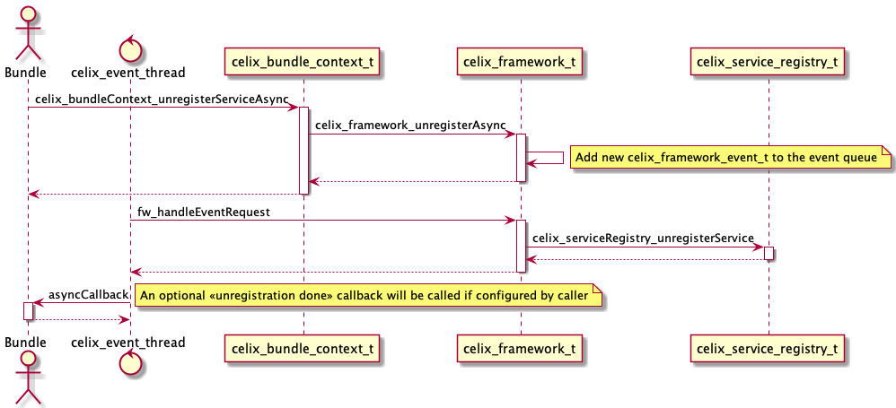
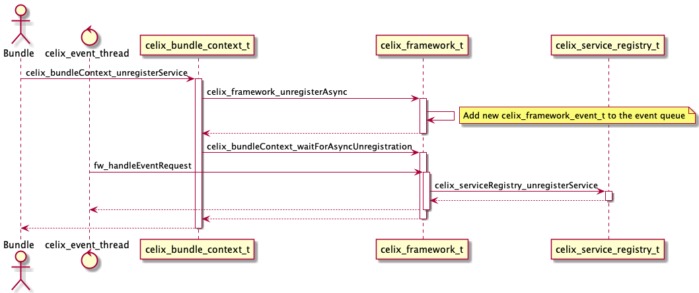
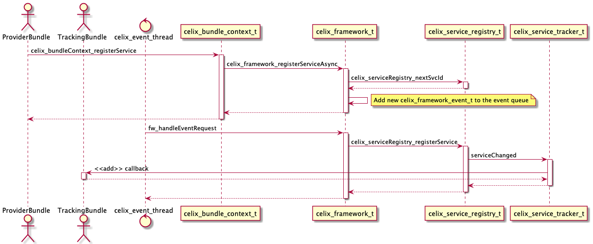
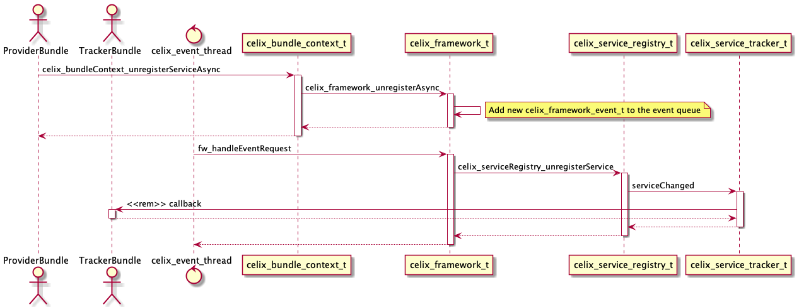
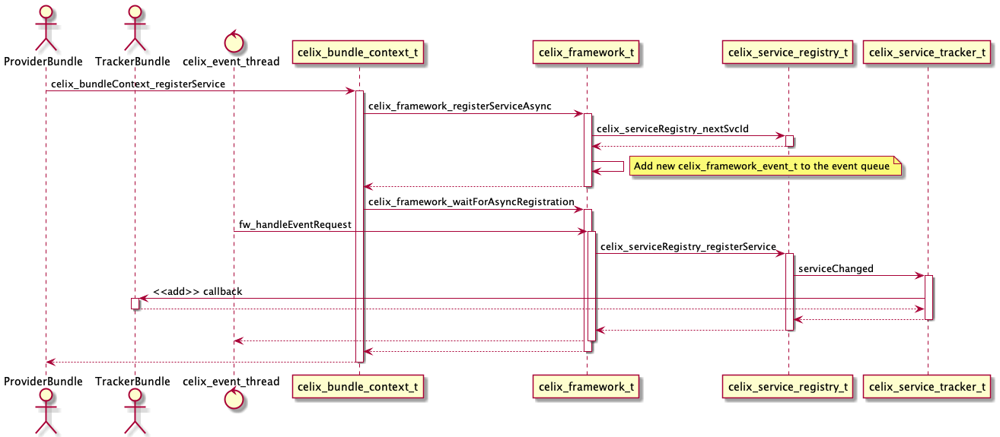
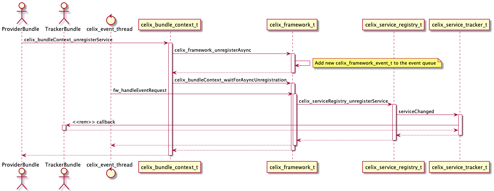

<!--
Licensed to the Apache Software Foundation (ASF) under one or more
contributor license agreements.  See the NOTICE file distributed with
this work for additional information regarding copyright ownership.
The ASF licenses this file to You under the Apache License, Version 2.0
(the "License"); you may not use this file except in compliance with
the License.  You may obtain a copy of the License at
   
    http://www.apache.org/licenses/LICENSE-2.0

Unless required by applicable law or agreed to in writing, software
distributed under the License is distributed on an "AS IS" BASIS,
WITHOUT WARRANTIES OR CONDITIONS OF ANY KIND, either express or implied.
See the License for the specific language governing permissions and
limitations under the License.
-->

# Apache Celix Services
An Apache Celix Service is a pointer registered to the Celix framework under a set of properties (metadata).
Services can be dynamically registered into and looked up from the Apache Celix framework.

By convention a C service in Apache Celix is a pointer to struct of function pointers and a C++ service is a pointer
(which can be provided as a `std::shared_ptr`) to an object implementing a (pure) abstract class.

A service is always registered under a service name and this service name is also used to lookup services. 
For C the service name must be provided by the user and for C++ the service name can be provided by the user. 
If for C++ no service name is provided the service name will be inferred based on the service template argument using
`celix::typeName<I>`. 

Note that the service name is represented in the service properties under the property name `objectClass`, 
this is inherited for the Java OSGi specification. 
Also note that for Celix - in contrast with Java OSGi - it is only possible to register a single interface 
per service registration in the Apache Celix Framework. This restriction was added because C does not 
(natively) supports multiple interfaces (struct with function pointers) on a single object/pointer.  

## Service Properties
As mentioned, a service is always registered with a set of properties (metadata). 
The service properties are represented as a `celix_properties_t` for C and as a `celix::Properties` for C++.
Service properties are used to classify and select services.

Apache Celix properties store key/value pairs and the key is always a string, but the value can be a string,
a long, a double, a bool or `celix_version_t` (`celix::Version` for C++). Next to the actual typed value a property
entry always stores a string representation of the value.

The following C functions can be used to create and manipulate properties:
- `celix_properties_create` - Create a new properties object.
- `celix_properties_destroy` - Destroy a properties object.
- `celix_properties_set` - Set a string property value.
- `celix_properties_setLong` - Set a long property value.
- `celix_properties_setDouble` - Set a double property value.
- `celix_properties_setBool` - Set a bool property value.
- `celix_properties_setVersion` - Set a version property value.
- `celix_properties_get` - Get a string or string representation of the property value.
- `celix_properties_getAsLong` - Get a long property value or string value parsed as long.
- `celix_properties_getAsDouble` - Get a double property value or string value parsed as double.
- `celix_properties_getAsBool` - Get a bool property value or string value parsed as bool.
- `celix_properties_getAsVersion` - Get a pointer to the version property if the property value is a version or was
                                  parsable as a version. Note there is also a `celix_properties_getAsVersion` 
                                  function which return a new version object, but this is less efficient and
                                  requires a memory allocation.

The following C++ methods can be used to create and manipulate properties:
- `celix::Properties::Properties` - Construct a new properties object.
- `celix::Properties::set` - Set a string property value. Uses template argument deduction to determine the type.
- `celix::Properties::get` - Get a string or string representation of the property value.
- `celix::Properties::getAsLong` - Get a long property value or string value parsed as long.
- `celix::Properties::getAsDouble` - Get a double property value or string value parsed as double.
- `celix::Properties::getAsBool` - Get a bool property value or string value parsed as bool.
- `celix::Properties::getAsVersion` - Get a version property value or string value parsed as version.

The following service properties are set by the Celix framework when registering a service:
- `objectClass` - The service name.
- `service.id` - The service id (long).
- `service.bundleid` - The bundle id (long) of the bundle registering the service.
- `service.scope` - The service scope (string, "singleton", "prototype" or "bundle").
- `service.version` - The service version (celix_version_t), if provided by the user.

## A C service example
As mentioned an Apache Celix C service is a registered pointer to a struct with function pointers. 
This struct ideally contains a handle pointer, a set of function pointers and should be well documented to
form a well-defined service contract.

A simple example of an Apache Celix C service is a shell command service. 
For C, the shell command header looks like:
```C
//celix_shell_command.h
...
#define CELIX_SHELL_COMMAND_NAME                "command.name"
#define CELIX_SHELL_COMMAND_USAGE               "command.usage"
#define CELIX_SHELL_COMMAND_DESCRIPTION         "command.description"

#define  CELIX_SHELL_COMMAND_SERVICE_NAME       "celix_shell_command"
#define  CELIX_SHELL_COMMAND_SERVICE_VERSION    "1.0.0"

typedef struct celix_shell_command celix_shell_command_t;

/**
 * The shell command can be used to register additional shell commands.
 * This service should be registered with the following properties:
 *  - command.name: mandatory, name of the command e.g. 'lb'
 *  - command.usage: optional, string describing how tu use the command e.g. 'lb [-l | -s | -u]'
 *  - command.description: optional, string describing the command e.g. 'list bundles.'
 */
struct celix_shell_command {
    void *handle;

    /**
     * Calls the shell command.
     * @param handle        The shell command handle.
     * @param commandLine   The complete provided cmd line (e.g. for a 'stop' command -> 'stop 42')
     * @param outStream     The output stream, to use for printing normal flow info.
     * @param errorStream   The error stream, to use for printing error flow info.
     * @return              Whether a command is successfully executed.
     */
    bool (*executeCommand)(void *handle, const char *commandLine, FILE *outStream, FILE *errorStream);
};
```

The service struct is documented, explains which service properties needs to be provided, contains a handle pointer and
a `executeCommand` function pointer. 

The `handle` field and the `handle` function argument should function as an opaque instance (`this` / `self`) handle 
and generally is unique for every service instance. Users of the service should forward the handle field when calling
a service function, e.g.:
```C
celix_shell_command_t* command = ...;
command->executeCommand(command->handle, "test 123", stdout, stderr);
```

## A C++ service example
As mentioned an Apache Celix C++ service is a registered pointer to an object implementing an abstract class.
The service class ideally should be well documented to form a well-defined service contract.

A simple example of an Apache Celix C++ service is a C++ shell command. 
For C++, the shell command header looks like:
```C++
//celix/IShellCommand.h
...
namespace celix {

    /**
     * The shell command interface can be used to register additional Celix shell commands.
     * This service should be registered with the following properties:
     *  - name: mandatory, name of the command e.g. 'celix::lb'
     *  - usage: optional, string describing how tu use the command e.g. 'celix::lb [-l | -s | -u]'
     *  - description: optional, string describing the command e.g. 'list bundles.'
     */
    class IShellCommand {
    public:
        /**
         * The required name of the shell command service (service property)
         */
        static constexpr const char * const COMMAND_NAME = "name";

        /**
         * The optional usage text of the shell command service (service property)
         */
        static constexpr const char * const COMMAND_USAGE = "usage";

        /**
         * The optional description text of the shell command service (service property)
         */
        static constexpr const char * const COMMAND_DESCRIPTION = "description";

        virtual ~IShellCommand() = default;

        /**
         * Calls the shell command.
         * @param commandLine   The complete provided command line (e.g. for a 'stop' command -> 'stop 42'). Only valid during the call.
         * @param commandArgs   A list of the arguments for the command (e.g. for a "stop 42 43" commandLine -> {"42", "43"}). Only valid during the call.
         * @param outStream     The C output stream, to use for printing normal flow info.
         * @param errorStream   The C error stream, to use for printing error flow info.
         * @return              Whether the command has been executed correctly.
         */
        virtual void executeCommand(const std::string& commandLine, const std::vector<std::string>& commandArgs, FILE* outStream, FILE* errorStream) = 0;
    };
}
```

As with the C shell command struct, the C++ service class is documented and explains which service properties needs to 
be provided. The `handle` construct is not needed for C++ services and using a C++ service function is just the same 
as calling a function member of any C++ object.

## Impact of dynamic services
Services in Apache Celix are dynamic, meaning that they can come and go at any moment.
This makes it possible to create emerging functionality based on the coming and going of Celix services.
How to cope with this dynamic behaviour is critical for creating a stable solution.

For Java OSGi this is already a challenge to program correctly, but less critical because generally speaking the
garbage collector will arrange that objects still exists even if the providing bundle is un-installed.
Taking into account that C and C++ has no garbage collection, handling the dynamic behaviour correctly is
more critical; If a bundle providing a certain service is removed, the code segment / memory allocated for
that service will also be removed / deallocated.

Apache Celix has several mechanisms for dealing with this dynamic behaviour:

* A built-in abstraction to use services with callbacks function where the Celix framework ensures the services
  are not removed during callback execution.
* Service trackers which ensure that service can only complete their un-registration when all service
  remove callbacks have been processed.
* Components with declarative service dependency so that a component life cycle is coupled with the availability of
  service dependencies. See the components' documentation section for more information about components.
* The Celix framework will handle all service registration/un-registration events and the starting/stopping of trackers
  on the Celix event thread to ensure that only 1 event can be processed per time and that callbacks for service
  registration and service tracker are always called from the same thread.
* Service registration, service un-registration, starting trackers and closing trackers can be done async.
 
## Registering and un-registering services
Service registration and un-registration in Celix can be done synchronized or asynchronized and although 
(un-)registering services synchronized is more inline with the OSGi spec, (un-)registering is preferred for Celix. 

When registering a service synchronized, the service registration event and all events resulting from the service
registration are handled; in practice this means that when a synchronized service registration returns all bundles
are aware of the new service and if needed have updated their administration accordingly.

Synchronized service (un-)registration can lead to problems if for example another service registration event is 
triggered on the handling of the current service registration events. 
In that case normal mutexes are not always enough and reference counting or recursive mutexes are needed. 
reference counting can be complex to handle (especially in C) and recursive mutexes are arguable a bad idea.

Interestingly for Java the use of `synchronized` is recursive and as result this seems te be smaller issue with Java.

When registering a service asynchronized, the service properties and specifically the `service.id` property will be 
finalized when the service registration call returns. The actual service registration event will be done asynchronized
by the Celix event thread and this can be done before or after the service registration call returns.

To register a service asynchronized the following C functions / C++ methods can be used:
 - `celix_bundleContext_registerServiceAsync`.
 - `celix_bundleContext_registerServiceWithOptionsAsync`.
 - `celix::BundleContext::registerService`.
 - `celix::BundleContext::registerUnmanagedService`.

To register a service synchronized the following C functions / C++ methods can be used:
 - `celix_bundleContext_registerService`.
 - `celix_bundleContext_registerServiceWithOptions`.
 - `celix::BundleContext::registerService`, use `celix::ServiceRegistrationBuilder::setRegisterAsync` to configure 
    registration synchronized because the default is asynchronized.
 - `celix::BundleContext::registerUnmanagedService`, use `celix::ServiceRegistrationBuilder::setRegisterAsync` 
   to configure registration synchronized because the default is asynchronized.
 

To unregister a service asynchronized the following C function can be used:
- `celix_bundleContext_unregisterServiceAsync`.

And to unregister a service synchronized the following C function can be used:
- `celix_bundleContext_unregisterService`.

For C++ a service un-registration happens when its corresponding `celix::ServiceRegistration` object goes out of 
scope. A C++ service can be configured for synchronized un-registration using ServiceRegistrationBuilder, 
specifically:
- `celix::ServiceRegistrationBuilder::setUnregisterAsync`. The default is asynchronized. 

### Example: Register a service in C
```C
//src/my_shell_command_provider_bundle_activator.c
#include <celix_bundle_activator.h>
#include <celix_shell_command.h>

typedef struct my_shell_command_provider_activator_data {
    celix_bundle_context_t* ctx;
    celix_shell_command_t shellCmdSvc;
    long shellCmdSvcId;
} my_shell_command_provider_activator_data_t;

static bool my_shell_command_executeCommand(void *handle, const char *commandLine, FILE *outStream, FILE *errorStream CELIX_UNUSED) {
    my_shell_command_provider_activator_data_t* data = handle;
    celix_bundle_t* bnd = celix_bundleContext_getBundle(data->ctx);
    fprintf(outStream, "Hello from bundle %s with command line '%s'\n", celix_bundle_getName(bnd), commandLine);
    return true;
}

static celix_status_t my_shell_command_provider_bundle_start(my_shell_command_provider_activator_data_t *data, celix_bundle_context_t *ctx) {
    data->ctx = ctx;
    data->shellCmdSvc.handle = data;
    data->shellCmdSvc.executeCommand = my_shell_command_executeCommand;
    
    celix_properties_t* props = celix_properties_create();
    celix_properties_set(props, CELIX_SHELL_COMMAND_NAME, "my_command");
    
    data->shellCmdSvcId = celix_bundleContext_registerServiceAsync(ctx, &data->shellCmdSvc, CELIX_SHELL_COMMAND_SERVICE_NAME, props);
    return CELIX_SUCCESS;
}

static celix_status_t my_shell_command_provider_bundle_stop(my_shell_command_provider_activator_data_t *data, celix_bundle_context_t *ctx) {
    celix_bundleContext_unregisterServiceAsync(ctx, data->shellCmdSvcId, NULL, NULL);
    return CELIX_SUCCESS;
}

CELIX_GEN_BUNDLE_ACTIVATOR(my_shell_command_provider_activator_data_t, my_shell_command_provider_bundle_start, my_shell_command_provider_bundle_stop)
```

### Example: Register a C++ service in C++
```C++
//src/MyShellCommandBundleActivator.cc
#include <celix/BundleActivator.h>
#include <celix/IShellCommand.h>

class MyCommand : public celix::IShellCommand {
public:
    explicit MyCommand(std::string_view _name) : name{_name} {}

    ~MyCommand() noexcept override = default;

    void executeCommand(
            const std::string& commandLine,
            const std::vector<std::string>& /*commandArgs*/,
            FILE* outStream,
            FILE* /*errorStream*/) override {
        fprintf(outStream, "Hello from bundle %s with command line '%s'\n", name.c_str(), commandLine.c_str());
    }
private:
    const std::string name;
};

class MyShellCommandProviderBundleActivator {
public:
    explicit MyShellCommandProviderBundleActivator(const std::shared_ptr<celix::BundleContext>& ctx) {
        auto svcObject = std::make_shared<MyCommand>(ctx->getBundle().getName());
        cmdShellRegistration = ctx->registerService<celix::IShellCommand>(std::move(svcObject))
                .addProperty(celix::IShellCommand::COMMAND_NAME, "MyCommand")
                .build();
    }

    ~MyShellCommandProvider() noexcept = default;
private:
    //NOTE when celix::ServiceRegistration goes out of scope the underlining service will be un-registered
    std::shared_ptr<celix::ServiceRegistration> cmdShellRegistration{};
};

CELIX_GEN_CXX_BUNDLE_ACTIVATOR(MyShellCommandProviderBundleActivator)
```

### Example: Register a C service in C++
```C++
//src/MyCShellCommandProviderBundleActivator.cc
#include <celix/BundleActivator.h>
#include <celix_shell_command.h>

struct MyCShellCommand : public celix_shell_command {
    explicit MyCShellCommand(std::shared_ptr<celix::BundleContext> _ctx) : celix_shell_command(), ctx{std::move(_ctx)} {
        handle = this;
        executeCommand = [] (void *handle, const char* commandLine, FILE* outStream, FILE* /*errorStream*/) -> bool {
            auto* cmdProvider = static_cast<MyCShellCommand*>(handle);
            fprintf(outStream, "Hello from bundle %s with command line '%s'\n", cmdProvider->ctx->getBundle().getName().c_str(), commandLine);
            return true;
        };
    }

    const std::shared_ptr<celix::BundleContext> ctx;
};

class MyCShellCommandProviderBundleActivator {
public:
    explicit MyCShellCommandProviderBundleActivator(const std::shared_ptr<celix::BundleContext>&  ctx) {
        auto shellCmd = std::make_shared<MyCShellCommand>(ctx);
        cmdShellRegistration = ctx->registerService<celix_shell_command>(std::move(shellCmd), CELIX_SHELL_COMMAND_SERVICE_NAME)
                .addProperty(CELIX_SHELL_COMMAND_NAME, "MyCCommand")
                .setUnregisterAsync(false)
                .build();
    }
private:
    //NOTE when celix::ServiceRegistration goes out of scope the underlining service will be un-registered
    std::shared_ptr<celix::ServiceRegistration> cmdShellRegistration{};
};

CELIX_GEN_CXX_BUNDLE_ACTIVATOR(MyCShellCommandProviderBundleActivator)
```

### Sequence diagrams for service registration


*An asynchronized service registration*

---


*A synchronized service registration*

---


*An asynchronized service un-registration*

---


*A synchronized service un-registration*

## Using services
Services can be used directly using the bundle context C functions or C++ methods:
- `celix_bundleContext_useServiceWithId`
- `celix_bundleContext_useService`
- `celix_bundleContext_useServices`
- `celix_bundleContext_useServiceWithOptions`
- `celix_bundleContext_useServicesWithOptions`
- `celix::BundleContext::useService`
- `celix::BundleContext::useServices`

These functions and methods work by providing a serviceName, optional filter and callback function which will be 
called by the Celix framework with the matching service or services.

An Apache Celix filter is an [LDAP filter](https://tools.ietf.org/html/rfc4515) and can be used to select services based
on their properties.
The filter can be provided as a string and the Celix framework will parse the string to a `celix_filter_t` or (for C++)
a `celix::Filter` object. For example the filter `(command.name=my_command)` will match all services with a
`command.name` property with value `my_command`.

When a "use service" function/method returns the callback function can can be safely deallocated. 
A "use service" function/method return value will indicate if a matching service is found or how many matching services 
are found.

The Celix framework provides service usage through callbacks - instead of directly return a service pointer - 
to ensure that services are prevented from removal while the services are still in use without forwarding 
this responsibility to the user; i.e. by adding an api to "lock" and "unlock" services for usage.

### Example: Using a service in C
```C
#include <stdio.h>
#include <celix_bundle_activator.h>
#include <celix_shell_command.h>

typedef struct use_command_service_example_data {
    //nop
} use_command_service_example_data_t;

static void useShellCommandCallback(void *handle CELIX_UNUSED, void *svc) {
    celix_shell_command_t* cmdSvc = (celix_shell_command_t*)svc;
    cmdSvc->executeCommand(cmdSvc->handle, "my_command test call from C", stdout, stderr);
}

static celix_status_t use_command_service_example_start(use_command_service_example_data_t *data CELIX_UNUSED, celix_bundle_context_t *ctx) {
    celix_service_use_options_t opts = CELIX_EMPTY_SERVICE_USE_OPTIONS;
    opts.callbackHandle = NULL;
    opts.use = useShellCommandCallback;
    opts.filter.serviceName = CELIX_SHELL_COMMAND_SERVICE_NAME;
    opts.filter.filter = "(command.name=my_command)";
    bool called = celix_bundleContext_useServicesWithOptions(ctx, &opts);
    if (!called) {
        fprintf(stderr, "%s: Command service not called!\n", __PRETTY_FUNCTION__);
    }
    return CELIX_SUCCESS;
}

static celix_status_t use_command_service_example_stop(use_command_service_example_data_t *data CELIX_UNUSED, celix_bundle_context_t *ctx CELIX_UNUSED) {
    return CELIX_SUCCESS;
}

CELIX_GEN_BUNDLE_ACTIVATOR(use_command_service_example_data_t, use_command_service_example_start, use_command_service_example_stop)
```

### Example: Using a service in C++
```C++
//src/UsingCommandServicesExample.cc
#include <celix/IShellCommand.h>
#include <celix/BundleActivator.h>
#include <celix_shell_command.h>

static void useCxxShellCommand(const std::shared_ptr<celix::BundleContext>& ctx) {
    auto called = ctx->useService<celix::IShellCommand>()
            .setFilter("(name=MyCommand)")
            .addUseCallback([](celix::IShellCommand& cmdSvc) {
                cmdSvc.executeCommand("MyCommand test call from C++", {}, stdout, stderr);
            })
            .build();
    if (!called) {
        std::cerr << __PRETTY_FUNCTION__  << ": Command service not called!" << std::endl;
    }
}

static void useCShellCommand(const std::shared_ptr<celix::BundleContext>& ctx) {
    auto calledCount = ctx->useServices<celix_shell_command>(CELIX_SHELL_COMMAND_SERVICE_NAME)
            //Note the filter should match 2 shell commands
            .setFilter("(|(command.name=MyCCommand)(command.name=my_command))") 
            .addUseCallback([](celix_shell_command& cmdSvc) {
                cmdSvc.executeCommand(cmdSvc.handle, "MyCCommand test call from C++", stdout, stderr);
            })
            .build();
    if (calledCount == 0) {
        std::cerr << __PRETTY_FUNCTION__  << ": Command service not called!" << std::endl;
    }
}

class UsingCommandServicesExample {
public:
    explicit UsingCommandServicesExample(const std::shared_ptr<celix::BundleContext>& ctx) {
        useCxxShellCommand(ctx);
        useCShellCommand(ctx);
    }

    ~UsingCommandServicesExample() noexcept = default;
};

CELIX_GEN_CXX_BUNDLE_ACTIVATOR(UsingCommandServicesExample)
```

## Tracking services
To monitor the coming and going of services, a service tracker can be used. Service trackers use - user provided - 
callbacks to handle matching services being added or removed. A service name and an optional LDAP filter is used
to select which services to monitor. A service name `*` can be used to match services with any service name. 
When a service unregisters, the un-registration can only finish after all matching service trackers 
remove callbacks are processed.

For C a service tracker can be created using the following bundle context functions:
- `celix_bundleContext_trackServicesAsync`
- `celix_bundleContext_trackServices`
- `celix_bundleContext_trackServicesWithOptionsAsync`
- `celix_bundleContext_trackServicesWithOptions`

The "track services" C functions always return a service id (long) which can be used to close and destroy the 
service tracker:
- `celix_bundleContext_stopTrackerAsync`
- `celix_bundleContext_stopTracker`

For C++ a service tracker can be created using the following bundle context methods:
- `celix::BundleContext::trackServices`
- `celix::BundleContext::trackAnyServices`

The C++ methods work with a builder API and will eventually return a `std::shared_ptr<celix::ServiceTracker<I>>` object.
if the underlining ServiceTracker object goes out of scope, the service tracker will be closed and destroyed.

C++ service trackers are created and opened asynchronized, but closed synchronized. 
The closing is done synchronized so that users can be sure that after a `celix::ServiceTracker::close()` call the 
added callbacks will not be invoked anymore.  

### Example: Tracking services in C
```C
//src/track_command_services_example.c
#include <stdio.h>
#include <celix_bundle_activator.h>
#include <celix_threads.h>
#include <celix_constants.h>
#include <celix_shell_command.h>

typedef struct track_command_services_example_data {
    long trackerId;
    celix_thread_mutex_t mutex; //protects below
    celix_array_list_t* commandServices;
} track_command_services_example_data_t;


static void addShellCommandService(void* data,void* svc, const celix_properties_t * properties) {
    track_command_services_example_data_t* activatorData = data;
    celix_shell_command_t* cmdSvc = svc;

    printf("Adding command service with svc id %li\n", celix_properties_getAsLong(properties, CELIX_FRAMEWORK_SERVICE_ID, -1));
    celixThreadMutex_lock(&activatorData->mutex);
    celix_arrayList_add(activatorData->commandServices, cmdSvc);
    printf("Nr of command service found: %i\n", celix_arrayList_size(activatorData->commandServices));
    celixThreadMutex_unlock(&activatorData->mutex);
}

static void removeShellCommandService(void* data,void* svc, const celix_properties_t * properties) {
    track_command_services_example_data_t* activatorData = data;
    celix_shell_command_t* cmdSvc = svc;

    printf("Removing command service with svc id %li\n", celix_properties_getAsLong(properties, CELIX_FRAMEWORK_SERVICE_ID, -1));
    celixThreadMutex_lock(&activatorData->mutex);
    celix_arrayList_remove(activatorData->commandServices, cmdSvc);
    printf("Nr of command service found: %i\n", celix_arrayList_size(activatorData->commandServices));
    celixThreadMutex_unlock(&activatorData->mutex);
}

static celix_status_t track_command_services_example_start(track_command_services_example_data_t *data, celix_bundle_context_t *ctx) {
    celixThreadMutex_create(&data->mutex, NULL);
    data->commandServices = celix_arrayList_create();

    celix_service_tracking_options_t opts = CELIX_EMPTY_SERVICE_TRACKING_OPTIONS;
    opts.filter.serviceName = CELIX_SHELL_COMMAND_SERVICE_NAME;
    opts.filter.filter = "(command.name=my_command)";
    opts.callbackHandle = data;
    opts.addWithProperties = addShellCommandService;
    opts.removeWithProperties = removeShellCommandService;
    data->trackerId = celix_bundleContext_trackServicesWithOptionsAsync(ctx, &opts);
    return CELIX_SUCCESS;
}

static celix_status_t track_command_services_example_stop(track_command_services_example_data_t *data, celix_bundle_context_t *ctx) {
    celix_bundleContext_stopTracker(ctx, data->trackerId);
    celixThreadMutex_lock(&data->mutex);
    celix_arrayList_destroy(data->commandServices);
    celixThreadMutex_unlock(&data->mutex);
    return CELIX_SUCCESS;
}

CELIX_GEN_BUNDLE_ACTIVATOR(track_command_services_example_data_t, track_command_services_example_start, track_command_services_example_stop)
```

### Example: Tracking services in C++
```C++
//src/TrackingCommandServicesExample.cc
#include <unordered_map>
#include <celix/IShellCommand.h>
#include <celix/BundleActivator.h>
#include <celix_shell_command.h>

class TrackingCommandServicesExample {
public:
    explicit TrackingCommandServicesExample(const std::shared_ptr<celix::BundleContext>& ctx) {
        //Tracking C++ IShellCommand services and filtering for services that have a "name=MyCommand" property.
        cxxCommandServiceTracker = ctx->trackServices<celix::IShellCommand>()
                .setFilter("(name=MyCommand)")
                .addAddWithPropertiesCallback([this](const auto& svc, const auto& properties) {
                    long svcId = properties->getAsLong(celix::SERVICE_ID, -1);
                    std::cout << "Adding C++ command services with svc id" << svcId << std::endl;
                    std::lock_guard lock{mutex};
                    cxxCommandServices[svcId] = svc;
                    std::cout << "Nr of C++ command services found: " << cxxCommandServices.size() << std::endl;
                })
                .addRemWithPropertiesCallback([this](const auto& /*svc*/, const auto& properties) {
                    long svcId = properties->getAsLong(celix::SERVICE_ID, -1);
                    std::cout << "Removing C++ command services with svc id " << svcId << std::endl;
                    std::lock_guard lock{mutex};
                    auto it = cxxCommandServices.find(svcId);
                    if (it != cxxCommandServices.end()) {
                        cxxCommandServices.erase(it);
                    }
                    std::cout << "Nr of C++ command services found: " << cxxCommandServices.size() << std::endl;
                })
                .build();

        //Tracking C celix_shell_command services and filtering for services that have a "command.name=MyCCommand" or
        // "command.name=my_command" property.
        cCommandServiceTracker = ctx->trackServices<celix_shell_command>()
                .setFilter("(|(command.name=MyCCommand)(command.name=my_command))")
                .addAddWithPropertiesCallback([this](const auto& svc, const auto& properties) {
                    long svcId = properties->getAsLong(celix::SERVICE_ID, -1);
                    std::cout << "Adding C command services with svc id " << svcId << std::endl;
                    std::lock_guard lock{mutex};
                    cCommandServices[svcId] = svc;
                    std::cout << "Nr of C command services found: " << cxxCommandServices.size() << std::endl;
                })
                .addRemWithPropertiesCallback([this](const auto& /*svc*/, const auto& properties) {
                    long svcId = properties->getAsLong(celix::SERVICE_ID, -1);
                    std::cout << "Removing C command services with svc id " << svcId << std::endl;
                    std::lock_guard lock{mutex};
                    auto it = cCommandServices.find(svcId);
                    if (it != cCommandServices.end()) {
                        cCommandServices.erase(it);
                    }
                    std::cout << "Nr of C command services found: " << cxxCommandServices.size() << std::endl;
                })
                .build();
    }

    ~TrackingCommandServicesExample() noexcept {
        cxxCommandServiceTracker->close();
        cCommandServiceTracker->close();
    };
private:
    std::mutex mutex; //protects cxxCommandServices and cCommandServices
    std::unordered_map<long, std::shared_ptr<celix::IShellCommand>> cxxCommandServices{};
    std::unordered_map<long, std::shared_ptr<celix_shell_command>> cCommandServices{};

    std::shared_ptr<celix::ServiceTracker<celix::IShellCommand>> cxxCommandServiceTracker{};
    std::shared_ptr<celix::ServiceTracker<celix_shell_command>> cCommandServiceTracker{};
};

CELIX_GEN_CXX_BUNDLE_ACTIVATOR(TrackingCommandServicesExample)
```

### Sequence diagrams for service tracker and service registration


*Service tracker callback with an asynchronized service registration*

---


*Service tracker callback with an asynchronized service un-registration*

---


*Service tracker callback with a synchronized service registration*

---


*Service tracker callback with a synchronized service un-registration*

# The `celix::query` shell command
To interactively see the which service and service trackers are available the `celix::query` shell command 
can be used.

Examples of supported `query` command lines are:
- `celix::query` - Show an overview of registered services and active service trackers per bundle.
- `query` - Same as `celix::query` (as long as there is no colliding other `query` commands).
- `query -v` - Show a detailed overview of registered services and active service trackers per bundle.
  For registered services the services properties are also printed and for active service trackers the number
  of tracked services is also printed.
- `query foo` - Show an overview of registered services and active service tracker where "foo" is
  (case-insensitive) part of the provided/tracked service name.   
- `query (service.id>=10)` - Shown an overview of registered services which match the provided LDAP filter. 
