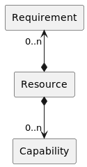

<!--
Licensed to the Apache Software Foundation (ASF) under one or more
contributor license agreements.  See the NOTICE file distributed with
this work for additional information regarding copyright ownership.
The ASF licenses this file to You under the Apache License, Version 2.0
(the "License"); you may not use this file except in compliance with
the License.  You may obtain a copy of the License at
   
    http://www.apache.org/licenses/LICENSE-2.0

Unless required by applicable law or agreed to in writing, software
distributed under the License is distributed on an "AS IS" BASIS,
WITHOUT WARRANTIES OR CONDITIONS OF ANY KIND, either express or implied.
See the License for the specific language governing permissions and
limitations under the License.
-->

## Requirement-Capability-Model (RCM) library
C library based on the OSGi Requirement-Capability-Model, part of 
[Chapter 3.3](https://docs.osgi.org/specification/osgi.core/8.0.0/framework.module.html#framework.module.dependencies)
, [Chapter 6](https://docs.osgi.org/specification/osgi.core/8.0.0/framework.resource.html)
and [Chapter 7](https://docs.osgi.org/specification/osgi.core/8.0.0/framework.wiring.html)
in the OSGi Core Specification 8.

## Base Requirement-Capability-Model 

The Requirement-Capability-Model (RCM) is a model for describing the capabilities and requirements for a resource.
This model can be used in bundle wiring to resolve the dependencies between bundles.

The following diagram shows the RCM model:

## Requirement-Capability-Model and (Bundle) Wiring

TODO

## Requirement-Capability-Model Resolver

TODO
